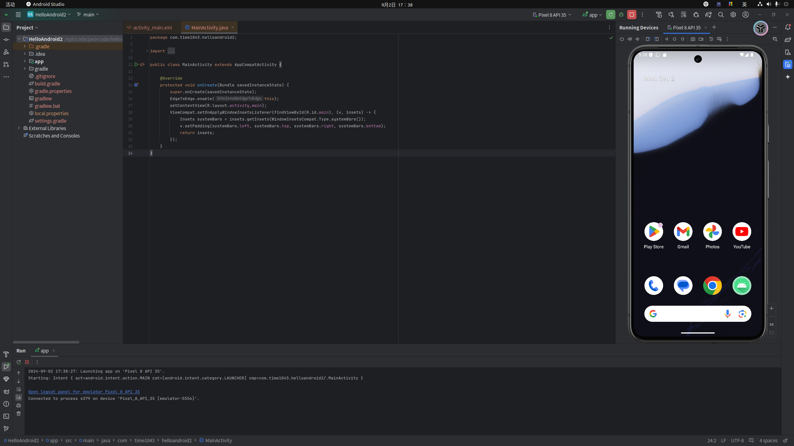

# android

## 背景介绍

### 环境配置 win

- [安卓官方中文社区](https://developer.android.google.cn)

  [下载android-studio](https://developer.android.google.cn/studio)、[历史版本android-studio](https://developer.android.google.cn/studio/archive)


### 环境配置 ubuntu

#### studio 集成开发环境

- Android

  ```bash
  # jdk
  sudo snap install android-studio --classic
  sudo snap remove android-studio
  
  # proxy ???
  # mirrors.aliyun.com:80
  
  ```

- 新建项目

  ```
  Language: Java
  Minimum SDK: API 24("Nougat";Android 7.0)
  Build configuration language: Groovy DSL(build.gradle)
  
  ```

  

  


#### Gradle 包管理器

- Gradle

  https://services.gradle.org/distributions/gradle-8.7-bin.zip

  ```bash
  # ~/.gradle/wrapper/dists
  # /opt/module/gradle-8.7
  mv gradle-8.7-bin.zip /opt/module/
  cd /opt/module/ && unzip gradle-8.7-bin.zip
  
  # Settings
  # -> Build - Build - Gradle
  # -> GradleUserHome: /opt/module/gradle-8.7
  
  # Settings 
  # -> Appearance - SystemSettings - HttpProxy 
  # -> ManualProxyConfiguration: http 127.0.0.1 7890
  
  # Gradle配置国内仓库
  
  ```

  build.gradle

  ```
  repositories {
  	// 阿里Maven仓库
  	maven { url'https://maven.aliyun.com/repository/public/' }
  	maven { url 'https://maven.aliyun.com/nexus/content/groups/public/' }
  	maven { url 'https://maven.aliyun.com/nexus/content/repositories/jcenter' }
  	maven { url 'https://maven.aliyun.com/nexus/content/repositories/google' }
  	maven { url 'https://maven.aliyun.com/nexus/content/repositories/gradle-plugin' }
  	maven { url'https://maven.aliyun.com/repository/central/' }
  	maven { url 'https://jitpack.io' }
  	mavenCentral()
  	mavenLocal()
  	
  	google()
  	jcenter()
  }
  
  ```

  log

  ```bash
  Download https://services.gradle.org/distributions/gradle-8.7-bin.zip, took 14 s 367 ms
  Starting Gradle Daemon...
  Gradle Daemon started in 380 ms
  Download https://dl.google.com/dl/android/maven2/com/android/application/com.android.application.gradle.plugin/8.5.0/com.android.application.gradle.plugin-8.5.0.pom, took 365 ms
  Download https://dl.google.com/dl/android/maven2/com/android/tools/build/gradle/8.5.0/gradle-8.5.0.pom, took 230 ms
  Download https://dl.google.com/dl/android/maven2/com/android/tools/build/gradle/8.5.0/gradle-8.5.0.module, took 88 ms
  Download https://dl.google.com/dl/android/maven2/com/android/tools/lint/lint-model/31.5.0/lint-model-31.5.0.pom, took 78 ms
  Download https://dl.google.com/dl/android/maven2/com/android/tools/build/aaptcompiler/8.5.0/aaptcompiler-8.5.0.pom, took 149 ms
  Download https://dl.google.com/dl/android/maven2/com/android/tools/sdklib/31.5.0/sdklib-31.5.0.pom, took 161 ms
  Download https://dl.google.com/dl/android/maven2/com/android/tools/build/gradle-settings-api/8.5.0/gradle-settings-api-8.5.0.pom, took 166 ms
  Download https://dl.google.com/dl/android/maven2/com/android/tools/analytics-library/crash/31.5.0/crash-31.5.0.pom, took 165 ms
  Download https://dl.google.com/dl/android/maven2/com/android/tools/utp/android-device-provider-ddmlib-proto/31.5.0/android-device-provider-ddmlib-proto-31.5.0.pom, took 168 ms
  Download https://dl.google.com/dl/android/maven2/com/android/tools/utp/android-test-plugin-host-logcat-proto/31.5.0/android-test-plugin-host-logcat-proto-31.5.0.pom, took 174 ms
  Download https://dl.google.com/dl/android/maven2/com/android/tools/ddms/ddmlib/31.5.0/ddmlib-31.5.0.pom, took 177 ms
  Download https://dl.google.com/dl/android/maven2/com/android/tools/build/builder-test-api/8.5.0/builder-test-api-8.5.0.pom, took 174 ms
  Download https://dl.google.com/dl/android/maven2/com/android/tools/build/aapt2-proto/8.5.0-11315950/aapt2-proto-8.5.0-11315950.pom, took 176 ms
  Download https://dl.google.com/dl/android/maven2/com/android/tools/layoutlib/layoutlib-api/31.5.0/layoutlib-api-31.5.0.pom, took 185 ms
  Download https://dl.google.com/dl/android/maven2/com/android/tools/utp/android-test-plugin-host-additional-test-output-proto/31.5.0/android-test-plugin-host-additional-test-output-proto-31.5.0.pom, took 187 ms
  Download https://dl.google.com/dl/android/maven2/com/android/tools/utp/android-test-plugin-host-emulator-control-proto/31.5.0/android-test-plugin-host-emulator-control-proto-31.5.0.pom, took 186 ms
  Download https://dl.google.com/dl/android/maven2/com/android/tools/utp/android-device-provider-gradle-proto/31.5.0/android-device-provider-gradle-proto-31.5.0.pom, took 187 ms
  Download https://dl.google.com/dl/android/maven2/com/android/tools/lint/lint-typedef-remover/31.5.0/lint-typedef-remover-31.5.0.pom, took 193 ms
  Download https://dl.google.com/dl/android/maven2/com/android/tools/analytics-library/shared/31.5.0/shared-31.5.0.pom, took 192 ms
  Download https://dl.google.com/dl/android/maven2/com/android/tools/utp/android-test-plugin-host-apk-installer-proto/31.5.0/android-test-plugin-host-apk-installer-proto-31.5.0.pom, took 210 ms
  Download https://dl.google.com/dl/android/maven2/androidx/databinding/databinding-compiler-common/8.5.0/databinding-compiler-common-8.5.0.pom, took 219 ms
  Download https://dl.google.com/dl/android/maven2/com/android/tools/utp/android-test-plugin-host-coverage-proto/31.5.0/android-test-plugin-host-coverage-proto-31.5.0.pom, took 229 ms
  Download https://dl.google.com/dl/android/maven2/com/android/tools/sdk-common/31.5.0/sdk-common-31.5.0.pom, took 231 ms
  Download https://dl.google.com/dl/android/maven2/com/android/tools/utp/android-test-plugin-result-listener-gradle-proto/31.5.0/android-test-plugin-result-listener-gradle-proto-31.5.0.pom, took 160 ms
  Download https://dl.google.com/dl/android/maven2/com/android/tools/build/aaptcompiler/8.5.0/aaptcompiler-8.5.0.module, took 84 ms
  Download https://dl.google.com/dl/android/maven2/com/android/tools/build/transform-api/2.0.0-deprecated-use-gradle-api/transform-api-2.0.0-deprecated-use-gradle-api.pom, took 80 ms
  Download https://dl.google.com/dl/android/maven2/com/android/tools/build/gradle-settings-api/8.5.0/gradle-settings-api-8.5.0.module, took 79 ms
  Download https://dl.google.com/dl/android/maven2/com/android/tools/build/bundletool/1.16.0/bundletool-1.16.0.pom, took 74 ms
  Download https://dl.google.com/dl/android/maven2/com/android/tools/build/jetifier/jetifier-core/1.0.0-beta10/jetifier-core-1.0.0-beta10.pom, took 74 ms
  Download https://dl.google.com/dl/android/maven2/com/android/tools/build/jetifier/jetifier-processor/1.0.0-beta10/jetifier-processor-1.0.0-beta10.pom, took 76 ms
  Download https://dl.google.com/dl/android/maven2/com/android/tools/utp/android-test-plugin-host-retention-proto/31.5.0/android-test-plugin-host-retention-proto-31.5.0.pom, took 251 ms
  Download https://dl.google.com/dl/android/maven2/com/android/tools/repository/31.5.0/repository-31.5.0.pom, took 257 ms
  Download https://dl.google.com/dl/android/maven2/com/android/tools/build/builder-test-api/8.5.0/builder-test-api-8.5.0.module, took 84 ms
  Download https://dl.google.com/dl/android/maven2/com/android/tools/build/aapt2-proto/8.5.0-11315950/aapt2-proto-8.5.0-11315950.module, took 85 ms
  Download https://dl.google.com/dl/android/maven2/com/google/testing/platform/core-proto/0.0.9-alpha02/core-proto-0.0.9-alpha02.pom, took 100 ms
  Download https://dl.google.com/dl/android/maven2/com/android/tools/build/builder-model/8.5.0/builder-model-8.5.0.pom, took 105 ms
  Download https://dl.google.com/dl/android/maven2/com/android/tools/build/builder/8.5.0/builder-8.5.0.pom, took 109 ms
  Download https://dl.google.com/dl/android/maven2/com/android/tools/build/gradle-api/8.5.0/gradle-api-8.5.0.pom, took 99 ms
  Download https://dl.google.com/dl/android/maven2/com/android/tools/build/jetifier/jetifier-core/1.0.0-beta10/jetifier-core-1.0.0-beta10.module, took 70 ms
  Download https://dl.google.com/dl/android/maven2/com/android/tools/build/jetifier/jetifier-processor/1.0.0-beta10/jetifier-processor-1.0.0-beta10.module, took 77 ms
  Download https://dl.google.com/dl/android/maven2/com/android/tools/build/builder-model/8.5.0/builder-model-8.5.0.module, took 73 ms
  Download https://dl.google.com/dl/android/maven2/com/android/tools/build/builder/8.5.0/builder-8.5.0.module, took 70 ms
  Download https://dl.google.com/dl/android/maven2/com/android/tools/build/gradle-api/8.5.0/gradle-api-8.5.0.module, took 87 ms
  Download https://repo.maven.apache.org/maven2/com/google/protobuf/protobuf-java-util/3.22.3/protobuf-java-util-3.22.3.pom, took 648 ms
  Download https://repo.maven.apache.org/maven2/com/google/protobuf/protobuf-java/3.22.3/protobuf-java-3.22.3.pom, took 656 ms
  Download https://repo.maven.apache.org/maven2/com/google/crypto/tink/tink/1.7.0/tink-1.7.0.pom, took 651 ms
  Download https://repo.maven.apache.org/maven2/com/google/code/gson/gson/2.10.1/gson-2.10.1.pom, took 656 ms
  Download https://repo.maven.apache.org/maven2/com/google/flatbuffers/flatbuffers-java/1.12.0/flatbuffers-java-1.12.0.pom, took 660 ms
  Download https://repo.maven.apache.org/maven2/org/sonatype/oss/oss-parent/7/oss-parent-7.pom, took 111 ms
  Download https://repo.maven.apache.org/maven2/com/google/code/gson/gson-parent/2.10.1/gson-parent-2.10.1.pom, took 122 ms
  Download https://repo.maven.apache.org/maven2/com/google/protobuf/protobuf-parent/3.22.3/protobuf-parent-3.22.3.pom, took 117 ms
  Download https://repo.maven.apache.org/maven2/com/google/protobuf/protobuf-bom/3.22.3/protobuf-bom-3.22.3.pom, took 109 ms
  Download https://repo.maven.apache.org/maven2/org/jetbrains/kotlin/kotlin-stdlib-jdk8/1.9.20/kotlin-stdlib-jdk8-1.9.20.pom, took 105 ms
  Download https://repo.maven.apache.org/maven2/org/apache/httpcomponents/httpmime/4.5.6/httpmime-4.5.6.pom, took 112 ms
  Download https://repo.maven.apache.org/maven2/org/apache/httpcomponents/httpcomponents-client/4.5.6/httpcomponents-client-4.5.6.pom, took 143 ms
  Download https://repo.maven.apache.org/maven2/org/apache/httpcomponents/httpcomponents-parent/10/httpcomponents-parent-10.pom, took 154 ms
  Download https://repo.maven.apache.org/maven2/org/apache/apache/18/apache-18.pom, took 111 ms
  Download https://repo.maven.apache.org/maven2/commons-io/commons-io/2.13.0/commons-io-2.13.0.pom, took 120 ms
  Download https://repo.maven.apache.org/maven2/org/apache/commons/commons-parent/58/commons-parent-58.pom, took 164 ms
  Download https://repo.maven.apache.org/maven2/org/apache/apache/29/apache-29.pom, took 122 ms
  Download https://repo.maven.apache.org/maven2/org/junit/junit-bom/5.9.3/junit-bom-5.9.3.pom, took 107 ms
  Download https://repo.maven.apache.org/maven2/org/junit/junit-bom/5.9.3/junit-bom-5.9.3.module, took 109 ms
  Download https://repo.maven.apache.org/maven2/org/ow2/asm/asm/9.6/asm-9.6.pom, took 105 ms
  Download https://repo.maven.apache.org/maven2/org/ow2/ow2/1.5.1/ow2-1.5.1.pom, took 110 ms
  Download https://repo.maven.apache.org/maven2/org/ow2/asm/asm-analysis/9.6/asm-analysis-9.6.pom, took 107 ms
  Download https://repo.maven.apache.org/maven2/org/ow2/asm/asm-commons/9.6/asm-commons-9.6.pom, took 108 ms
  Download https://repo.maven.apache.org/maven2/org/ow2/asm/asm-util/9.6/asm-util-9.6.pom, took 105 ms
  Download https://repo.maven.apache.org/maven2/org/bouncycastle/bcpkix-jdk18on/1.77/bcpkix-jdk18on-1.77.pom, took 359 ms
  Download https://repo.maven.apache.org/maven2/org/glassfish/jaxb/jaxb-runtime/2.3.2/jaxb-runtime-2.3.2.pom, took 238 ms
  Download https://repo.maven.apache.org/maven2/com/sun/xml/bind/mvn/jaxb-runtime-parent/2.3.2/jaxb-runtime-parent-2.3.2.pom, took 115 ms
  Download https://repo.maven.apache.org/maven2/com/sun/xml/bind/mvn/jaxb-parent/2.3.2/jaxb-parent-2.3.2.pom, took 230 ms
  Download https://repo.maven.apache.org/maven2/com/sun/xml/bind/jaxb-bom-ext/2.3.2/jaxb-bom-ext-2.3.2.pom, took 114 ms
  Download https://repo.maven.apache.org/maven2/org/glassfish/jaxb/jaxb-bom/2.3.2/jaxb-bom-2.3.2.pom, took 116 ms
  Download https://repo.maven.apache.org/maven2/org/eclipse/ee4j/project/1.0.5/project-1.0.5.pom, took 112 ms
  Download https://repo.maven.apache.org/maven2/net/sf/jopt-simple/jopt-simple/4.9/jopt-simple-4.9.pom, took 345 ms
  Download https://repo.maven.apache.org/maven2/com/squareup/javapoet/1.10.0/javapoet-1.10.0.pom, took 107 ms
  Download https://repo.maven.apache.org/maven2/io/grpc/grpc-core/1.57.0/grpc-core-1.57.0.pom, took 117 ms
  Download https://repo.maven.apache.org/maven2/io/grpc/grpc-netty/1.57.0/grpc-netty-1.57.0.pom, took 311 ms
  Download https://repo.maven.apache.org/maven2/io/grpc/grpc-protobuf/1.57.0/grpc-protobuf-1.57.0.pom, took 114 ms
  Download https://repo.maven.apache.org/maven2/io/grpc/grpc-stub/1.57.0/grpc-stub-1.57.0.pom, took 105 ms
  Download https://repo.maven.apache.org/maven2/net/sf/kxml/kxml2/2.3.0/kxml2-2.3.0.pom, took 105 ms
  Download https://repo.maven.apache.org/maven2/org/tensorflow/tensorflow-lite-metadata/0.1.0-rc2/tensorflow-lite-metadata-0.1.0-rc2.pom, took 381 ms
  Download https://dl.google.com/dl/android/maven2/com/android/tools/common/31.5.0/common-31.5.0.pom, took 87 ms
  Download https://repo.maven.apache.org/maven2/com/google/guava/guava/32.0.1-jre/guava-32.0.1-jre.pom, took 111 ms
  Download https://repo.maven.apache.org/maven2/com/google/guava/guava-parent/32.0.1-jre/guava-parent-32.0.1-jre.pom, took 116 ms
  Download https://repo.maven.apache.org/maven2/org/bouncycastle/bcprov-jdk18on/1.77/bcprov-jdk18on-1.77.pom, took 105 ms
  Download https://repo.maven.apache.org/maven2/org/jetbrains/intellij/deps/trove4j/1.0.20200330/trove4j-1.0.20200330.pom, took 106 ms
  Download https://repo.maven.apache.org/maven2/org/jetbrains/kotlin/kotlin-reflect/1.9.22/kotlin-reflect-1.9.22.pom, took 105 ms
  Download https://dl.google.com/dl/android/maven2/com/android/tools/dvlib/31.5.0/dvlib-31.5.0.pom, took 100 ms
  Download https://repo.maven.apache.org/maven2/org/apache/commons/commons-compress/1.21/commons-compress-1.21.pom, took 140 ms
  Download https://repo.maven.apache.org/maven2/org/apache/commons/commons-parent/52/commons-parent-52.pom, took 153 ms
  Download https://repo.maven.apache.org/maven2/org/apache/apache/23/apache-23.pom, took 111 ms
  Download https://repo.maven.apache.org/maven2/org/apache/httpcomponents/httpcore/4.4.16/httpcore-4.4.16.pom, took 121 ms
  Download https://repo.maven.apache.org/maven2/org/apache/httpcomponents/httpcomponents-core/4.4.16/httpcomponents-core-4.4.16.pom, took 110 ms
  Download https://repo.maven.apache.org/maven2/org/apache/httpcomponents/httpcomponents-parent/11/httpcomponents-parent-11.pom, took 122 ms
  Download https://repo.maven.apache.org/maven2/org/apache/apache/21/apache-21.pom, took 118 ms
  Download https://repo.maven.apache.org/maven2/com/google/jimfs/jimfs/1.1/jimfs-1.1.pom, took 110 ms
  Download https://repo.maven.apache.org/maven2/com/google/jimfs/jimfs-parent/1.1/jimfs-parent-1.1.pom, took 108 ms
  Download https://repo.maven.apache.org/maven2/com/sun/activation/javax.activation/1.2.0/javax.activation-1.2.0.pom, took 106 ms
  Download https://repo.maven.apache.org/maven2/com/sun/activation/all/1.2.0/all-1.2.0.pom, took 113 ms
  Download https://repo.maven.apache.org/maven2/net/java/jvnet-parent/1/jvnet-parent-1.pom, took 109 ms
  Download https://repo.maven.apache.org/maven2/org/jetbrains/annotations/13.0/annotations-13.0.pom, took 107 ms
  Download https://repo.maven.apache.org/maven2/org/apache/httpcomponents/httpclient/4.5.14/httpclient-4.5.14.pom, took 107 ms
  Download https://repo.maven.apache.org/maven2/org/apache/httpcomponents/httpcomponents-client/4.5.14/httpcomponents-client-4.5.14.pom, took 125 ms
  Download https://dl.google.com/dl/android/maven2/com/android/tools/analytics-library/protos/31.5.0/protos-31.5.0.pom, took 88 ms
  Download https://repo.maven.apache.org/maven2/net/java/dev/jna/jna-platform/5.6.0/jna-platform-5.6.0.pom, took 121 ms
  Download https://repo.maven.apache.org/maven2/com/googlecode/juniversalchardet/juniversalchardet/1.0.3/juniversalchardet-1.0.3.pom, took 156 ms
  Download https://repo.maven.apache.org/maven2/javax/annotation/javax.annotation-api/1.3.2/javax.annotation-api-1.3.2.pom, took 114 ms
  Download https://repo.maven.apache.org/maven2/net/java/jvnet-parent/3/jvnet-parent-3.pom, took 107 ms
  Download https://repo.maven.apache.org/maven2/org/jetbrains/kotlin/kotlin-stdlib-jdk7/1.9.20/kotlin-stdlib-jdk7-1.9.20.pom, took 115 ms
  Download https://repo.maven.apache.org/maven2/org/jetbrains/kotlin/kotlin-stdlib/1.9.22/kotlin-stdlib-1.9.22.pom, took 114 ms
  Download https://repo.maven.apache.org/maven2/org/jetbrains/kotlin/kotlin-stdlib/1.9.22/kotlin-stdlib-1.9.22.module, took 122 ms
  Download https://repo.maven.apache.org/maven2/org/ow2/asm/asm-tree/9.6/asm-tree-9.6.pom, took 107 ms
  Download https://repo.maven.apache.org/maven2/org/bouncycastle/bcutil-jdk18on/1.77/bcutil-jdk18on-1.77.pom, took 104 ms
  Download https://repo.maven.apache.org/maven2/jakarta/xml/bind/jakarta.xml.bind-api/2.3.2/jakarta.xml.bind-api-2.3.2.pom, took 111 ms
  Download https://repo.maven.apache.org/maven2/jakarta/xml/bind/jakarta.xml.bind-api-parent/2.3.2/jakarta.xml.bind-api-parent-2.3.2.pom, took 106 ms
  Download https://repo.maven.apache.org/maven2/org/glassfish/jaxb/txw2/2.3.2/txw2-2.3.2.pom, took 107 ms
  Download https://repo.maven.apache.org/maven2/com/sun/xml/bind/mvn/jaxb-txw-parent/2.3.2/jaxb-txw-parent-2.3.2.pom, took 105 ms
  Download https://repo.maven.apache.org/maven2/com/sun/istack/istack-commons-runtime/3.0.8/istack-commons-runtime-3.0.8.pom, took 104 ms
  Download https://repo.maven.apache.org/maven2/com/sun/istack/istack-commons/3.0.8/istack-commons-3.0.8.pom, took 113 ms
  Download https://repo.maven.apache.org/maven2/org/jvnet/staxex/stax-ex/1.8.1/stax-ex-1.8.1.pom, took 110 ms
  Download https://repo.maven.apache.org/maven2/com/sun/xml/fastinfoset/FastInfoset/1.2.16/FastInfoset-1.2.16.pom, took 105 ms
  Download https://repo.maven.apache.org/maven2/com/sun/xml/fastinfoset/fastinfoset-project/1.2.16/fastinfoset-project-1.2.16.pom, took 112 ms
  Download https://repo.maven.apache.org/maven2/jakarta/activation/jakarta.activation-api/1.2.1/jakarta.activation-api-1.2.1.pom, took 105 ms
  Download https://repo.maven.apache.org/maven2/com/sun/activation/all/1.2.1/all-1.2.1.pom, took 113 ms
  Download https://repo.maven.apache.org/maven2/org/eclipse/ee4j/project/1.0.2/project-1.0.2.pom, took 110 ms
  Download https://repo.maven.apache.org/maven2/com/google/dagger/dagger/2.28.3/dagger-2.28.3.pom, took 107 ms
  Download https://repo.maven.apache.org/maven2/com/google/errorprone/error_prone_annotations/2.3.1/error_prone_annotations-2.3.1.pom, took 112 ms
  Download https://repo.maven.apache.org/maven2/com/google/auto/value/auto-value-annotations/1.6.2/auto-value-annotations-1.6.2.pom, took 106 ms
  Download https://repo.maven.apache.org/maven2/com/google/auto/value/auto-value-parent/1.6.2/auto-value-parent-1.6.2.pom, took 105 ms
  Download https://repo.maven.apache.org/maven2/com/google/errorprone/error_prone_parent/2.3.1/error_prone_parent-2.3.1.pom, took 116 ms
  Download https://repo.maven.apache.org/maven2/com/google/auto/auto-parent/6/auto-parent-6.pom, took 149 ms
  Download https://repo.maven.apache.org/maven2/org/bitbucket/b_c/jose4j/0.9.5/jose4j-0.9.5.pom, took 118 ms
  Download https://repo.maven.apache.org/maven2/org/slf4j/slf4j-api/1.7.30/slf4j-api-1.7.30.pom, took 112 ms
  Download https://repo.maven.apache.org/maven2/org/slf4j/slf4j-parent/1.7.30/slf4j-parent-1.7.30.pom, took 120 ms
  Download https://repo.maven.apache.org/maven2/org/jdom/jdom2/2.0.6/jdom2-2.0.6.pom, took 113 ms
  Download https://repo.maven.apache.org/maven2/com/google/errorprone/error_prone_annotations/2.11.0/error_prone_annotations-2.11.0.pom, took 111 ms
  Download https://repo.maven.apache.org/maven2/com/google/errorprone/error_prone_parent/2.11.0/error_prone_parent-2.11.0.pom, took 117 ms
  Download https://repo.maven.apache.org/maven2/com/google/code/findbugs/jsr305/3.0.2/jsr305-3.0.2.pom, took 113 ms
  Download https://repo.maven.apache.org/maven2/com/google/j2objc/j2objc-annotations/1.3/j2objc-annotations-1.3.pom, took 105 ms
  Download https://repo.maven.apache.org/maven2/com/google/errorprone/error_prone_annotations/2.18.0/error_prone_annotations-2.18.0.pom, took 106 ms
  Download https://repo.maven.apache.org/maven2/com/google/errorprone/error_prone_parent/2.18.0/error_prone_parent-2.18.0.pom, took 114 ms
  Download https://repo.maven.apache.org/maven2/io/grpc/grpc-api/1.57.0/grpc-api-1.57.0.pom, took 105 ms
  Download https://repo.maven.apache.org/maven2/com/google/android/annotations/4.1.1.4/annotations-4.1.1.4.pom, took 108 ms
  Download https://repo.maven.apache.org/maven2/org/codehaus/mojo/animal-sniffer-annotations/1.23/animal-sniffer-annotations-1.23.pom, took 104 ms
  Download https://repo.maven.apache.org/maven2/org/codehaus/mojo/animal-sniffer-parent/1.23/animal-sniffer-parent-1.23.pom, took 109 ms
  Download https://repo.maven.apache.org/maven2/org/codehaus/mojo/mojo-parent/74/mojo-parent-74.pom, took 134 ms
  Download https://repo.maven.apache.org/maven2/org/junit/junit-bom/5.9.2/junit-bom-5.9.2.pom, took 104 ms
  Download https://repo.maven.apache.org/maven2/org/junit/junit-bom/5.9.2/junit-bom-5.9.2.module, took 105 ms
  Download https://repo.maven.apache.org/maven2/io/perfmark/perfmark-api/0.26.0/perfmark-api-0.26.0.pom, took 119 ms
  Download https://repo.maven.apache.org/maven2/io/perfmark/perfmark-api/0.26.0/perfmark-api-0.26.0.module, took 105 ms
  Download https://repo.maven.apache.org/maven2/io/grpc/grpc-context/1.57.0/grpc-context-1.57.0.pom, took 106 ms
  Download https://repo.maven.apache.org/maven2/io/netty/netty-codec-http2/4.1.93.Final/netty-codec-http2-4.1.93.Final.pom, took 108 ms
  Download https://repo.maven.apache.org/maven2/io/netty/netty-parent/4.1.93.Final/netty-parent-4.1.93.Final.pom, took 158 ms
  Download https://repo.maven.apache.org/maven2/org/sonatype/oss/oss-parent/9/oss-parent-9.pom, took 106 ms
  Download https://repo.maven.apache.org/maven2/io/netty/netty-handler-proxy/4.1.93.Final/netty-handler-proxy-4.1.93.Final.pom, took 103 ms
  Download https://repo.maven.apache.org/maven2/io/netty/netty-transport-native-unix-common/4.1.93.Final/netty-transport-native-unix-common-4.1.93.Final.pom, took 108 ms
  Download https://repo.maven.apache.org/maven2/com/google/api/grpc/proto-google-common-protos/2.17.0/proto-google-common-protos-2.17.0.pom, took 107 ms
  Download https://repo.maven.apache.org/maven2/io/grpc/grpc-protobuf-lite/1.57.0/grpc-protobuf-lite-1.57.0.pom, took 107 ms
  Download https://repo.maven.apache.org/maven2/org/checkerframework/checker-qual/2.5.8/checker-qual-2.5.8.pom, took 106 ms
  Download https://dl.google.com/dl/android/maven2/com/android/tools/build/manifest-merger/31.5.0/manifest-merger-31.5.0.pom, took 73 ms
  Download https://dl.google.com/dl/android/maven2/com/android/tools/analytics-library/tracker/31.5.0/tracker-31.5.0.pom, took 74 ms
  Download https://dl.google.com/dl/android/maven2/com/android/signflinger/8.5.0/signflinger-8.5.0.pom, took 90 ms
  Download https://dl.google.com/dl/android/maven2/com/android/tools/build/apkzlib/8.5.0/apkzlib-8.5.0.pom, took 89 ms
  Download https://dl.google.com/dl/android/maven2/com/android/zipflinger/8.5.0/zipflinger-8.5.0.pom, took 97 ms
  Download https://dl.google.com/dl/android/maven2/com/android/tools/build/manifest-merger/31.5.0/manifest-merger-31.5.0.module, took 70 ms
  Download https://repo.maven.apache.org/maven2/commons-codec/commons-codec/1.10/commons-codec-1.10.pom, took 114 ms
  Download https://repo.maven.apache.org/maven2/org/apache/commons/commons-parent/35/commons-parent-35.pom, took 121 ms
  Download https://repo.maven.apache.org/maven2/org/apache/apache/15/apache-15.pom, took 104 ms
  Download https://repo.maven.apache.org/maven2/com/squareup/javawriter/2.5.0/javawriter-2.5.0.pom, took 104 ms
  Download https://repo.maven.apache.org/maven2/org/checkerframework/checker-qual/3.33.0/checker-qual-3.33.0.pom, took 105 ms
  Download https://repo.maven.apache.org/maven2/org/checkerframework/checker-qual/3.33.0/checker-qual-3.33.0.module, took 114 ms
  Download https://repo.maven.apache.org/maven2/com/google/j2objc/j2objc-annotations/2.8/j2objc-annotations-2.8.pom, took 106 ms
  Download https://repo.maven.apache.org/maven2/com/google/guava/listenablefuture/9999.0-empty-to-avoid-conflict-with-guava/listenablefuture-9999.0-empty-to-avoid-conflict-with-guava.pom, took 206 ms
  Download https://repo.maven.apache.org/maven2/com/google/guava/failureaccess/1.0.1/failureaccess-1.0.1.pom, took 236 ms
  Download https://repo.maven.apache.org/maven2/com/google/guava/guava-parent/26.0-android/guava-parent-26.0-android.pom, took 105 ms
  Download https://repo.maven.apache.org/maven2/commons-codec/commons-codec/1.11/commons-codec-1.11.pom, took 106 ms
  Download https://repo.maven.apache.org/maven2/org/apache/commons/commons-parent/42/commons-parent-42.pom, took 116 ms
  Download https://repo.maven.apache.org/maven2/commons-logging/commons-logging/1.2/commons-logging-1.2.pom, took 107 ms
  Download https://repo.maven.apache.org/maven2/org/apache/commons/commons-parent/34/commons-parent-34.pom, took 128 ms
  Download https://repo.maven.apache.org/maven2/org/apache/apache/13/apache-13.pom, took 109 ms
  Download https://repo.maven.apache.org/maven2/net/java/dev/jna/jna/5.6.0/jna-5.6.0.pom, took 116 ms
  Download https://repo.maven.apache.org/maven2/io/netty/netty-common/4.1.93.Final/netty-common-4.1.93.Final.pom, took 107 ms
  Download https://repo.maven.apache.org/maven2/io/netty/netty-buffer/4.1.93.Final/netty-buffer-4.1.93.Final.pom, took 106 ms
  Download https://repo.maven.apache.org/maven2/io/netty/netty-transport/4.1.93.Final/netty-transport-4.1.93.Final.pom, took 103 ms
  Download https://repo.maven.apache.org/maven2/io/netty/netty-codec/4.1.93.Final/netty-codec-4.1.93.Final.pom, took 130 ms
  Download https://repo.maven.apache.org/maven2/io/netty/netty-handler/4.1.93.Final/netty-handler-4.1.93.Final.pom, took 128 ms
  Download https://repo.maven.apache.org/maven2/io/netty/netty-codec-http/4.1.93.Final/netty-codec-http-4.1.93.Final.pom, took 143 ms
  Download https://repo.maven.apache.org/maven2/io/netty/netty-codec-socks/4.1.93.Final/netty-codec-socks-4.1.93.Final.pom, took 108 ms
  Download https://repo.maven.apache.org/maven2/io/netty/netty-resolver/4.1.93.Final/netty-resolver-4.1.93.Final.pom, took 132 ms
  Download https://dl.google.com/dl/android/maven2/com/android/tools/build/builder-test-api/8.5.0/builder-test-api-8.5.0.jar, took 81 ms
  Download https://dl.google.com/dl/android/maven2/com/android/tools/utp/android-test-plugin-host-emulator-control-proto/31.5.0/android-test-plugin-host-emulator-control-proto-31.5.0.jar, took 97 ms
  Download https://dl.google.com/dl/android/maven2/com/android/tools/build/gradle-settings-api/8.5.0/gradle-settings-api-8.5.0.jar, took 112 ms
  Download https://dl.google.com/dl/android/maven2/com/android/tools/dvlib/31.5.0/dvlib-31.5.0.jar, took 161 ms
  Download https://dl.google.com/dl/android/maven2/com/android/tools/analytics-library/shared/31.5.0/shared-31.5.0.jar, took 369 ms
  Download https://dl.google.com/dl/android/maven2/com/android/tools/analytics-library/tracker/31.5.0/tracker-31.5.0.jar, took 388 ms
  Download https://dl.google.com/dl/android/maven2/com/android/tools/build/jetifier/jetifier-processor/1.0.0-beta10/jetifier-processor-1.0.0-beta10.jar, took 391 ms
  Download https://dl.google.com/dl/android/maven2/com/android/tools/build/manifest-merger/31.5.0/manifest-merger-31.5.0.jar, took 409 ms
  Download https://dl.google.com/dl/android/maven2/com/android/tools/utp/android-test-plugin-host-retention-proto/31.5.0/android-test-plugin-host-retention-proto-31.5.0.jar, took 460 ms
  Download https://dl.google.com/dl/android/maven2/com/android/tools/lint/lint-typedef-remover/31.5.0/lint-typedef-remover-31.5.0.jar, took 77 ms
  Download https://dl.google.com/dl/android/maven2/com/android/tools/layoutlib/layoutlib-api/31.5.0/layoutlib-api-31.5.0.jar, took 474 ms
  Download https://dl.google.com/dl/android/maven2/com/android/tools/analytics-library/crash/31.5.0/crash-31.5.0.jar, took 100 ms
  Download https://dl.google.com/dl/android/maven2/androidx/databinding/databinding-common/8.5.0/databinding-common-8.5.0.jar, took 117 ms
  Download https://dl.google.com/dl/android/maven2/com/android/tools/lint/lint-model/31.5.0/lint-model-31.5.0.jar, took 546 ms
  Download https://dl.google.com/dl/android/maven2/com/android/databinding/baseLibrary/8.5.0/baseLibrary-8.5.0.jar, took 86 ms
  Download https://dl.google.com/dl/android/maven2/com/android/tools/utp/android-test-plugin-host-additional-test-output-proto/31.5.0/android-test-plugin-host-additional-test-output-proto-31.5.0.jar, took 78 ms
  Download https://repo.maven.apache.org/maven2/org/jetbrains/annotations/13.0/annotations-13.0.jar, took 503 ms
  Download https://dl.google.com/dl/android/maven2/com/android/tools/common/31.5.0/common-31.5.0.jar, took 617 ms
  Download https://dl.google.com/dl/android/maven2/com/android/tools/utp/android-test-plugin-host-coverage-proto/31.5.0/android-test-plugin-host-coverage-proto-31.5.0.jar, took 125 ms
  Download https://dl.google.com/dl/android/maven2/com/android/tools/build/aaptcompiler/8.5.0/aaptcompiler-8.5.0.jar, took 666 ms
  Download https://dl.google.com/dl/android/maven2/com/android/tools/build/gradle-api/8.5.0/gradle-api-8.5.0.jar, took 716 ms
  Download https://dl.google.com/dl/android/maven2/com/android/tools/utp/android-test-plugin-host-logcat-proto/31.5.0/android-test-plugin-host-logcat-proto-31.5.0.jar, took 196 ms
  Download https://dl.google.com/dl/android/maven2/com/android/tools/utp/android-test-plugin-result-listener-gradle-proto/31.5.0/android-test-plugin-result-listener-gradle-proto-31.5.0.jar, took 180 ms
  Download https://dl.google.com/dl/android/maven2/com/android/tools/utp/android-test-plugin-host-apk-installer-proto/31.5.0/android-test-plugin-host-apk-installer-proto-31.5.0.jar, took 184 ms
  Download https://dl.google.com/dl/android/maven2/com/android/tools/build/jetifier/jetifier-core/1.0.0-beta10/jetifier-core-1.0.0-beta10.jar, took 743 ms
  Download https://dl.google.com/dl/android/maven2/com/android/tools/repository/31.5.0/repository-31.5.0.jar, took 755 ms
  Download https://dl.google.com/dl/android/maven2/com/android/tools/build/builder-model/8.5.0/builder-model-8.5.0.jar, took 836 ms
  Download https://repo.maven.apache.org/maven2/commons-io/commons-io/2.13.0/commons-io-2.13.0.jar, took 443 ms
  Download https://repo.maven.apache.org/maven2/org/apache/httpcomponents/httpmime/4.5.6/httpmime-4.5.6.jar, took 455 ms
  Download https://repo.maven.apache.org/maven2/org/ow2/asm/asm-commons/9.6/asm-commons-9.6.jar, took 460 ms
  Download https://dl.google.com/dl/android/maven2/com/android/tools/ddms/ddmlib/31.5.0/ddmlib-31.5.0.jar, took 1 s 170 ms
  Download https://repo.maven.apache.org/maven2/io/grpc/grpc-protobuf/1.57.0/grpc-protobuf-1.57.0.jar, took 144 ms
  Download https://dl.google.com/dl/android/maven2/com/android/tools/build/apkzlib/8.5.0/apkzlib-8.5.0.jar, took 507 ms
  Download https://repo.maven.apache.org/maven2/com/google/protobuf/protobuf-java-util/3.22.3/protobuf-java-util-3.22.3.jar, took 199 ms
  Download https://repo.maven.apache.org/maven2/org/ow2/asm/asm-analysis/9.6/asm-analysis-9.6.jar, took 811 ms
  Download https://repo.maven.apache.org/maven2/com/squareup/javapoet/1.10.0/javapoet-1.10.0.jar, took 705 ms
  Download https://repo.maven.apache.org/maven2/net/sf/jopt-simple/jopt-simple/4.9/jopt-simple-4.9.jar, took 832 ms
  Download https://dl.google.com/dl/android/maven2/com/android/tools/utp/android-device-provider-gradle-proto/31.5.0/android-device-provider-gradle-proto-31.5.0.jar, took 1 s 119 ms
  Download https://repo.maven.apache.org/maven2/org/jetbrains/kotlin/kotlin-reflect/1.9.22/kotlin-reflect-1.9.22.jar, took 1 s 523 ms
  Download https://repo.maven.apache.org/maven2/io/grpc/grpc-netty/1.57.0/grpc-netty-1.57.0.jar, took 388 ms
  Download https://repo.maven.apache.org/maven2/org/ow2/asm/asm-util/9.6/asm-util-9.6.jar, took 997 ms
  Download https://repo.maven.apache.org/maven2/org/ow2/asm/asm/9.6/asm-9.6.jar, took 952 ms
  Download https://repo.maven.apache.org/maven2/org/ow2/asm/asm-tree/9.6/asm-tree-9.6.jar, took 1 s 125 ms
  Download https://repo.maven.apache.org/maven2/io/grpc/grpc-stub/1.57.0/grpc-stub-1.57.0.jar, took 277 ms
  Download https://repo.maven.apache.org/maven2/com/google/code/gson/gson/2.10.1/gson-2.10.1.jar, took 363 ms
  Download https://repo.maven.apache.org/maven2/com/google/flatbuffers/flatbuffers-java/1.12.0/flatbuffers-java-1.12.0.jar, took 244 ms
  Download https://repo.maven.apache.org/maven2/org/jetbrains/kotlin/kotlin-stdlib/1.9.22/kotlin-stdlib-1.9.22.jar, took 1 s 836 ms
  Download https://repo.maven.apache.org/maven2/io/grpc/grpc-protobuf-lite/1.57.0/grpc-protobuf-lite-1.57.0.jar, took 109 ms
  Download https://repo.maven.apache.org/maven2/com/google/jimfs/jimfs/1.1/jimfs-1.1.jar, took 317 ms
  Download https://repo.maven.apache.org/maven2/net/sf/kxml/kxml2/2.3.0/kxml2-2.3.0.jar, took 388 ms
  Download https://repo.maven.apache.org/maven2/javax/inject/javax.inject/1/javax.inject-1.jar, took 102 ms
  Download https://repo.maven.apache.org/maven2/com/google/dagger/dagger/2.28.3/dagger-2.28.3.jar, took 148 ms
  Download https://repo.maven.apache.org/maven2/org/tensorflow/tensorflow-lite-metadata/0.1.0-rc2/tensorflow-lite-metadata-0.1.0-rc2.jar, took 597 ms
  Download https://repo.maven.apache.org/maven2/io/grpc/grpc-api/1.57.0/grpc-api-1.57.0.jar, took 438 ms
  Download https://dl.google.com/dl/android/maven2/com/google/testing/platform/core-proto/0.0.9-alpha02/core-proto-0.0.9-alpha02.jar, took 751 ms
  Download https://repo.maven.apache.org/maven2/org/glassfish/jaxb/jaxb-runtime/2.3.2/jaxb-runtime-2.3.2.jar, took 1 s 664 ms
  Download https://dl.google.com/dl/android/maven2/com/android/signflinger/8.5.0/signflinger-8.5.0.jar, took 84 ms
  Download https://repo.maven.apache.org/maven2/io/grpc/grpc-core/1.57.0/grpc-core-1.57.0.jar, took 1 s 26 ms
  Download https://dl.google.com/dl/android/maven2/com/android/zipflinger/8.5.0/zipflinger-8.5.0.jar, took 134 ms
  Download https://repo.maven.apache.org/maven2/org/jetbrains/intellij/deps/trove4j/1.0.20200330/trove4j-1.0.20200330.jar, took 549 ms
  Download https://repo.maven.apache.org/maven2/com/google/crypto/tink/tink/1.7.0/tink-1.7.0.jar, took 1 s 445 ms
  Download https://dl.google.com/dl/android/maven2/com/android/tools/annotations/31.5.0/annotations-31.5.0.jar, took 173 ms
  Download https://repo.maven.apache.org/maven2/com/sun/activation/javax.activation/1.2.0/javax.activation-1.2.0.jar, took 261 ms
  Download https://repo.maven.apache.org/maven2/javax/annotation/javax.annotation-api/1.3.2/javax.annotation-api-1.3.2.jar, took 135 ms
  Download https://repo.maven.apache.org/maven2/org/jvnet/staxex/stax-ex/1.8.1/stax-ex-1.8.1.jar, took 172 ms
  Download https://repo.maven.apache.org/maven2/org/bouncycastle/bcutil-jdk18on/1.77/bcutil-jdk18on-1.77.jar, took 767 ms
  Download https://dl.google.com/dl/android/maven2/com/android/tools/utp/android-device-provider-ddmlib-proto/31.5.0/android-device-provider-ddmlib-proto-31.5.0.jar, took 2 s 292 ms
  Download https://repo.maven.apache.org/maven2/org/apache/httpcomponents/httpcore/4.4.16/httpcore-4.4.16.jar, took 583 ms
  Download https://repo.maven.apache.org/maven2/com/sun/istack/istack-commons-runtime/3.0.8/istack-commons-runtime-3.0.8.jar, took 158 ms
  Download https://repo.maven.apache.org/maven2/org/apache/httpcomponents/httpclient/4.5.14/httpclient-4.5.14.jar, took 758 ms
  Download https://repo.maven.apache.org/maven2/com/googlecode/juniversalchardet/juniversalchardet/1.0.3/juniversalchardet-1.0.3.jar, took 396 ms
  Download https://repo.maven.apache.org/maven2/jakarta/xml/bind/jakarta.xml.bind-api/2.3.2/jakarta.xml.bind-api-2.3.2.jar, took 340 ms
  Download https://repo.maven.apache.org/maven2/com/google/errorprone/error_prone_annotations/2.18.0/error_prone_annotations-2.18.0.jar, took 118 ms
  Download https://repo.maven.apache.org/maven2/org/slf4j/slf4j-api/1.7.30/slf4j-api-1.7.30.jar, took 160 ms
  Download https://repo.maven.apache.org/maven2/com/sun/xml/fastinfoset/FastInfoset/1.2.16/FastInfoset-1.2.16.jar, took 321 ms
  Download https://repo.maven.apache.org/maven2/com/google/j2objc/j2objc-annotations/2.8/j2objc-annotations-2.8.jar, took 112 ms
  Download https://dl.google.com/dl/android/maven2/androidx/databinding/databinding-compiler-common/8.5.0/databinding-compiler-common-8.5.0.jar, took 3 s 87 ms
  Download https://repo.maven.apache.org/maven2/com/google/code/findbugs/jsr305/3.0.2/jsr305-3.0.2.jar, took 151 ms
  Download https://repo.maven.apache.org/maven2/org/bitbucket/b_c/jose4j/0.9.5/jose4j-0.9.5.jar, took 264 ms
  Download https://repo.maven.apache.org/maven2/com/google/android/annotations/4.1.1.4/annotations-4.1.1.4.jar, took 102 ms
  Download https://repo.maven.apache.org/maven2/org/glassfish/jaxb/txw2/2.3.2/txw2-2.3.2.jar, took 519 ms
  Download https://repo.maven.apache.org/maven2/jakarta/activation/jakarta.activation-api/1.2.1/jakarta.activation-api-1.2.1.jar, took 398 ms
  Download https://repo.maven.apache.org/maven2/org/codehaus/mojo/animal-sniffer-annotations/1.23/animal-sniffer-annotations-1.23.jar, took 108 ms
  Download https://repo.maven.apache.org/maven2/io/perfmark/perfmark-api/0.26.0/perfmark-api-0.26.0.jar, took 108 ms
  Download https://repo.maven.apache.org/maven2/com/google/auto/value/auto-value-annotations/1.6.2/auto-value-annotations-1.6.2.jar, took 450 ms
  Download https://repo.maven.apache.org/maven2/io/netty/netty-transport-native-unix-common/4.1.93.Final/netty-transport-native-unix-common-4.1.93.Final.jar, took 196 ms
  Download https://repo.maven.apache.org/maven2/io/netty/netty-handler-proxy/4.1.93.Final/netty-handler-proxy-4.1.93.Final.jar, took 240 ms
  Download https://repo.maven.apache.org/maven2/commons-codec/commons-codec/1.11/commons-codec-1.11.jar, took 297 ms
  Download https://repo.maven.apache.org/maven2/org/jdom/jdom2/2.0.6/jdom2-2.0.6.jar, took 522 ms
  Download https://repo.maven.apache.org/maven2/com/google/guava/listenablefuture/9999.0-empty-to-avoid-conflict-with-guava/listenablefuture-9999.0-empty-to-avoid-conflict-with-guava.jar, took 128 ms
  Download https://repo.maven.apache.org/maven2/com/squareup/javawriter/2.5.0/javawriter-2.5.0.jar, took 303 ms
  Download https://repo.maven.apache.org/maven2/com/google/guava/failureaccess/1.0.1/failureaccess-1.0.1.jar, took 213 ms
  Download https://repo.maven.apache.org/maven2/commons-logging/commons-logging/1.2/commons-logging-1.2.jar, took 275 ms
  Download https://repo.maven.apache.org/maven2/io/netty/netty-codec-http/4.1.93.Final/netty-codec-http-4.1.93.Final.jar, took 660 ms
  Download https://repo.maven.apache.org/maven2/io/netty/netty-transport/4.1.93.Final/netty-transport-4.1.93.Final.jar, took 355 ms
  Download https://repo.maven.apache.org/maven2/io/netty/netty-resolver/4.1.93.Final/netty-resolver-4.1.93.Final.jar, took 142 ms
  Download https://repo.maven.apache.org/maven2/org/checkerframework/checker-qual/3.33.0/checker-qual-3.33.0.jar, took 769 ms
  Download https://repo.maven.apache.org/maven2/io/netty/netty-handler/4.1.93.Final/netty-handler-4.1.93.Final.jar, took 837 ms
  Download https://repo.maven.apache.org/maven2/io/netty/netty-codec-socks/4.1.93.Final/netty-codec-socks-4.1.93.Final.jar, took 719 ms
  Download https://dl.google.com/dl/android/maven2/com/android/tools/build/aapt2-proto/8.5.0-11315950/aapt2-proto-8.5.0-11315950.jar, took 4 s 73 ms
  Download https://dl.google.com/dl/android/maven2/com/android/tools/sdk-common/31.5.0/sdk-common-31.5.0.jar, took 4 s 505 ms
  Download https://repo.maven.apache.org/maven2/io/netty/netty-buffer/4.1.93.Final/netty-buffer-4.1.93.Final.jar, took 774 ms
  Download https://repo.maven.apache.org/maven2/io/netty/netty-common/4.1.93.Final/netty-common-4.1.93.Final.jar, took 638 ms
  Download https://repo.maven.apache.org/maven2/io/netty/netty-codec/4.1.93.Final/netty-codec-4.1.93.Final.jar, took 1 s 43 ms
  Download https://repo.maven.apache.org/maven2/net/java/dev/jna/jna/5.6.0/jna-5.6.0.jar, took 1 s 101 ms
  Download https://dl.google.com/dl/android/maven2/com/android/tools/sdklib/31.5.0/sdklib-31.5.0.jar, took 4 s 911 ms
  Download https://repo.maven.apache.org/maven2/com/google/api/grpc/proto-google-common-protos/2.17.0/proto-google-common-protos-2.17.0.jar, took 3 s 942 ms
  Download https://dl.google.com/dl/android/maven2/com/android/tools/build/apksig/8.5.0/apksig-8.5.0.jar, took 2 s 43 ms
  Download https://repo.maven.apache.org/maven2/net/java/dev/jna/jna-platform/5.6.0/jna-platform-5.6.0.jar, took 2 s 773 ms
  Download https://repo.maven.apache.org/maven2/org/apache/commons/commons-compress/1.21/commons-compress-1.21.jar, took 3 s 376 ms
  Download https://repo.maven.apache.org/maven2/org/bouncycastle/bcpkix-jdk18on/1.77/bcpkix-jdk18on-1.77.jar, took 5 s 1 ms
  Download https://repo.maven.apache.org/maven2/io/netty/netty-codec-http2/4.1.93.Final/netty-codec-http2-4.1.93.Final.jar, took 2 s 838 ms
  Download https://repo.maven.apache.org/maven2/com/google/protobuf/protobuf-java/3.22.3/protobuf-java-3.22.3.jar, took 5 s 148 ms
  Download https://repo.maven.apache.org/maven2/com/google/guava/guava/32.0.1-jre/guava-32.0.1-jre.jar, took 6 s 106 ms
  Download https://dl.google.com/dl/android/maven2/com/android/tools/analytics-library/protos/31.5.0/protos-31.5.0.jar, took 7 s 11 ms
  Download https://dl.google.com/dl/android/maven2/com/android/tools/build/builder/8.5.0/builder-8.5.0.jar, took 8 s 762 ms
  Download https://dl.google.com/dl/android/maven2/com/android/tools/build/bundletool/1.16.0/bundletool-1.16.0.jar, took 9 s 311 ms
  Download https://dl.google.com/dl/android/maven2/com/android/tools/build/gradle/8.5.0/gradle-8.5.0.jar, took 9 s 803 ms
  Download https://repo.maven.apache.org/maven2/org/bouncycastle/bcprov-jdk18on/1.77/bcprov-jdk18on-1.77.jar, took 12 s 583 ms
  > Task :prepareKotlinBuildScriptModel UP-TO-DATE
  Checking the license for package Android SDK Build-Tools 34 in /opt/module/Android/Sdk/licenses
  License for package Android SDK Build-Tools 34 accepted.
  Preparing "Install Android SDK Build-Tools 34 v.34.0.0".
  "Install Android SDK Build-Tools 34 v.34.0.0" ready.
  Installing Android SDK Build-Tools 34 in /opt/module/Android/Sdk/build-tools/34.0.0
  "Install Android SDK Build-Tools 34 v.34.0.0" complete.
  "Install Android SDK Build-Tools 34 v.34.0.0" finished.
  Download https://dl.google.com/dl/android/maven2/com/google/android/material/material/1.10.0/material-1.10.0.pom, took 174 ms
  Download https://dl.google.com/dl/android/maven2/androidx/appcompat/appcompat/1.6.1/appcompat-1.6.1.pom, took 178 ms
  Download https://dl.google.com/dl/android/maven2/androidx/constraintlayout/constraintlayout/2.1.4/constraintlayout-2.1.4.pom, took 188 ms
  Download https://dl.google.com/dl/android/maven2/androidx/activity/activity/1.8.0/activity-1.8.0.pom, took 189 ms
  Download https://dl.google.com/dl/android/maven2/androidx/appcompat/appcompat/1.6.1/appcompat-1.6.1.module, took 72 ms
  Download https://dl.google.com/dl/android/maven2/androidx/constraintlayout/constraintlayout/2.1.4/constraintlayout-2.1.4.module, took 78 ms
  Download https://dl.google.com/dl/android/maven2/androidx/activity/activity/1.8.0/activity-1.8.0.module, took 82 ms
  Download https://repo.maven.apache.org/maven2/org/jetbrains/kotlin/kotlin-bom/1.8.22/kotlin-bom-1.8.22.pom, took 508 ms
  Download https://dl.google.com/dl/android/maven2/com/google/android/material/material/1.10.0/material-1.10.0.module, took 83 ms
  Download https://dl.google.com/dl/android/maven2/androidx/core/core-ktx/1.8.0/core-ktx-1.8.0.pom, took 70 ms
  Download https://dl.google.com/dl/android/maven2/androidx/emoji2/emoji2/1.2.0/emoji2-1.2.0.pom, took 71 ms
  Download https://dl.google.com/dl/android/maven2/androidx/drawerlayout/drawerlayout/1.0.0/drawerlayout-1.0.0.pom, took 76 ms
  Download https://dl.google.com/dl/android/maven2/androidx/annotation/annotation/1.3.0/annotation-1.3.0.pom, took 79 ms
  Download https://dl.google.com/dl/android/maven2/androidx/core/core-ktx/1.8.0/core-ktx-1.8.0.module, took 70 ms
  Download https://dl.google.com/dl/android/maven2/androidx/emoji2/emoji2/1.2.0/emoji2-1.2.0.module, took 71 ms
  Download https://dl.google.com/dl/android/maven2/androidx/annotation/annotation/1.3.0/annotation-1.3.0.module, took 77 ms
  Download https://dl.google.com/dl/android/maven2/androidx/resourceinspection/resourceinspection-annotation/1.0.1/resourceinspection-annotation-1.0.1.pom, took 162 ms
  Download https://dl.google.com/dl/android/maven2/androidx/lifecycle/lifecycle-runtime/2.5.1/lifecycle-runtime-2.5.1.pom, took 164 ms
  Download https://dl.google.com/dl/android/maven2/androidx/collection/collection/1.0.0/collection-1.0.0.pom, took 165 ms
  Download https://dl.google.com/dl/android/maven2/androidx/core/core/1.9.0/core-1.9.0.pom, took 168 ms
  Download https://dl.google.com/dl/android/maven2/androidx/lifecycle/lifecycle-viewmodel/2.5.1/lifecycle-viewmodel-2.5.1.pom, took 173 ms
  Download https://dl.google.com/dl/android/maven2/androidx/emoji2/emoji2-views-helper/1.2.0/emoji2-views-helper-1.2.0.pom, took 185 ms
  Download https://dl.google.com/dl/android/maven2/androidx/savedstate/savedstate/1.2.0/savedstate-1.2.0.pom, took 214 ms
  Download https://dl.google.com/dl/android/maven2/androidx/resourceinspection/resourceinspection-annotation/1.0.1/resourceinspection-annotation-1.0.1.module, took 69 ms
  Download https://dl.google.com/dl/android/maven2/androidx/lifecycle/lifecycle-runtime/2.5.1/lifecycle-runtime-2.5.1.module, took 70 ms
  Download https://dl.google.com/dl/android/maven2/androidx/core/core/1.9.0/core-1.9.0.module, took 72 ms
  Download https://dl.google.com/dl/android/maven2/androidx/fragment/fragment/1.3.6/fragment-1.3.6.pom, took 240 ms
  Download https://dl.google.com/dl/android/maven2/androidx/lifecycle/lifecycle-viewmodel/2.5.1/lifecycle-viewmodel-2.5.1.module, took 73 ms
  Download https://dl.google.com/dl/android/maven2/androidx/emoji2/emoji2-views-helper/1.2.0/emoji2-views-helper-1.2.0.module, took 77 ms
  Download https://dl.google.com/dl/android/maven2/androidx/savedstate/savedstate/1.2.0/savedstate-1.2.0.module, took 88 ms
  Download https://dl.google.com/dl/android/maven2/androidx/fragment/fragment/1.3.6/fragment-1.3.6.module, took 71 ms
  Download https://dl.google.com/dl/android/maven2/androidx/cursoradapter/cursoradapter/1.0.0/cursoradapter-1.0.0.pom, took 421 ms
  Download https://dl.google.com/dl/android/maven2/androidx/appcompat/appcompat-resources/1.6.1/appcompat-resources-1.6.1.pom, took 483 ms
  Download https://repo.maven.apache.org/maven2/org/jetbrains/kotlin/kotlin-stdlib/1.7.10/kotlin-stdlib-1.7.10.pom, took 111 ms
  Download https://dl.google.com/dl/android/maven2/androidx/appcompat/appcompat-resources/1.6.1/appcompat-resources-1.6.1.module, took 80 ms
  Download https://dl.google.com/dl/android/maven2/androidx/drawerlayout/drawerlayout/1.1.1/drawerlayout-1.1.1.pom, took 70 ms
  Download https://dl.google.com/dl/android/maven2/androidx/coordinatorlayout/coordinatorlayout/1.1.0/coordinatorlayout-1.1.0.pom, took 72 ms
  Download https://dl.google.com/dl/android/maven2/androidx/transition/transition/1.2.0/transition-1.2.0.pom, took 71 ms
  Download https://dl.google.com/dl/android/maven2/androidx/cardview/cardview/1.0.0/cardview-1.0.0.pom, took 72 ms
  Download https://dl.google.com/dl/android/maven2/androidx/dynamicanimation/dynamicanimation/1.0.0/dynamicanimation-1.0.0.pom, took 72 ms
  Download https://dl.google.com/dl/android/maven2/androidx/recyclerview/recyclerview/1.0.0/recyclerview-1.0.0.pom, took 73 ms
  Download https://dl.google.com/dl/android/maven2/androidx/viewpager2/viewpager2/1.0.0/viewpager2-1.0.0.pom, took 74 ms
  Download https://dl.google.com/dl/android/maven2/androidx/vectordrawable/vectordrawable/1.1.0/vectordrawable-1.1.0.pom, took 77 ms
  Download https://dl.google.com/dl/android/maven2/androidx/annotation/annotation-experimental/1.0.0/annotation-experimental-1.0.0.pom, took 85 ms
  Download https://repo.maven.apache.org/maven2/com/google/errorprone/error_prone_annotations/2.15.0/error_prone_annotations-2.15.0.pom, took 114 ms
  Download https://repo.maven.apache.org/maven2/com/google/errorprone/error_prone_parent/2.15.0/error_prone_parent-2.15.0.pom, took 122 ms
  Download https://dl.google.com/dl/android/maven2/androidx/lifecycle/lifecycle-runtime/2.6.1/lifecycle-runtime-2.6.1.pom, took 91 ms
  Download https://dl.google.com/dl/android/maven2/androidx/lifecycle/lifecycle-runtime/2.6.1/lifecycle-runtime-2.6.1.module, took 103 ms
  Download https://dl.google.com/dl/android/maven2/androidx/lifecycle/lifecycle-viewmodel/2.6.1/lifecycle-viewmodel-2.6.1.pom, took 102 ms
  Download https://dl.google.com/dl/android/maven2/androidx/lifecycle/lifecycle-viewmodel/2.6.1/lifecycle-viewmodel-2.6.1.module, took 96 ms
  Download https://dl.google.com/dl/android/maven2/androidx/savedstate/savedstate/1.2.1/savedstate-1.2.1.pom, took 86 ms
  Download https://dl.google.com/dl/android/maven2/androidx/savedstate/savedstate/1.2.1/savedstate-1.2.1.module, took 92 ms
  Download https://repo.maven.apache.org/maven2/org/jetbrains/kotlin/kotlin-stdlib/1.8.22/kotlin-stdlib-1.8.22.pom, took 116 ms
  Download https://dl.google.com/dl/android/maven2/androidx/profileinstaller/profileinstaller/1.3.0/profileinstaller-1.3.0.pom, took 73 ms
  Download https://dl.google.com/dl/android/maven2/androidx/lifecycle/lifecycle-viewmodel-savedstate/2.6.1/lifecycle-viewmodel-savedstate-2.6.1.pom, took 85 ms
  Download https://dl.google.com/dl/android/maven2/androidx/tracing/tracing/1.0.0/tracing-1.0.0.pom, took 86 ms
  Download https://dl.google.com/dl/android/maven2/androidx/profileinstaller/profileinstaller/1.3.0/profileinstaller-1.3.0.module, took 76 ms
  Download https://dl.google.com/dl/android/maven2/androidx/tracing/tracing/1.0.0/tracing-1.0.0.module, took 78 ms
  Download https://dl.google.com/dl/android/maven2/androidx/lifecycle/lifecycle-viewmodel-savedstate/2.6.1/lifecycle-viewmodel-savedstate-2.6.1.module, took 100 ms
  Download https://dl.google.com/dl/android/maven2/androidx/constraintlayout/constraintlayout-core/1.0.4/constraintlayout-core-1.0.4.pom, took 85 ms
  Download https://dl.google.com/dl/android/maven2/androidx/constraintlayout/constraintlayout-core/1.0.4/constraintlayout-core-1.0.4.module, took 87 ms
  Download https://dl.google.com/dl/android/maven2/androidx/vectordrawable/vectordrawable-animated/1.1.0/vectordrawable-animated-1.1.0.pom, took 85 ms
  Download https://dl.google.com/dl/android/maven2/androidx/annotation/annotation-experimental/1.3.0/annotation-experimental-1.3.0.pom, took 86 ms
  Download https://dl.google.com/dl/android/maven2/androidx/annotation/annotation-experimental/1.3.0/annotation-experimental-1.3.0.module, took 87 ms
  Download https://dl.google.com/dl/android/maven2/androidx/core/core-ktx/1.9.0/core-ktx-1.9.0.pom, took 86 ms
  Download https://dl.google.com/dl/android/maven2/androidx/core/core-ktx/1.9.0/core-ktx-1.9.0.module, took 86 ms
  Download https://dl.google.com/dl/android/maven2/androidx/versionedparcelable/versionedparcelable/1.1.1/versionedparcelable-1.1.1.pom, took 79 ms
  Download https://dl.google.com/dl/android/maven2/androidx/concurrent/concurrent-futures/1.0.0/concurrent-futures-1.0.0.pom, took 85 ms
  Download https://dl.google.com/dl/android/maven2/androidx/collection/collection/1.1.0/collection-1.1.0.pom, took 85 ms
  Download https://dl.google.com/dl/android/maven2/androidx/lifecycle/lifecycle-process/2.4.1/lifecycle-process-2.4.1.pom, took 78 ms
  Download https://dl.google.com/dl/android/maven2/androidx/startup/startup-runtime/1.0.0/startup-runtime-1.0.0.pom, took 87 ms
  Download https://dl.google.com/dl/android/maven2/androidx/lifecycle/lifecycle-process/2.4.1/lifecycle-process-2.4.1.module, took 79 ms
  Download https://dl.google.com/dl/android/maven2/androidx/startup/startup-runtime/1.0.0/startup-runtime-1.0.0.module, took 88 ms
  Download https://dl.google.com/dl/android/maven2/androidx/lifecycle/lifecycle-livedata-core/2.3.1/lifecycle-livedata-core-2.3.1.pom, took 72 ms
  Download https://dl.google.com/dl/android/maven2/androidx/loader/loader/1.0.0/loader-1.0.0.pom, took 79 ms
  Download https://dl.google.com/dl/android/maven2/androidx/viewpager/viewpager/1.0.0/viewpager-1.0.0.pom, took 84 ms
  Download https://dl.google.com/dl/android/maven2/androidx/lifecycle/lifecycle-livedata-core/2.3.1/lifecycle-livedata-core-2.3.1.module, took 79 ms
  Download https://dl.google.com/dl/android/maven2/androidx/customview/customview/1.1.0/customview-1.1.0.pom, took 77 ms
  Download https://dl.google.com/dl/android/maven2/androidx/legacy/legacy-support-core-utils/1.0.0/legacy-support-core-utils-1.0.0.pom, took 78 ms
  Download https://dl.google.com/dl/android/maven2/androidx/legacy/legacy-support-core-ui/1.0.0/legacy-support-core-ui-1.0.0.pom, took 80 ms
  Download https://dl.google.com/dl/android/maven2/androidx/recyclerview/recyclerview/1.1.0/recyclerview-1.1.0.pom, took 79 ms
  Download https://dl.google.com/dl/android/maven2/androidx/lifecycle/lifecycle-livedata-core/2.6.1/lifecycle-livedata-core-2.6.1.pom, took 83 ms
  Download https://dl.google.com/dl/android/maven2/androidx/lifecycle/lifecycle-livedata-core/2.6.1/lifecycle-livedata-core-2.6.1.module, took 91 ms
  Download https://dl.google.com/dl/android/maven2/androidx/lifecycle/lifecycle-process/2.6.1/lifecycle-process-2.6.1.pom, took 83 ms
  Download https://dl.google.com/dl/android/maven2/androidx/lifecycle/lifecycle-process/2.6.1/lifecycle-process-2.6.1.module, took 90 ms
  Download https://dl.google.com/dl/android/maven2/androidx/arch/core/core-common/2.2.0/core-common-2.2.0.pom, took 77 ms
  Download https://dl.google.com/dl/android/maven2/androidx/lifecycle/lifecycle-common/2.6.1/lifecycle-common-2.6.1.pom, took 76 ms
  Download https://dl.google.com/dl/android/maven2/androidx/arch/core/core-runtime/2.2.0/core-runtime-2.2.0.pom, took 85 ms
  Download https://dl.google.com/dl/android/maven2/androidx/arch/core/core-common/2.2.0/core-common-2.2.0.module, took 73 ms
  Download https://dl.google.com/dl/android/maven2/androidx/lifecycle/lifecycle-common/2.6.1/lifecycle-common-2.6.1.module, took 90 ms
  Download https://dl.google.com/dl/android/maven2/androidx/arch/core/core-runtime/2.2.0/core-runtime-2.2.0.module, took 87 ms
  Download https://repo.maven.apache.org/maven2/org/jetbrains/kotlin/kotlin-stdlib-common/1.8.22/kotlin-stdlib-common-1.8.22.pom, took 133 ms
  Download https://repo.maven.apache.org/maven2/org/jetbrains/kotlinx/kotlinx-coroutines-android/1.6.4/kotlinx-coroutines-android-1.6.4.pom, took 115 ms
  Download https://repo.maven.apache.org/maven2/org/jetbrains/kotlinx/kotlinx-coroutines-bom/1.6.4/kotlinx-coroutines-bom-1.6.4.pom, took 117 ms
  Download https://repo.maven.apache.org/maven2/org/jetbrains/kotlinx/kotlinx-coroutines-android/1.6.4/kotlinx-coroutines-android-1.6.4.module, took 114 ms
  Download https://dl.google.com/dl/android/maven2/androidx/concurrent/concurrent-futures/1.1.0/concurrent-futures-1.1.0.pom, took 87 ms
  Download https://dl.google.com/dl/android/maven2/androidx/concurrent/concurrent-futures/1.1.0/concurrent-futures-1.1.0.module, took 88 ms
  Download https://dl.google.com/dl/android/maven2/androidx/startup/startup-runtime/1.1.1/startup-runtime-1.1.1.pom, took 86 ms
  Download https://dl.google.com/dl/android/maven2/androidx/startup/startup-runtime/1.1.1/startup-runtime-1.1.1.module, took 86 ms
  Download https://repo.maven.apache.org/maven2/com/google/guava/listenablefuture/1.0/listenablefuture-1.0.pom, took 112 ms
  Download https://dl.google.com/dl/android/maven2/androidx/interpolator/interpolator/1.0.0/interpolator-1.0.0.pom, took 85 ms
  Download https://dl.google.com/dl/android/maven2/androidx/lifecycle/lifecycle-livedata/2.6.1/lifecycle-livedata-2.6.1.pom, took 87 ms
  Download https://dl.google.com/dl/android/maven2/androidx/lifecycle/lifecycle-livedata/2.6.1/lifecycle-livedata-2.6.1.module, took 100 ms
  Download https://dl.google.com/dl/android/maven2/androidx/localbroadcastmanager/localbroadcastmanager/1.0.0/localbroadcastmanager-1.0.0.pom, took 73 ms
  Download https://dl.google.com/dl/android/maven2/androidx/print/print/1.0.0/print-1.0.0.pom, took 77 ms
  Download https://dl.google.com/dl/android/maven2/androidx/documentfile/documentfile/1.0.0/documentfile-1.0.0.pom, took 86 ms
  Download https://repo.maven.apache.org/maven2/org/jetbrains/kotlinx/kotlinx-coroutines-core/1.6.4/kotlinx-coroutines-core-1.6.4.pom, took 113 ms
  Download https://repo.maven.apache.org/maven2/org/jetbrains/kotlinx/kotlinx-coroutines-core/1.6.4/kotlinx-coroutines-core-1.6.4.module, took 131 ms
  Download https://repo.maven.apache.org/maven2/org/jetbrains/kotlin/kotlin-stdlib-jdk8/1.8.22/kotlin-stdlib-jdk8-1.8.22.pom, took 112 ms
  Download https://repo.maven.apache.org/maven2/org/jetbrains/kotlinx/kotlinx-coroutines-core-jvm/1.6.4/kotlinx-coroutines-core-jvm-1.6.4.pom, took 114 ms
  Download https://repo.maven.apache.org/maven2/org/jetbrains/kotlinx/kotlinx-coroutines-core-jvm/1.6.4/kotlinx-coroutines-core-jvm-1.6.4.module, took 113 ms
  Download https://repo.maven.apache.org/maven2/org/jetbrains/kotlin/kotlin-stdlib-jdk7/1.8.22/kotlin-stdlib-jdk7-1.8.22.pom, took 113 ms
  Download https://dl.google.com/dl/android/maven2/androidx/test/ext/junit/1.1.5/junit-1.1.5.pom, took 168 ms
  Download https://dl.google.com/dl/android/maven2/androidx/test/espresso/espresso-core/3.5.1/espresso-core-3.5.1.pom, took 174 ms
  Download https://dl.google.com/dl/android/maven2/androidx/test/core/1.5.0/core-1.5.0.pom, took 72 ms
  Download https://dl.google.com/dl/android/maven2/androidx/test/monitor/1.6.1/monitor-1.6.1.pom, took 163 ms
  Download https://repo.maven.apache.org/maven2/junit/junit/4.13.2/junit-4.13.2.pom, took 478 ms
  Download https://dl.google.com/dl/android/maven2/androidx/test/espresso/espresso-idling-resource/3.5.1/espresso-idling-resource-3.5.1.pom, took 69 ms
  Download https://dl.google.com/dl/android/maven2/androidx/test/runner/1.5.2/runner-1.5.2.pom, took 77 ms
  Download https://dl.google.com/dl/android/maven2/androidx/test/annotation/1.0.1/annotation-1.0.1.pom, took 169 ms
  Download https://repo.maven.apache.org/maven2/org/hamcrest/hamcrest-integration/1.3/hamcrest-integration-1.3.pom, took 100 ms
  Download https://repo.maven.apache.org/maven2/com/squareup/javawriter/2.1.1/javawriter-2.1.1.pom, took 410 ms
  Download https://repo.maven.apache.org/maven2/org/hamcrest/hamcrest-parent/1.3/hamcrest-parent-1.3.pom, took 473 ms
  Download https://dl.google.com/dl/android/maven2/androidx/test/services/storage/1.4.2/storage-1.4.2.pom, took 73 ms
  Download https://dl.google.com/dl/android/maven2/androidx/lifecycle/lifecycle-runtime/2.0.0/lifecycle-runtime-2.0.0.pom, took 170 ms
  Download https://dl.google.com/dl/android/maven2/androidx/core/core-ktx/1.2.0/core-ktx-1.2.0.pom, took 70 ms
  Download https://repo.maven.apache.org/maven2/org/jetbrains/kotlin/kotlin-stdlib-jdk8/1.6.21/kotlin-stdlib-jdk8-1.6.21.pom, took 489 ms
  Download https://dl.google.com/dl/android/maven2/androidx/arch/core/core-runtime/2.1.0/core-runtime-2.1.0.pom, took 72 ms
  Download https://repo.maven.apache.org/maven2/org/jetbrains/kotlin/kotlin-stdlib-jdk7/1.6.21/kotlin-stdlib-jdk7-1.6.21.pom, took 123 ms
  Download https://dl.google.com/dl/android/maven2/androidx/legacy/legacy-support-core-utils/1.0.0/legacy-support-core-utils-1.0.0.aar, took 206 ms
  Download https://dl.google.com/dl/android/maven2/androidx/test/annotation/1.0.1/annotation-1.0.1.aar, took 79 ms
  Download https://dl.google.com/dl/android/maven2/androidx/coordinatorlayout/coordinatorlayout/1.1.0/coordinatorlayout-1.1.0.aar, took 150 ms
  Download https://dl.google.com/dl/android/maven2/androidx/drawerlayout/drawerlayout/1.1.1/drawerlayout-1.1.1.aar, took 166 ms
  Download https://dl.google.com/dl/android/maven2/androidx/dynamicanimation/dynamicanimation/1.0.0/dynamicanimation-1.0.0.aar, took 147 ms
  Download https://dl.google.com/dl/android/maven2/androidx/test/monitor/1.6.1/monitor-1.6.1.aar, took 199 ms
  Download https://dl.google.com/dl/android/maven2/androidx/test/core/1.5.0/core-1.5.0.aar, took 190 ms
  Download https://dl.google.com/dl/android/maven2/androidx/appcompat/appcompat-resources/1.6.1/appcompat-resources-1.6.1.aar, took 432 ms
  Download https://dl.google.com/dl/android/maven2/androidx/customview/customview/1.1.0/customview-1.1.0.aar, took 140 ms
  Download https://dl.google.com/dl/android/maven2/androidx/test/ext/junit/1.1.5/junit-1.1.5.aar, took 422 ms
  Download https://dl.google.com/dl/android/maven2/androidx/loader/loader/1.0.0/loader-1.0.0.aar, took 105 ms
  Download https://dl.google.com/dl/android/maven2/androidx/fragment/fragment/1.3.6/fragment-1.3.6.aar, took 523 ms
  Download https://dl.google.com/dl/android/maven2/androidx/vectordrawable/vectordrawable/1.1.0/vectordrawable-1.1.0.aar, took 101 ms
  Download https://dl.google.com/dl/android/maven2/androidx/test/runner/1.5.2/runner-1.5.2.aar, took 387 ms
  Download https://dl.google.com/dl/android/maven2/androidx/viewpager/viewpager/1.0.0/viewpager-1.0.0.aar, took 439 ms
  Download https://dl.google.com/dl/android/maven2/androidx/lifecycle/lifecycle-livedata/2.6.1/lifecycle-livedata-2.6.1.aar, took 98 ms
  Download https://dl.google.com/dl/android/maven2/androidx/lifecycle/lifecycle-viewmodel-savedstate/2.6.1/lifecycle-viewmodel-savedstate-2.6.1.aar, took 101 ms
  Download https://dl.google.com/dl/android/maven2/androidx/lifecycle/lifecycle-livedata-core/2.6.1/lifecycle-livedata-core-2.6.1.aar, took 104 ms
  Download https://dl.google.com/dl/android/maven2/androidx/lifecycle/lifecycle-runtime/2.6.1/lifecycle-runtime-2.6.1.aar, took 107 ms
  Download https://dl.google.com/dl/android/maven2/androidx/lifecycle/lifecycle-viewmodel/2.6.1/lifecycle-viewmodel-2.6.1.aar, took 109 ms
  Download https://dl.google.com/dl/android/maven2/androidx/constraintlayout/constraintlayout/2.1.4/constraintlayout-2.1.4.aar, took 616 ms
  Download https://dl.google.com/dl/android/maven2/androidx/activity/activity/1.8.0/activity-1.8.0.aar, took 654 ms
  Download https://dl.google.com/dl/android/maven2/androidx/vectordrawable/vectordrawable-animated/1.1.0/vectordrawable-animated-1.1.0.aar, took 561 ms
  Download https://dl.google.com/dl/android/maven2/androidx/test/espresso/espresso-core/3.5.1/espresso-core-3.5.1.aar, took 602 ms
  Download https://dl.google.com/dl/android/maven2/androidx/cursoradapter/cursoradapter/1.0.0/cursoradapter-1.0.0.aar, took 77 ms
  Download https://dl.google.com/dl/android/maven2/androidx/recyclerview/recyclerview/1.1.0/recyclerview-1.1.0.aar, took 194 ms
  Download https://dl.google.com/dl/android/maven2/com/google/android/material/material/1.10.0/material-1.10.0.aar, took 835 ms
  Download https://dl.google.com/dl/android/maven2/androidx/transition/transition/1.2.0/transition-1.2.0.aar, took 669 ms
  Download https://dl.google.com/dl/android/maven2/androidx/test/services/storage/1.4.2/storage-1.4.2.aar, took 95 ms
  Download https://dl.google.com/dl/android/maven2/androidx/savedstate/savedstate/1.2.1/savedstate-1.2.1.aar, took 81 ms
  Download https://dl.google.com/dl/android/maven2/androidx/interpolator/interpolator/1.0.0/interpolator-1.0.0.aar, took 79 ms
  Download https://dl.google.com/dl/android/maven2/androidx/cardview/cardview/1.0.0/cardview-1.0.0.aar, took 89 ms
  Download https://dl.google.com/dl/android/maven2/androidx/localbroadcastmanager/localbroadcastmanager/1.0.0/localbroadcastmanager-1.0.0.aar, took 72 ms
  Download https://dl.google.com/dl/android/maven2/androidx/documentfile/documentfile/1.0.0/documentfile-1.0.0.aar, took 78 ms
  Download https://dl.google.com/dl/android/maven2/androidx/versionedparcelable/versionedparcelable/1.1.1/versionedparcelable-1.1.1.aar, took 74 ms
  Download https://dl.google.com/dl/android/maven2/androidx/print/print/1.0.0/print-1.0.0.aar, took 74 ms
  Download https://dl.google.com/dl/android/maven2/androidx/tracing/tracing/1.0.0/tracing-1.0.0.aar, took 70 ms
  Download https://dl.google.com/dl/android/maven2/androidx/arch/core/core-runtime/2.1.0/core-runtime-2.1.0.aar, took 87 ms
  Download https://dl.google.com/dl/android/maven2/androidx/annotation/annotation-experimental/1.3.0/annotation-experimental-1.3.0.aar, took 103 ms
  Download https://dl.google.com/dl/android/maven2/androidx/viewpager2/viewpager2/1.0.0/viewpager2-1.0.0.aar, took 406 ms
  Download https://dl.google.com/dl/android/maven2/androidx/test/espresso/espresso-idling-resource/3.5.1/espresso-idling-resource-3.5.1.aar, took 89 ms
  Download https://dl.google.com/dl/android/maven2/androidx/appcompat/appcompat/1.6.1/appcompat-1.6.1.aar, took 1 s 118 ms
  Download https://dl.google.com/dl/android/maven2/androidx/core/core-ktx/1.2.0/core-ktx-1.2.0.aar, took 126 ms
  Download https://dl.google.com/dl/android/maven2/androidx/core/core/1.9.0/core-1.9.0.aar, took 824 ms
  Download https://dl.google.com/dl/android/maven2/androidx/concurrent/concurrent-futures/1.1.0/concurrent-futures-1.1.0.jar, took 89 ms
  Download https://dl.google.com/dl/android/maven2/androidx/resourceinspection/resourceinspection-annotation/1.0.1/resourceinspection-annotation-1.0.1.jar, took 91 ms
  Download https://dl.google.com/dl/android/maven2/androidx/collection/collection/1.1.0/collection-1.1.0.jar, took 103 ms
  Download https://dl.google.com/dl/android/maven2/androidx/annotation/annotation/1.3.0/annotation-1.3.0.jar, took 103 ms
  Download https://dl.google.com/dl/android/maven2/androidx/arch/core/core-common/2.2.0/core-common-2.2.0.jar, took 107 ms
  Download https://dl.google.com/dl/android/maven2/androidx/lifecycle/lifecycle-common/2.6.1/lifecycle-common-2.6.1.jar, took 109 ms
  Download https://repo.maven.apache.org/maven2/junit/junit/4.13.2/junit-4.13.2.jar, took 420 ms
  Download https://repo.maven.apache.org/maven2/com/squareup/javawriter/2.1.1/javawriter-2.1.1.jar, took 523 ms
  Download https://repo.maven.apache.org/maven2/com/google/guava/listenablefuture/1.0/listenablefuture-1.0.jar, took 525 ms
  Download https://repo.maven.apache.org/maven2/org/hamcrest/hamcrest-integration/1.3/hamcrest-integration-1.3.jar, took 536 ms
  Download https://repo.maven.apache.org/maven2/org/jetbrains/kotlinx/kotlinx-coroutines-android/1.6.4/kotlinx-coroutines-android-1.6.4.jar, took 545 ms
  Download https://repo.maven.apache.org/maven2/org/jetbrains/kotlin/kotlin-stdlib-jdk7/1.6.21/kotlin-stdlib-jdk7-1.6.21.jar, took 566 ms
  Download https://repo.maven.apache.org/maven2/org/jetbrains/kotlin/kotlin-stdlib-jdk8/1.6.21/kotlin-stdlib-jdk8-1.6.21.jar, took 581 ms
  Download https://repo.maven.apache.org/maven2/org/hamcrest/hamcrest-core/1.3/hamcrest-core-1.3.jar, took 591 ms
  Download https://repo.maven.apache.org/maven2/com/google/code/findbugs/jsr305/2.0.2/jsr305-2.0.2.jar, took 596 ms
  Download https://repo.maven.apache.org/maven2/org/hamcrest/hamcrest-library/1.3/hamcrest-library-1.3.jar, took 598 ms
  Download https://repo.maven.apache.org/maven2/org/jetbrains/kotlin/kotlin-stdlib-common/1.8.22/kotlin-stdlib-common-1.8.22.jar, took 635 ms
  Download https://repo.maven.apache.org/maven2/org/jetbrains/kotlin/kotlin-stdlib/1.8.22/kotlin-stdlib-1.8.22.jar, took 943 ms
  Download https://repo.maven.apache.org/maven2/org/jetbrains/kotlinx/kotlinx-coroutines-core-jvm/1.6.4/kotlinx-coroutines-core-jvm-1.6.4.jar, took 1 s 98 ms
  Download https://dl.google.com/dl/android/maven2/androidx/arch/core/core-runtime/2.2.0/core-runtime-2.2.0.aar, took 167 ms
  Download https://dl.google.com/dl/android/maven2/androidx/core/core-ktx/1.9.0/core-ktx-1.9.0.aar, took 303 ms
  Download https://dl.google.com/dl/android/maven2/androidx/emoji2/emoji2-views-helper/1.2.0/emoji2-views-helper-1.2.0.aar, took 187 ms
  Download https://dl.google.com/dl/android/maven2/androidx/lifecycle/lifecycle-process/2.6.1/lifecycle-process-2.6.1.aar, took 194 ms
  Download https://dl.google.com/dl/android/maven2/androidx/profileinstaller/profileinstaller/1.3.0/profileinstaller-1.3.0.aar, took 209 ms
  Download https://dl.google.com/dl/android/maven2/androidx/startup/startup-runtime/1.1.1/startup-runtime-1.1.1.aar, took 221 ms
  Download https://dl.google.com/dl/android/maven2/androidx/emoji2/emoji2/1.2.0/emoji2-1.2.0.aar, took 353 ms
  Download https://dl.google.com/dl/android/maven2/androidx/constraintlayout/constraintlayout-core/1.0.4/constraintlayout-core-1.0.4.jar, took 169 ms
  Download https://repo.maven.apache.org/maven2/com/google/errorprone/error_prone_annotations/2.15.0/error_prone_annotations-2.15.0.jar, took 479 ms
  Download https://dl.google.com/dl/android/maven2/androidx/test/ext/junit/1.1.5/junit-1.1.5-javadoc.jar, took 90 ms
  Download https://dl.google.com/dl/android/maven2/androidx/test/espresso/espresso-core/3.5.1/espresso-core-3.5.1-javadoc.jar, took 196 ms
  Download https://dl.google.com/dl/android/maven2/androidx/test/core/1.5.0/core-1.5.0-javadoc.jar, took 477 ms
  Download https://repo.maven.apache.org/maven2/org/jetbrains/annotations/13.0/annotations-13.0-javadoc.jar, took 246 ms
  Download https://dl.google.com/dl/android/maven2/androidx/test/runner/1.5.2/runner-1.5.2-javadoc.jar, took 142 ms
  Download https://dl.google.com/dl/android/maven2/androidx/test/services/storage/1.4.2/storage-1.4.2-javadoc.jar, took 392 ms
  Download https://dl.google.com/dl/android/maven2/androidx/test/monitor/1.6.1/monitor-1.6.1-javadoc.jar, took 140 ms
  Download https://dl.google.com/dl/android/maven2/androidx/test/espresso/espresso-idling-resource/3.5.1/espresso-idling-resource-3.5.1-javadoc.jar, took 77 ms
  Download https://repo.maven.apache.org/maven2/junit/junit/4.13.2/junit-4.13.2-javadoc.jar, took 372 ms
  Download https://repo.maven.apache.org/maven2/org/hamcrest/hamcrest-integration/1.3/hamcrest-integration-1.3-javadoc.jar, took 125 ms
  Download https://repo.maven.apache.org/maven2/org/hamcrest/hamcrest-library/1.3/hamcrest-library-1.3-javadoc.jar, took 166 ms
  Download https://repo.maven.apache.org/maven2/org/hamcrest/hamcrest-core/1.3/hamcrest-core-1.3-javadoc.jar, took 992 ms
  Download https://repo.maven.apache.org/maven2/com/google/guava/listenablefuture/1.0/listenablefuture-1.0-javadoc.jar, took 240 ms
  Download https://repo.maven.apache.org/maven2/com/squareup/javawriter/2.1.1/javawriter-2.1.1-javadoc.jar, took 287 ms
  Download https://repo.maven.apache.org/maven2/javax/inject/javax.inject/1/javax.inject-1-javadoc.jar, took 203 ms
  Download https://dl.google.com/dl/android/maven2/androidx/vectordrawable/vectordrawable-animated/1.1.0/vectordrawable-animated-1.1.0-sources.jar, took 107 ms
  Download https://dl.google.com/dl/android/maven2/androidx/vectordrawable/vectordrawable/1.1.0/vectordrawable-1.1.0-sources.jar, took 80 ms
  Download https://dl.google.com/dl/android/maven2/androidx/drawerlayout/drawerlayout/1.1.1/drawerlayout-1.1.1-sources.jar, took 82 ms
  Download https://dl.google.com/dl/android/maven2/androidx/viewpager/viewpager/1.0.0/viewpager-1.0.0-sources.jar, took 93 ms
  Download https://dl.google.com/dl/android/maven2/androidx/coordinatorlayout/coordinatorlayout/1.1.0/coordinatorlayout-1.1.0-sources.jar, took 84 ms
  Download https://dl.google.com/dl/android/maven2/androidx/viewpager2/viewpager2/1.0.0/viewpager2-1.0.0-sources.jar, took 85 ms
  Download https://dl.google.com/dl/android/maven2/androidx/recyclerview/recyclerview/1.1.0/recyclerview-1.1.0-sources.jar, took 149 ms
  Download https://dl.google.com/dl/android/maven2/androidx/customview/customview/1.1.0/customview-1.1.0-sources.jar, took 74 ms
  Download https://dl.google.com/dl/android/maven2/androidx/dynamicanimation/dynamicanimation/1.0.0/dynamicanimation-1.0.0-sources.jar, took 73 ms
  Download https://dl.google.com/dl/android/maven2/androidx/legacy/legacy-support-core-utils/1.0.0/legacy-support-core-utils-1.0.0-sources.jar, took 74 ms
  Download https://dl.google.com/dl/android/maven2/androidx/loader/loader/1.0.0/loader-1.0.0-sources.jar, took 75 ms
  Download https://dl.google.com/dl/android/maven2/androidx/transition/transition/1.2.0/transition-1.2.0-sources.jar, took 109 ms
  Download https://dl.google.com/dl/android/maven2/androidx/test/ext/junit/1.1.5/junit-1.1.5-sources.jar, took 75 ms
  Download https://dl.google.com/dl/android/maven2/androidx/test/espresso/espresso-core/3.5.1/espresso-core-3.5.1-sources.jar, took 130 ms
  Download https://dl.google.com/dl/android/maven2/androidx/test/core/1.5.0/core-1.5.0-sources.jar, took 73 ms
  Download https://dl.google.com/dl/android/maven2/androidx/test/runner/1.5.2/runner-1.5.2-sources.jar, took 128 ms
  Download https://dl.google.com/dl/android/maven2/androidx/test/services/storage/1.4.2/storage-1.4.2-sources.jar, took 73 ms
  Download https://dl.google.com/dl/android/maven2/androidx/test/monitor/1.6.1/monitor-1.6.1-sources.jar, took 106 ms
  Download https://dl.google.com/dl/android/maven2/androidx/test/annotation/1.0.1/annotation-1.0.1-sources.jar, took 72 ms
  Download https://dl.google.com/dl/android/maven2/androidx/versionedparcelable/versionedparcelable/1.1.1/versionedparcelable-1.1.1-sources.jar, took 73 ms
  Download https://dl.google.com/dl/android/maven2/androidx/interpolator/interpolator/1.0.0/interpolator-1.0.0-sources.jar, took 72 ms
  Download https://dl.google.com/dl/android/maven2/androidx/cursoradapter/cursoradapter/1.0.0/cursoradapter-1.0.0-sources.jar, took 73 ms
  Download https://dl.google.com/dl/android/maven2/androidx/cardview/cardview/1.0.0/cardview-1.0.0-sources.jar, took 73 ms
  Download https://dl.google.com/dl/android/maven2/androidx/documentfile/documentfile/1.0.0/documentfile-1.0.0-sources.jar, took 72 ms
  Download https://dl.google.com/dl/android/maven2/androidx/localbroadcastmanager/localbroadcastmanager/1.0.0/localbroadcastmanager-1.0.0-sources.jar, took 74 ms
  Download https://dl.google.com/dl/android/maven2/androidx/print/print/1.0.0/print-1.0.0-sources.jar, took 74 ms
  Download https://dl.google.com/dl/android/maven2/androidx/collection/collection/1.1.0/collection-1.1.0-sources.jar, took 243 ms
  Download https://repo.maven.apache.org/maven2/org/jetbrains/kotlin/kotlin-stdlib/1.8.22/kotlin-stdlib-1.8.22-sources.jar, took 253 ms
  Download https://repo.maven.apache.org/maven2/org/jetbrains/kotlin/kotlin-stdlib-common/1.8.22/kotlin-stdlib-common-1.8.22-sources.jar, took 155 ms
  Download https://repo.maven.apache.org/maven2/org/jetbrains/annotations/13.0/annotations-13.0-sources.jar, took 108 ms
  Download https://dl.google.com/dl/android/maven2/androidx/test/espresso/espresso-idling-resource/3.5.1/espresso-idling-resource-3.5.1-sources.jar, took 72 ms
  Download https://repo.maven.apache.org/maven2/junit/junit/4.13.2/junit-4.13.2-sources.jar, took 123 ms
  Download https://repo.maven.apache.org/maven2/org/hamcrest/hamcrest-integration/1.3/hamcrest-integration-1.3-sources.jar, took 101 ms
  Download https://repo.maven.apache.org/maven2/org/hamcrest/hamcrest-library/1.3/hamcrest-library-1.3-sources.jar, took 106 ms
  Download https://repo.maven.apache.org/maven2/org/hamcrest/hamcrest-core/1.3/hamcrest-core-1.3-sources.jar, took 118 ms
  Download https://repo.maven.apache.org/maven2/com/google/guava/listenablefuture/1.0/listenablefuture-1.0-sources.jar, took 102 ms
  Download https://repo.maven.apache.org/maven2/com/squareup/javawriter/2.1.1/javawriter-2.1.1-sources.jar, took 101 ms
  Download https://repo.maven.apache.org/maven2/javax/inject/javax.inject/1/javax.inject-1-sources.jar, took 102 ms
  Download https://dl.google.com/dl/android/maven2/androidx/savedstate/savedstate/1.2.1/savedstate-1.2.1-sources.jar, took 74 ms
  Download https://dl.google.com/dl/android/maven2/androidx/tracing/tracing/1.0.0/tracing-1.0.0-sources.jar, took 164 ms
  Download https://dl.google.com/dl/android/maven2/androidx/lifecycle/lifecycle-runtime/2.6.1/lifecycle-runtime-2.6.1-sources.jar, took 165 ms
  Download https://dl.google.com/dl/android/maven2/androidx/arch/core/core-common/2.2.0/core-common-2.2.0-sources.jar, took 167 ms
  Download https://dl.google.com/dl/android/maven2/androidx/lifecycle/lifecycle-viewmodel/2.6.1/lifecycle-viewmodel-2.6.1-sources.jar, took 171 ms
  Download https://dl.google.com/dl/android/maven2/androidx/lifecycle/lifecycle-viewmodel-savedstate/2.6.1/lifecycle-viewmodel-savedstate-2.6.1-sources.jar, took 172 ms
  Download https://dl.google.com/dl/android/maven2/androidx/annotation/annotation-experimental/1.3.0/annotation-experimental-1.3.0-sources.jar, took 187 ms
  Download https://dl.google.com/dl/android/maven2/androidx/lifecycle/lifecycle-livedata/2.6.1/lifecycle-livedata-2.6.1-sources.jar, took 186 ms
  Download https://dl.google.com/dl/android/maven2/androidx/arch/core/core-runtime/2.2.0/core-runtime-2.2.0-sources.jar, took 203 ms
  Download https://dl.google.com/dl/android/maven2/androidx/lifecycle/lifecycle-livedata-core/2.6.1/lifecycle-livedata-core-2.6.1-sources.jar, took 203 ms
  Download https://dl.google.com/dl/android/maven2/androidx/annotation/annotation/1.3.0/annotation-1.3.0-sources.jar, took 220 ms
  Download https://dl.google.com/dl/android/maven2/androidx/resourceinspection/resourceinspection-annotation/1.0.1/resourceinspection-annotation-1.0.1-sources.jar, took 267 ms
  Download https://dl.google.com/dl/android/maven2/androidx/appcompat/appcompat-resources/1.6.1/appcompat-resources-1.6.1-sources.jar, took 275 ms
  Download https://dl.google.com/dl/android/maven2/androidx/core/core-ktx/1.9.0/core-ktx-1.9.0-sources.jar, took 297 ms
  Download https://dl.google.com/dl/android/maven2/androidx/fragment/fragment/1.3.6/fragment-1.3.6-sources.jar, took 304 ms
  Download https://dl.google.com/dl/android/maven2/androidx/activity/activity/1.8.0/activity-1.8.0-sources.jar, took 350 ms
  Download https://dl.google.com/dl/android/maven2/androidx/core/core/1.9.0/core-1.9.0-sources.jar, took 478 ms
  Download https://dl.google.com/dl/android/maven2/androidx/lifecycle/lifecycle-common/2.6.1/lifecycle-common-2.6.1-sources.jar, took 517 ms
  Download https://dl.google.com/dl/android/maven2/androidx/concurrent/concurrent-futures/1.1.0/concurrent-futures-1.1.0-sources.jar, took 559 ms
  Download https://dl.google.com/dl/android/maven2/androidx/appcompat/appcompat/1.6.1/appcompat-1.6.1-sources.jar, took 631 ms
  Download https://dl.google.com/dl/android/maven2/com/google/android/material/material/1.10.0/material-1.10.0-sources.jar, took 729 ms
  Download https://dl.google.com/dl/android/maven2/androidx/constraintlayout/constraintlayout/2.1.4/constraintlayout-2.1.4-sources.jar, took 179 ms
  Download https://repo.maven.apache.org/maven2/org/jetbrains/kotlinx/kotlinx-coroutines-android/1.6.4/kotlinx-coroutines-android-1.6.4-sources.jar, took 119 ms
  Download https://repo.maven.apache.org/maven2/org/jetbrains/kotlinx/kotlinx-coroutines-core-jvm/1.6.4/kotlinx-coroutines-core-jvm-1.6.4-sources.jar, took 308 ms
  Download https://dl.google.com/dl/android/maven2/androidx/core/core-ktx/1.2.0/core-ktx-1.2.0-sources.jar, took 679 ms
  Download https://dl.google.com/dl/android/maven2/androidx/arch/core/core-runtime/2.1.0/core-runtime-2.1.0-sources.jar, took 86 ms
  Download https://repo.maven.apache.org/maven2/org/jetbrains/kotlin/kotlin-stdlib-jdk8/1.6.21/kotlin-stdlib-jdk8-1.6.21-sources.jar, took 112 ms
  Download https://repo.maven.apache.org/maven2/org/jetbrains/kotlin/kotlin-stdlib-jdk7/1.6.21/kotlin-stdlib-jdk7-1.6.21-sources.jar, took 116 ms
  Download https://dl.google.com/dl/android/maven2/com/android/tools/build/gradle/8.5.0/gradle-8.5.0-sources.jar, took 608 ms
  Download https://dl.google.com/dl/android/maven2/com/android/tools/build/gradle-settings-api/8.5.0/gradle-settings-api-8.5.0-sources.jar, took 70 ms
  Download https://dl.google.com/dl/android/maven2/com/android/tools/lint/lint-model/31.5.0/lint-model-31.5.0-sources.jar, took 75 ms
  Download https://dl.google.com/dl/android/maven2/com/android/tools/build/builder/8.5.0/builder-8.5.0-sources.jar, took 104 ms
  Download https://dl.google.com/dl/android/maven2/com/android/tools/sdk-common/31.5.0/sdk-common-31.5.0-sources.jar, took 159 ms
  Download https://dl.google.com/dl/android/maven2/com/android/tools/sdklib/31.5.0/sdklib-31.5.0-sources.jar, took 147 ms
  Download https://dl.google.com/dl/android/maven2/com/android/tools/repository/31.5.0/repository-31.5.0-sources.jar, took 127 ms
  Download https://dl.google.com/dl/android/maven2/com/android/tools/build/aaptcompiler/8.5.0/aaptcompiler-8.5.0-sources.jar, took 88 ms
  Download https://dl.google.com/dl/android/maven2/com/android/tools/analytics-library/shared/31.5.0/shared-31.5.0-sources.jar, took 71 ms
  Download https://dl.google.com/dl/android/maven2/androidx/databinding/databinding-compiler-common/8.5.0/databinding-compiler-common-8.5.0-sources.jar, took 82 ms
  Download https://dl.google.com/dl/android/maven2/com/android/tools/utp/android-test-plugin-host-emulator-control-proto/31.5.0/android-test-plugin-host-emulator-control-proto-31.5.0-sources.jar, took 72 ms
  Download https://dl.google.com/dl/android/maven2/com/android/tools/utp/android-test-plugin-host-retention-proto/31.5.0/android-test-plugin-host-retention-proto-31.5.0-sources.jar, took 70 ms
  Download https://dl.google.com/dl/android/maven2/com/android/tools/build/builder-model/8.5.0/builder-model-8.5.0-sources.jar, took 114 ms
  Download https://dl.google.com/dl/android/maven2/com/android/tools/build/gradle-api/8.5.0/gradle-api-8.5.0-sources.jar, took 132 ms
  Download https://dl.google.com/dl/android/maven2/com/android/tools/build/builder-test-api/8.5.0/builder-test-api-8.5.0-sources.jar, took 85 ms
  Download https://dl.google.com/dl/android/maven2/com/android/tools/ddms/ddmlib/31.5.0/ddmlib-31.5.0-sources.jar, took 137 ms
  Download https://dl.google.com/dl/android/maven2/com/android/tools/layoutlib/layoutlib-api/31.5.0/layoutlib-api-31.5.0-sources.jar, took 95 ms
  Download https://dl.google.com/dl/android/maven2/com/android/tools/build/jetifier/jetifier-processor/1.0.0-beta10/jetifier-processor-1.0.0-beta10-sources.jar, took 76 ms
  Download https://dl.google.com/dl/android/maven2/com/android/tools/build/jetifier/jetifier-core/1.0.0-beta10/jetifier-core-1.0.0-beta10-sources.jar, took 77 ms
  Download https://dl.google.com/dl/android/maven2/com/android/tools/build/aapt2-proto/8.5.0-11315950/aapt2-proto-8.5.0-11315950-sources.jar, took 119 ms
  Download https://dl.google.com/dl/android/maven2/com/android/tools/analytics-library/crash/31.5.0/crash-31.5.0-sources.jar, took 70 ms
  Download https://dl.google.com/dl/android/maven2/com/android/tools/lint/lint-typedef-remover/31.5.0/lint-typedef-remover-31.5.0-sources.jar, took 74 ms
  Download https://dl.google.com/dl/android/maven2/androidx/databinding/databinding-common/8.5.0/databinding-common-8.5.0-sources.jar, took 72 ms
  Download https://dl.google.com/dl/android/maven2/com/android/databinding/baseLibrary/8.5.0/baseLibrary-8.5.0-sources.jar, took 94 ms
  Download https://dl.google.com/dl/android/maven2/com/android/tools/utp/android-device-provider-ddmlib-proto/31.5.0/android-device-provider-ddmlib-proto-31.5.0-sources.jar, took 72 ms
  Download https://dl.google.com/dl/android/maven2/com/android/tools/utp/android-device-provider-gradle-proto/31.5.0/android-device-provider-gradle-proto-31.5.0-sources.jar, took 87 ms
  Download https://dl.google.com/dl/android/maven2/com/android/tools/utp/android-test-plugin-host-additional-test-output-proto/31.5.0/android-test-plugin-host-additional-test-output-proto-31.5.0-sources.jar, took 72 ms
  Download https://dl.google.com/dl/android/maven2/com/android/tools/utp/android-test-plugin-host-coverage-proto/31.5.0/android-test-plugin-host-coverage-proto-31.5.0-sources.jar, took 70 ms
  Download https://dl.google.com/dl/android/maven2/com/android/tools/utp/android-test-plugin-host-logcat-proto/31.5.0/android-test-plugin-host-logcat-proto-31.5.0-sources.jar, took 69 ms
  Download https://dl.google.com/dl/android/maven2/com/android/tools/utp/android-test-plugin-host-apk-installer-proto/31.5.0/android-test-plugin-host-apk-installer-proto-31.5.0-sources.jar, took 95 ms
  Download https://dl.google.com/dl/android/maven2/com/android/tools/utp/android-test-plugin-result-listener-gradle-proto/31.5.0/android-test-plugin-result-listener-gradle-proto-31.5.0-sources.jar, took 73 ms
  Download https://repo.maven.apache.org/maven2/org/apache/httpcomponents/httpmime/4.5.6/httpmime-4.5.6-sources.jar, took 155 ms
  Download https://repo.maven.apache.org/maven2/commons-io/commons-io/2.13.0/commons-io-2.13.0-sources.jar, took 293 ms
  Download https://repo.maven.apache.org/maven2/org/ow2/asm/asm-commons/9.6/asm-commons-9.6-sources.jar, took 121 ms
  Download https://repo.maven.apache.org/maven2/org/ow2/asm/asm-util/9.6/asm-util-9.6-sources.jar, took 173 ms
  Download https://repo.maven.apache.org/maven2/org/ow2/asm/asm-analysis/9.6/asm-analysis-9.6-sources.jar, took 149 ms
  Download https://repo.maven.apache.org/maven2/org/ow2/asm/asm/9.6/asm-9.6-sources.jar, took 131 ms
  Download https://repo.maven.apache.org/maven2/org/bouncycastle/bcpkix-jdk18on/1.77/bcpkix-jdk18on-1.77-sources.jar, took 270 ms
  Download https://repo.maven.apache.org/maven2/org/glassfish/jaxb/jaxb-runtime/2.3.2/jaxb-runtime-2.3.2-sources.jar, took 287 ms
  Download https://repo.maven.apache.org/maven2/net/sf/jopt-simple/jopt-simple/4.9/jopt-simple-4.9-sources.jar, took 122 ms
  Download https://repo.maven.apache.org/maven2/com/squareup/javapoet/1.10.0/javapoet-1.10.0-sources.jar, took 116 ms
  Download https://repo.maven.apache.org/maven2/com/google/protobuf/protobuf-java-util/3.22.3/protobuf-java-util-3.22.3-sources.jar, took 587 ms
  Download https://repo.maven.apache.org/maven2/io/grpc/grpc-protobuf/1.57.0/grpc-protobuf-1.57.0-sources.jar, took 201 ms
  Download https://repo.maven.apache.org/maven2/com/google/crypto/tink/tink/1.7.0/tink-1.7.0-sources.jar, took 632 ms
  Download https://repo.maven.apache.org/maven2/com/google/protobuf/protobuf-java/3.22.3/protobuf-java-3.22.3-sources.jar, took 475 ms
  Download https://repo.maven.apache.org/maven2/io/grpc/grpc-netty/1.57.0/grpc-netty-1.57.0-sources.jar, took 144 ms
  Download https://repo.maven.apache.org/maven2/io/grpc/grpc-core/1.57.0/grpc-core-1.57.0-sources.jar, took 228 ms
  Download https://repo.maven.apache.org/maven2/com/google/code/gson/gson/2.10.1/gson-2.10.1-sources.jar, took 194 ms
  Download https://repo.maven.apache.org/maven2/io/grpc/grpc-stub/1.57.0/grpc-stub-1.57.0-sources.jar, took 167 ms
  Download https://repo.maven.apache.org/maven2/net/sf/kxml/kxml2/2.3.0/kxml2-2.3.0-sources.jar, took 135 ms
  Download https://repo.maven.apache.org/maven2/com/google/flatbuffers/flatbuffers-java/1.12.0/flatbuffers-java-1.12.0-sources.jar, took 118 ms
  Download https://dl.google.com/dl/android/maven2/com/android/tools/common/31.5.0/common-31.5.0-sources.jar, took 105 ms
  Download https://dl.google.com/dl/android/maven2/com/android/tools/build/manifest-merger/31.5.0/manifest-merger-31.5.0-sources.jar, took 93 ms
  Download https://dl.google.com/dl/android/maven2/com/android/tools/analytics-library/tracker/31.5.0/tracker-31.5.0-sources.jar, took 72 ms
  Download https://dl.google.com/dl/android/maven2/com/android/tools/build/apkzlib/8.5.0/apkzlib-8.5.0-sources.jar, took 87 ms
  Download https://dl.google.com/dl/android/maven2/com/android/tools/analytics-library/protos/31.5.0/protos-31.5.0-sources.jar, took 409 ms
  Download https://repo.maven.apache.org/maven2/org/bouncycastle/bcprov-jdk18on/1.77/bcprov-jdk18on-1.77-sources.jar, took 894 ms
  Download https://dl.google.com/dl/android/maven2/com/android/signflinger/8.5.0/signflinger-8.5.0-sources.jar, took 71 ms
  Download https://dl.google.com/dl/android/maven2/com/android/zipflinger/8.5.0/zipflinger-8.5.0-sources.jar, took 73 ms
  Download https://repo.maven.apache.org/maven2/commons-codec/commons-codec/1.11/commons-codec-1.11-sources.jar, took 265 ms
  Download https://dl.google.com/dl/android/maven2/com/android/tools/build/apksig/8.5.0/apksig-8.5.0-sources.jar, took 116 ms
  Download https://repo.maven.apache.org/maven2/com/squareup/javawriter/2.5.0/javawriter-2.5.0-sources.jar, took 109 ms
  Download https://repo.maven.apache.org/maven2/org/jetbrains/kotlin/kotlin-reflect/1.9.22/kotlin-reflect-1.9.22-sources.jar, took 225 ms
  Download https://repo.maven.apache.org/maven2/com/google/guava/guava/32.0.1-jre/guava-32.0.1-jre-sources.jar, took 324 ms
  Download https://repo.maven.apache.org/maven2/org/jetbrains/intellij/deps/trove4j/1.0.20200330/trove4j-1.0.20200330-sources.jar, took 480 ms
  Download https://dl.google.com/dl/android/maven2/com/android/tools/dvlib/31.5.0/dvlib-31.5.0-sources.jar, took 73 ms
  Download https://repo.maven.apache.org/maven2/org/apache/commons/commons-compress/1.21/commons-compress-1.21-sources.jar, took 525 ms
  Download https://repo.maven.apache.org/maven2/org/apache/httpcomponents/httpcore/4.4.16/httpcore-4.4.16-sources.jar, took 461 ms
  Download https://repo.maven.apache.org/maven2/com/google/jimfs/jimfs/1.1/jimfs-1.1-sources.jar, took 156 ms
  Download https://repo.maven.apache.org/maven2/com/sun/activation/javax.activation/1.2.0/javax.activation-1.2.0-sources.jar, took 143 ms
  Download https://dl.google.com/dl/android/maven2/com/android/tools/annotations/31.5.0/annotations-31.5.0-sources.jar, took 70 ms
  Download https://repo.maven.apache.org/maven2/net/java/dev/jna/jna-platform/5.6.0/jna-platform-5.6.0-sources.jar, took 313 ms
  Download https://repo.maven.apache.org/maven2/com/googlecode/juniversalchardet/juniversalchardet/1.0.3/juniversalchardet-1.0.3-sources.jar, took 152 ms
  Download https://repo.maven.apache.org/maven2/org/jetbrains/kotlin/kotlin-stdlib/1.9.22/kotlin-stdlib-1.9.22-sources.jar, took 222 ms
  Download https://repo.maven.apache.org/maven2/org/jdom/jdom2/2.0.6/jdom2-2.0.6-sources.jar, took 244 ms
  Download https://repo.maven.apache.org/maven2/com/google/dagger/dagger/2.28.3/dagger-2.28.3-sources.jar, took 116 ms
  Download https://repo.maven.apache.org/maven2/com/google/auto/value/auto-value-annotations/1.6.2/auto-value-annotations-1.6.2-sources.jar, took 121 ms
  Download https://repo.maven.apache.org/maven2/com/google/errorprone/error_prone_annotations/2.18.0/error_prone_annotations-2.18.0-sources.jar, took 118 ms
  Download https://repo.maven.apache.org/maven2/org/bitbucket/b_c/jose4j/0.9.5/jose4j-0.9.5-sources.jar, took 166 ms
  Download https://repo.maven.apache.org/maven2/org/slf4j/slf4j-api/1.7.30/slf4j-api-1.7.30-sources.jar, took 121 ms
  Download https://repo.maven.apache.org/maven2/org/apache/httpcomponents/httpclient/4.5.14/httpclient-4.5.14-sources.jar, took 347 ms
  Download https://repo.maven.apache.org/maven2/javax/annotation/javax.annotation-api/1.3.2/javax.annotation-api-1.3.2-sources.jar, took 128 ms
  Download https://repo.maven.apache.org/maven2/org/ow2/asm/asm-tree/9.6/asm-tree-9.6-sources.jar, took 141 ms
  Download https://repo.maven.apache.org/maven2/org/bouncycastle/bcutil-jdk18on/1.77/bcutil-jdk18on-1.77-sources.jar, took 232 ms
  Download https://repo.maven.apache.org/maven2/org/jvnet/staxex/stax-ex/1.8.1/stax-ex-1.8.1-sources.jar, took 118 ms
  Download https://repo.maven.apache.org/maven2/jakarta/xml/bind/jakarta.xml.bind-api/2.3.2/jakarta.xml.bind-api-2.3.2-sources.jar, took 236 ms
  Download https://repo.maven.apache.org/maven2/org/glassfish/jaxb/txw2/2.3.2/txw2-2.3.2-sources.jar, took 123 ms
  Download https://repo.maven.apache.org/maven2/com/sun/istack/istack-commons-runtime/3.0.8/istack-commons-runtime-3.0.8-sources.jar, took 144 ms
  Download https://repo.maven.apache.org/maven2/com/sun/xml/fastinfoset/FastInfoset/1.2.16/FastInfoset-1.2.16-sources.jar, took 155 ms
  Download https://repo.maven.apache.org/maven2/jakarta/activation/jakarta.activation-api/1.2.1/jakarta.activation-api-1.2.1-sources.jar, took 138 ms
  Download https://repo.maven.apache.org/maven2/com/google/code/findbugs/jsr305/3.0.2/jsr305-3.0.2-sources.jar, took 115 ms
  Download https://repo.maven.apache.org/maven2/com/google/j2objc/j2objc-annotations/2.8/j2objc-annotations-2.8-sources.jar, took 118 ms
  Download https://repo.maven.apache.org/maven2/com/google/api/grpc/proto-google-common-protos/2.17.0/proto-google-common-protos-2.17.0-sources.jar, took 241 ms
  Download https://repo.maven.apache.org/maven2/io/grpc/grpc-protobuf-lite/1.57.0/grpc-protobuf-lite-1.57.0-sources.jar, took 110 ms
  Download https://repo.maven.apache.org/maven2/io/grpc/grpc-api/1.57.0/grpc-api-1.57.0-sources.jar, took 133 ms
  Download https://repo.maven.apache.org/maven2/io/perfmark/perfmark-api/0.26.0/perfmark-api-0.26.0-sources.jar, took 119 ms
  Download https://repo.maven.apache.org/maven2/io/netty/netty-codec-http2/4.1.93.Final/netty-codec-http2-4.1.93.Final-sources.jar, took 235 ms
  Download https://repo.maven.apache.org/maven2/io/netty/netty-handler-proxy/4.1.93.Final/netty-handler-proxy-4.1.93.Final-sources.jar, took 183 ms
  Download https://repo.maven.apache.org/maven2/io/netty/netty-transport-native-unix-common/4.1.93.Final/netty-transport-native-unix-common-4.1.93.Final-sources.jar, took 400 ms
  Download https://repo.maven.apache.org/maven2/com/google/android/annotations/4.1.1.4/annotations-4.1.1.4-sources.jar, took 116 ms
  Download https://repo.maven.apache.org/maven2/org/codehaus/mojo/animal-sniffer-annotations/1.23/animal-sniffer-annotations-1.23-sources.jar, took 116 ms
  Download https://repo.maven.apache.org/maven2/org/checkerframework/checker-qual/3.33.0/checker-qual-3.33.0-sources.jar, took 726 ms
  Download https://repo.maven.apache.org/maven2/com/google/guava/failureaccess/1.0.1/failureaccess-1.0.1-sources.jar, took 114 ms
  Download https://repo.maven.apache.org/maven2/net/java/dev/jna/jna/5.6.0/jna-5.6.0-sources.jar, took 281 ms
  Download https://repo.maven.apache.org/maven2/commons-logging/commons-logging/1.2/commons-logging-1.2-sources.jar, took 169 ms
  Download https://repo.maven.apache.org/maven2/io/netty/netty-codec-http/4.1.93.Final/netty-codec-http-4.1.93.Final-sources.jar, took 485 ms
  Download https://repo.maven.apache.org/maven2/io/netty/netty-handler/4.1.93.Final/netty-handler-4.1.93.Final-sources.jar, took 269 ms
  Download https://repo.maven.apache.org/maven2/io/netty/netty-codec/4.1.93.Final/netty-codec-4.1.93.Final-sources.jar, took 205 ms
  Download https://repo.maven.apache.org/maven2/io/netty/netty-transport/4.1.93.Final/netty-transport-4.1.93.Final-sources.jar, took 193 ms
  Download https://repo.maven.apache.org/maven2/io/netty/netty-buffer/4.1.93.Final/netty-buffer-4.1.93.Final-sources.jar, took 153 ms
  Download https://repo.maven.apache.org/maven2/io/netty/netty-common/4.1.93.Final/netty-common-4.1.93.Final-sources.jar, took 212 ms
  Download https://repo.maven.apache.org/maven2/io/netty/netty-codec-socks/4.1.93.Final/netty-codec-socks-4.1.93.Final-sources.jar, took 143 ms
  Download https://repo.maven.apache.org/maven2/io/netty/netty-resolver/4.1.93.Final/netty-resolver-4.1.93.Final-sources.jar, took 123 ms
  Download https://services.gradle.org/distributions/gradle-8.7-src.zip, took 20 s 456 ms
  
  BUILD SUCCESSFUL in 2m 46s
  
  ```

  


#### SDK 软件开发工具包

- sdk

  ```bash
  # /opt/module/Android/Sdk
  # Android 9.0 (Pie)  # 28
  
  ```

  


#### Virtual 虚拟机

- Virtual Phone

  ```
  
  ```

  


