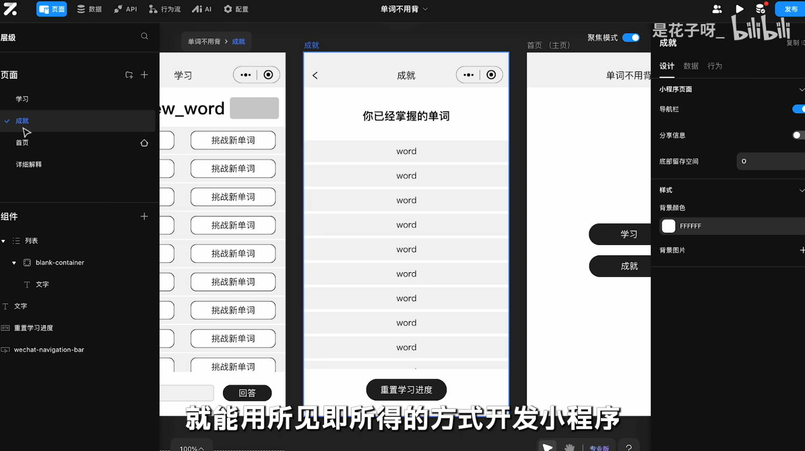
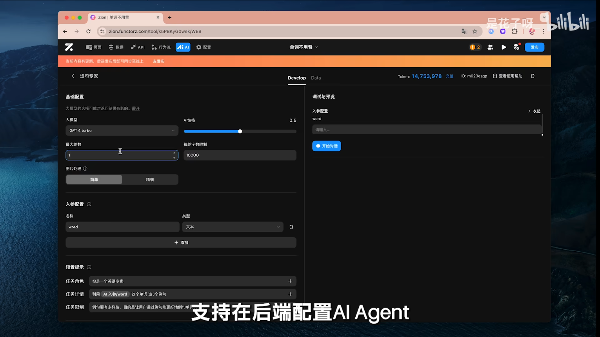
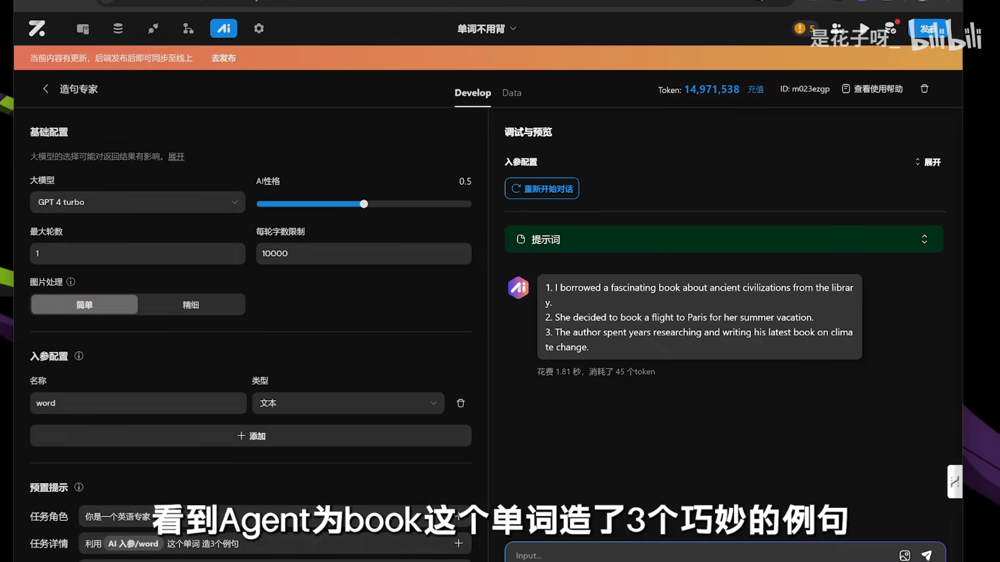
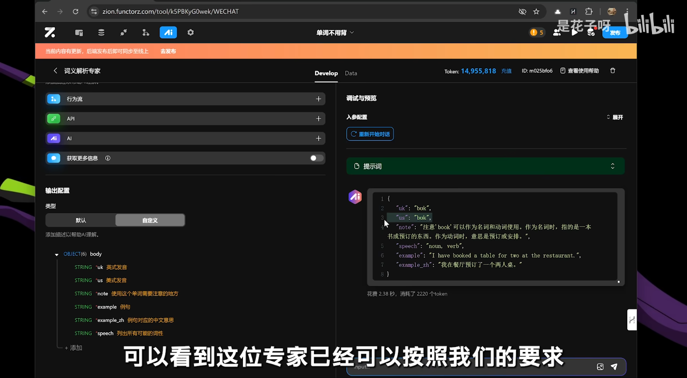

# AISpeak

## 背景介绍

### 需求分析

- 市场调研

  背单词在英语学习上很重要

  市面上的背单词软件：选择题、填空题 (传统编程思维限制)

  反思关键：学习的痛感

- 设计对比

  传统背单词：选择填空死记硬背、学生会就会不会就瞎猜

  AI背单词：耐心聊天循循善诱、引导学生理解和记忆 
  
- 起名字

  爱 ~ ai

  爱背单词 (*单词*)

  爱说话 (*句子*)

  


### 项目规划

### 技术选型 ✔

- 前端

- 后端

  AI Agent 专一任务 工具集

- 部署


---

- 低代码

  Zion (配置和拖拽流程图 所见即所得 + GPT Agent)

  

  

  


### 业务流程

### 功能梳理

- 功能设计

  背单词：和AI英语老师聊天 (不是选择题填空题死记硬背)

  判断是否掌握某单词：AI根据实际表现评估 (不是用刻板题目考察)

  语音聊天

- 模块设计

  学习和测试融合：每次抽取一个单词测试 (利用碎片时间)

  个人模块：成就(背诵进度 已经掌握单词)、词库(选择词库)、AI学习建议

- 数据模型

  单词会话列表

  单词消息列表

  单词本列表

  单词列表

  单词本

  账户 (当前正在学习的单词本)

  学习进度 (账户ID 单词ID)

  一个单词的属性 (掌握程度 更新时间)

  


---

- Agent

  英语老师：负责整体的教学互动，根据学生情况灵活调整教学策略

  造句专家助教：为指定单词创造生动有趣的例句

  词义解析助教：对特定单词进行深入解释

  ```bash
  # #################################################
  # Agent1 造句专家
  # #################################################
  # 基础配置
  大模型：GPT4-turbo
  AI性格：0.5 (温度Temperature 创造性top_k)
  最大轮数：1
  每轮字数限制：10000
  图片处理：简单 or 精细
  
  # 入参配置 (变量名 类型)
  word text
  
  # 预制提示
  任务角色：你是一个英语专家
  任务详情：利用`AI入参/word`这个单词造3个例句
  任务限制：例句要有多样性，目的是让用户通过例句能更好地理解单词的意思
  
  # 知识库 (本地数据 第三方API)
  #
  
  # 工具 (行为流 API AI)
  #
  
  # 输出配置 (默认长文本可自定义格式 流式输出)
  json
  {
    example1: "string",
    example2: "string",
    example3: "string",
  }
  
  
  # #################################################
  # Agent1 调试
  # #################################################
  # 输入
  book
  
  # 提示词
  ###ROLE###
  You are 你是一个英语专家
  ###GOALS###
  利用book这个单词 造3个句子
  ###ROLE###
  例句要有多样性，目的是让用户通过例句能更好地理解单词的意思
  
  # 输出 (花费时间 消耗token)
  #
  
  
  # #################################################
  # Agent2 词义解析
  # #################################################
  # 基础配置
  大模型：GPT4-turbo
  AI性格：0.5 (温度Temperature 创造性top_k)
  最大轮数：1
  每轮字数限制：10000
  图片处理：简单 or 精细
  
  # 入参配置 (变量名 类型)
  word text
  
  # 预制提示
  任务角色：你是专业的英语词典专家，你能准确地对单词进行解释
  任务详情：根据用户输出的单词`AI入参/word`对这个单词进行详细解释。包括英式音标、美式音标，词义(可能有多个)、词性、例句，还有这个单词需要注意的地方
  任务限制：目的是让用户通过解释能更好地理解单词的意思
  
  # 知识库 (本地数据 第三方API)
  #
  
  # 工具 (行为流 API AI)
  #
  
  # 输出配置 (默认长文本可自定义格式 流式输出)
  json
  {
    uk: "string",
    us: "string",
    note: "string",
    example: "string",
    example_zh: "string",
    speech: "string"
  }
  
  
  # #################################################
  # Agent2 调试
  # #################################################
  # 输入
  book
  
  # 提示词
  #
  
  # 输出 (花费时间 消耗token)
  # 
  
  
  # #################################################
  # Agent3 英语老师
  # #################################################
  # 基础配置
  大模型：GPT4-turbo
  AI性格：0.5 (温度Temperature 创造性top_k)
  最大轮数：10
  每轮字数限制：10000
  图片处理：简单 or 精细
  
  # 入参配置 (变量名 类型)
  word text
  answer text
  
  # 预制提示
  任务角色：你是个非常有教学经验，循循善诱的英语老师
  任务详情：利用你的专业引导用户掌握`AI入参/word`这个单词。当你询问用户`AI入参/word`这个单词的意思时，用户的回答是`AI入参/answer`。请你点评用户的答案，当用户回答不正确或用户需要提示时，可以给点小提示。但注意不要直接给出答案。如果用户回答正确，可以幽默风趣地夸夸用户！
  任务限制：点评控制在3句话之内
  
  # 知识库 (本地数据 第三方API)
  #
  
  # 工具 (行为流 API AI) ✔
  造句专家：输入一个单词，获取单词对应的例句
  
  # 输出配置 (默认长文本可自定义格式 流式输出)
  json
  {
    comment: "string",
    correct: "boolean"
  }
  
  
  # #################################################
  # Agent3 调试
  # #################################################
  # 输入
  dog
  猫
  
  # 提示词
  #
  
  # 输出 (花费时间 消耗token)
  # 
  
  
  ```

  

  

  


### 架构设计 ✔


## 页面设计 ✔

### 页面 X

### 页面 X


## 库表设计 ✔

### model X

### model X


## 接口数据 ✔

### Interface X

### Interface X


## 前端初始化

### 新建项目

### 依赖配置

### 路由配置


## 后端初始化

### 新建项目

### 依赖配置


## 前端页面 XXX

### 页面和布局

### 组件 X

### 组件 X

### 前端请求


## 后端接口 XXX

### 逻辑梳理

### 代码生成 MyBatisX


### 数据库访问层 (mapper) ✔

### 业务逻辑层 (service) ✔

### 接口访问层 (controller) ✔


### 数据模型 (model)

### 自定义异常

### 测试接口


## 项目部署


