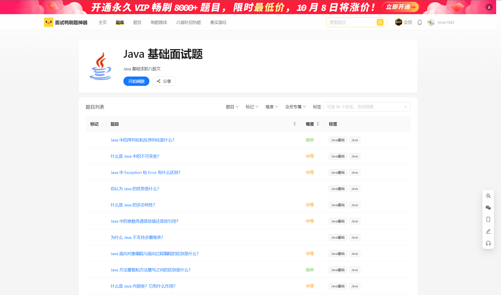

# Offer Machine

- Reference

  [mianshiya.com](https://www.mianshiya.com/) 

  [mainshiya github](https://github.com/liyupi/mianshiya-next)

  


## 背景介绍

### 需求分析

- 基础需求

  管理员：创建题库、题目、题解

  用户：注册登陆、分词检索题目、在线刷题、查看刷题记录日历图

- 延展需求

  性能：**数据库连接池**、**HotKey热点探测**、**缓存和高级数据结构**

  安全：*流量控制和熔断*、*动态IP黑白名单过滤*、*同端登陆冲突检测*、*分级反爬虫策略*

  


### 项目规划

- 三大阶段

  第一阶段：基础刷题平台 (熟悉项目开发流程 + Next.js服务端渲染 + springboot应用快速开发)

  第二阶段：真实业务场景 (Redis**缓存和高级数据结构** + ElasticSearch**搜索引擎** + Druid**连接池和并发编程** + **HotKey热点探测**)

  第三阶段：优化安全性 (Sentinel*网站流量控制和熔断* + Nacos*动态IP黑白名单* + Sa-Token*同端登陆冲突检测* + Redis*分级反爬虫策略*)

  


### 技术选型 ✔

- 前端

  Nodejs18.18 + React18 + Next.js服务端渲染 + Redux状态管理

  Ant Design组件库 + RTE组件

  ESLint + Prettier + TypeScript 前端工程化

  OpenAPI前端代码生成

- 后端

  JDK(11 17) + SpringBoot + Maven多模块构建

  Mysql + MyBatisPlus + MyBatisX

  Redis分布式缓存 + Caffeine本地缓存

  Redission分布式锁 + BitMap + BloomFilter

  ElasticSearch搜索引擎

  Druid数据库连接池 + 并发编程

  Sa-Token权限控制

  HotKey热点探测

  Sentinel流量控制

  Nacos配置中心

- 优化

  性能、安全、可用

  


### 业务流程 

- 核心流程

  管理员：创建题库、题目、题解

  用户：注册登陆、分词检索题目、在线刷题、查看刷题记录日历图
  
  
  
  


### 功能梳理

- 基础功能

  用户模块：用户注册、用户登陆(账号密码)、管理用户(管理员 CRUD)

  题库模块：题库列表、题库详情(很多题目)、管理题库(管理员 CRUD)

  题目模块：题目搜索、题目详情(刷题页面)、管理题目(管理员 CRUD 按照题库查询题目 修改题目所属题库)

- 扩展功能

  题目批量管理 (管理员 向题库添加题目 从题库移除题目 删除题目)

  分词题目搜索

  用户刷题记录日历图

  自动缓存热门题目

  网站流量控制和熔断

  动态IP黑马名单过滤

  同端登陆冲突检测

  分级题目反爬策略

  


### 架构设计 ✔

- Architecture

  

  


## 页面设计 ✔

### 首页PC

- 首页

  

  

  


### 题库页面

- 题库列表

  
  
- 题库详情

  


### 题目页面

- 题目列表(搜索页)

  
  
- 题目详情

  

- 题目创建页

  

  


### 真题模拟题

- 真题

  

- 模拟题

  

  


### 题目管理

- 题目管理(批量操作)

  


### 个人页面

- 个人

  

- 会员

  

- 消息

  

  


## 库表设计 ✔

- 汇总

  表结构

  ```sql
  # 数据库初始化
  -- create database if not exists offer_machine;
  -- use offer_machine;
  
  
  -- 用户表
  create table if not exists user
  (
      id           bigint auto_increment comment 'id' primary key,
      userAccount  varchar(256)                           not null comment '账号',
      userPassword varchar(512)                           not null comment '密码',
      unionId      varchar(256)                           null comment '微信开放平台id',
      mpOpenId     varchar(256)                           null comment '公众号openId',
      userName     varchar(256)                           null comment '用户昵称',
      userAvatar   varchar(1024)                          null comment '用户头像',
      userProfile  varchar(512)                           null comment '用户简介',
      userRole     varchar(256) default 'user'            not null comment '用户角色：user/admin/ban',
      editTime     datetime     default CURRENT_TIMESTAMP not null comment '编辑时间',
      createTime   datetime     default CURRENT_TIMESTAMP not null comment '创建时间',
      updateTime   datetime     default CURRENT_TIMESTAMP not null on update CURRENT_TIMESTAMP comment '更新时间',
      isDelete     tinyint      default 0                 not null comment '是否删除',
      index idx_unionId (unionId)
  ) comment '用户' collate = utf8mb4_unicode_ci;
  
  -- 题库表
  create table if not exists question_bank
  (
      id          bigint auto_increment comment 'id' primary key,
      title       varchar(256)                       null comment '标题',
      description text                               null comment '描述',
      picture     varchar(2048)                      null comment '图片',
      userId      bigint                             not null comment '创建用户 id',
      editTime    datetime default CURRENT_TIMESTAMP not null comment '编辑时间',
      createTime  datetime default CURRENT_TIMESTAMP not null comment '创建时间',
      updateTime  datetime default CURRENT_TIMESTAMP not null on update CURRENT_TIMESTAMP comment '更新时间',
      isDelete    tinyint  default 0                 not null comment '是否删除',
      index idx_title (title)
  ) comment '题库' collate = utf8mb4_unicode_ci;
  
  -- 题目表
  create table if not exists question
  (
      id         bigint auto_increment comment 'id' primary key,
      title      varchar(256)                       null comment '标题',
      content    text                               null comment '内容',
      tags       varchar(1024)                      null comment '标签列表（json 数组）',
      answer     text                               null comment '推荐答案',
      userId     bigint                             not null comment '创建用户 id',
      editTime   datetime default CURRENT_TIMESTAMP not null comment '编辑时间',
      createTime datetime default CURRENT_TIMESTAMP not null comment '创建时间',
      updateTime datetime default CURRENT_TIMESTAMP not null on update CURRENT_TIMESTAMP comment '更新时间',
      isDelete   tinyint  default 0                 not null comment '是否删除',
      index idx_title (title),
      index idx_userId (userId)
  ) comment '题目' collate = utf8mb4_unicode_ci;
  
  -- 题库题目表（硬删除）
  create table if not exists question_bank_question
  (
      id             bigint auto_increment comment 'id' primary key,
      questionBankId bigint                             not null comment '题库 id',
      questionId     bigint                             not null comment '题目 id',
      userId         bigint                             not null comment '创建用户 id',
      createTime     datetime default CURRENT_TIMESTAMP not null comment '创建时间',
      updateTime     datetime default CURRENT_TIMESTAMP not null on update CURRENT_TIMESTAMP comment '更新时间',
      UNIQUE (questionBankId, questionId)
  ) comment '题库题目' collate = utf8mb4_unicode_ci;
  ```
  
  初始化数据
  
  ```sql
  # 初始数据
  -- use mianshiya;
  
  -- 用户表初始数据（密码是 12345678）
  INSERT INTO user (id, userAccount, userPassword, unionId, mpOpenId, userName, userAvatar, userProfile, userRole)
  VALUES (1, 'user1', 'b0dd3697a192885d7c055db46155b26a', 'unionId1', 'mpOpenId1', 'user1',
          'https://www.code-nav.cn/logo.png', '喜欢编程的小白', 'user'),
         (2, 'user2', 'b0dd3697a192885d7c055db46155b26a', 'unionId2', 'mpOpenId2', 'user2',
          'https://www.code-nav.cn/logo.png', '全栈开发工程师', 'user'),
         (3, 'user3', 'b0dd3697a192885d7c055db46155b26a', 'unionId3', 'mpOpenId3', 'user3',
          'https://www.code-nav.cn/logo.png', '前端爱好者', 'user'),
         (4, 'user4', 'b0dd3697a192885d7c055db46155b26a', 'unionId4', 'mpOpenId4', 'user4',
          'https://www.code-nav.cn/logo.png', '后端开发工程师', 'user'),
         (5, 'yupi', 'b0dd3697a192885d7c055db46155b26a', NULL, NULL, '程序员鱼皮', 'https://www.code-nav.cn/logo.png',
          '系统管理员', 'admin');
  
  -- 题库表初始数据
  INSERT INTO question_bank (title, description, picture, userId)
  VALUES ('JavaScript 基础', '包含 JavaScript 的基础知识题目',
          'https://pic.code-nav.cn/mianshiya/question_bank_picture/1777886594896760834/JldkWf9w_JavaScript.png', 1),
         ('CSS 样式', '包含 CSS 相关的样式问题',
          'https://pic.code-nav.cn/mianshiya/question_bank_picture/1777886594896760834/QatnFmEN_CSS.png', 2),
         ('HTML 基础', 'HTML 标记语言的基本知识', 'https://www.mianshiya.com/logo.png', 3),
         ('前端框架', 'React, Vue, Angular 等框架相关的题目', 'https://www.mianshiya.com/logo.png', 1),
         ('算法与数据结构', '数据结构和算法题目', 'https://www.mianshiya.com/logo.png', 2),
         ('数据库原理', 'SQL 语句和数据库设计', 'https://www.mianshiya.com/logo.png', 3),
         ('操作系统', '操作系统的基本概念', 'https://www.mianshiya.com/logo.png', 1),
         ('网络协议', 'HTTP, TCP/IP 等网络协议题目', 'https://www.mianshiya.com/logo.png', 2),
         ('设计模式', '常见设计模式及其应用', 'https://www.mianshiya.com/logo.png', 3),
         ('编程语言概述', '多种编程语言的基础知识', 'https://www.mianshiya.com/logo.png', 1),
         ('版本控制', 'Git 和 SVN 的使用', 'https://www.mianshiya.com/logo.png', 2),
         ('安全与加密', '网络安全和加密技术', 'https://www.mianshiya.com/logo.png', 3),
         ('云计算', '云服务和架构', 'https://www.mianshiya.com/logo.png', 1),
         ('微服务架构', '微服务的设计与实现', 'https://www.mianshiya.com/logo.png', 2),
         ('容器技术', 'Docker 和 Kubernetes 相关知识', 'https://www.mianshiya.com/logo.png', 3),
         ('DevOps 实践', '持续集成与持续交付', 'https://www.mianshiya.com/logo.png', 1),
         ('数据分析', '数据分析和可视化', 'https://www.mianshiya.com/logo.png', 2),
         ('人工智能', '机器学习与深度学习基础', 'https://www.mianshiya.com/logo.png', 3),
         ('区块链技术', '区块链的基本原理和应用', 'https://www.mianshiya.com/logo.png', 1),
         ('项目管理', '软件开发项目的管理和执行', 'https://www.mianshiya.com/logo.png', 2);
  
  -- 题目表初始数据
  INSERT INTO question (title, content, tags, answer, userId)
  VALUES ('JavaScript 变量提升', '请解释 JavaScript 中的变量提升现象。', '["JavaScript", "基础"]',
          '变量提升是指在 JavaScript 中，变量声明会被提升到作用域的顶部。', 1),
         ('CSS Flexbox 布局', '如何使用 CSS 实现一个水平居中的盒子？', '["CSS", "布局"]',
          '可以使用 Flexbox 布局，通过设置父容器 display 为 flex，并使用 justify-content: center; 对齐子元素。', 2),
         ('HTML 中的语义化', '什么是 HTML 的语义化？为什么重要？', '["HTML", "语义化"]',
          'HTML 语义化是使用正确的标签来描述内容的意义，能够提高可访问性和 SEO 效果。', 3),
         ('React 中的状态管理', '如何在 React 中管理组件状态？', '["React", "状态管理"]',
          '可以使用 React 的 useState 或 useReducer 钩子来管理组件状态，或使用 Redux 进行全局状态管理。', 1),
         ('算法：二分查找', '请实现一个二分查找算法。', '["算法", "数据结构"]',
          '二分查找是一种在有序数组中查找特定元素的算法，通过不断折半的方式缩小查找范围。', 2),
         ('数据库索引的作用', '什么是数据库索引？它的作用是什么？', '["数据库", "索引"]',
          '数据库索引是用于加快查询速度的数据结构，它通过优化查找路径减少查询时间。', 3),
         ('HTTP 与 HTTPS 的区别', '请解释 HTTP 和 HTTPS 之间的主要区别。', '["网络", "协议"]',
          'HTTPS 是加密的 HTTP，通过 SSL/TLS 提供更安全的数据传输。', 1),
         ('设计模式：单例模式', '请解释单例模式的实现及应用场景。', '["设计模式", "单例"]',
          '单例模式确保一个类只有一个实例，并提供全局访问点。常用于配置类等只需一个实例的场景。', 2),
         ('Git 中的分支管理', '如何在 Git 中管理分支？', '["版本控制", "Git"]',
          'Git 中通过 branch 命令创建分支，使用 checkout 切换分支，使用 merge 合并分支。', 3),
         ('Docker 的基本命令', '列举并解释几个常用的 Docker 命令。', '["容器技术", "Docker"]',
          '常用命令包括 docker run, docker build, docker ps, docker stop 等。', 1),
         ('前端性能优化', '列举几个前端性能优化的手段。', '["前端", "性能优化"]',
          '包括代码分割、资源压缩、缓存策略、懒加载等。', 2),
         ('JavaScript 闭包的应用', '什么是闭包？举例说明闭包的实际应用。', '["JavaScript", "高级"]',
          '闭包是指函数能够记住创建时的上下文环境，常用于数据隐藏和模块化编程。', 3),
         ('数据库事务的特性', '请解释数据库事务的 ACID 特性。', '["数据库", "事务"]',
          'ACID 代表原子性、一致性、隔离性和持久性，是事务处理的四大特性。', 1),
         ('CSS 的 BEM 命名规范', '什么是 BEM？如何使用 BEM 进行 CSS 命名？', '["CSS", "命名规范"]',
          'BEM 代表块（Block）、元素（Element）和修饰符（Modifier），是一种 CSS 命名规范。', 2),
         ('JavaScript 原型链', '请解释 JavaScript 中的原型链机制。', '["JavaScript", "原型链"]',
          '原型链是 JavaScript 实现继承的机制，对象通过原型链可以继承其他对象的属性和方法。', 3),
         ('React 生命周期', '请说明 React 组件的生命周期方法。', '["React", "生命周期"]',
          'React 组件的生命周期包括初始化、更新和卸载三个阶段，各阶段有不同的生命周期方法。', 1),
         ('HTTP 状态码 404 与 500 的区别', '请解释 HTTP 状态码 404 和 500 的含义。', '["网络", "HTTP"]',
          '404 表示未找到资源，500 表示服务器内部错误。', 2),
         ('Python 与 Java 的区别', '比较 Python 和 Java 的主要区别。', '["编程语言", "Python", "Java"]',
          'Python 是动态类型语言，语法简洁，而 Java 是静态类型语言，注重严谨性和性能。', 3),
         ('Vue 的双向数据绑定', '请解释 Vue.js 是如何实现双向数据绑定的。', '["Vue", "数据绑定"]',
          'Vue.js 通过数据劫持和发布-订阅模式实现了双向数据绑定。', 1),
         ('前端工程化的意义', '为什么需要前端工程化？', '["前端", "工程化"]',
          '前端工程化能够提高开发效率、代码质量和可维护性，规范开发流程。', 2);
  
  -- 题库题目关联初始数据
  INSERT INTO question_bank_question (questionBankId, questionId, userId)
  VALUES (1, 1, 1),
         (1, 2, 1),
         (1, 3, 1),
         (1, 4, 1),
         (1, 5, 1),
         (1, 6, 1),
         (1, 7, 1),
         (1, 8, 1),
         (1, 9, 1),
         (1, 10, 1),
         (2, 2, 2),
         (2, 14, 2),
         (3, 3, 3),
         (3, 13, 3),
         (4, 4, 1),
         (4, 16, 1),
         (5, 5, 2),
         (5, 18, 2),
         (6, 6, 3),
         (6, 19, 3),
         (7, 7, 1),
         (7, 11, 1),
         (8, 8, 2),
         (8, 10, 2),
         (9, 9, 3),
         (9, 17, 3),
         (10, 12, 1),
         (10, 20, 1);
  ```
  
  post_es_mapping.json
  
  ```json
  {
    "aliases": {
      "question": {}
    },
    "mappings": {
      "properties": {
        "title": {
          "type": "text",
          "analyzer": "ik_max_word",
          "search_analyzer": "ik_smart",
          "fields": {
            "keyword": {
              "type": "keyword",
              "ignore_above": 256
            }
          }
        },
        "content": {
          "type": "text",
          "analyzer": "ik_max_word",
          "search_analyzer": "ik_smart"
        },
        "tags": {
          "type": "keyword"
        },
        "answer": {
          "type": "text",
          "analyzer": "ik_max_word",
          "search_analyzer": "ik_smart"
        },
        "userId": {
          "type": "long"
        },
        "editTime": {
          "type": "date",
          "format": "yyyy-MM-dd HH:mm:ss"
        },
        "createTime": {
          "type": "date",
          "format": "yyyy-MM-dd HH:mm:ss"
        },
        "updateTime": {
          "type": "date",
          "format": "yyyy-MM-dd HH:mm:ss"
        },
        "isDelete": {
          "type": "keyword"
        }
      }
    }
  }
  ```
  
  


### model 用户

- user

  ```sql
  -- 用户表
  create table if not exists user
  (
      id           bigint auto_increment comment 'id' primary key,
      userAccount  varchar(256)                           not null comment '账号',
      userPassword varchar(512)                           not null comment '密码',
      unionId      varchar(256)                           null comment '微信开放平台id',
      mpOpenId     varchar(256)                           null comment '公众号openId',
      userName     varchar(256)                           null comment '用户昵称',
      userAvatar   varchar(1024)                          null comment '用户头像',
      userProfile  varchar(512)                           null comment '用户简介',
      userRole     varchar(256) default 'user'            not null comment '用户角色：user/admin/ban',
      editTime     datetime     default CURRENT_TIMESTAMP not null comment '编辑时间',
      createTime   datetime     default CURRENT_TIMESTAMP not null comment '创建时间',
      updateTime   datetime     default CURRENT_TIMESTAMP not null on update CURRENT_TIMESTAMP comment '更新时间',
      isDelete     tinyint      default 0                 not null comment '是否删除',
      index idx_unionId (unionId)
  ) comment '用户' collate = utf8mb4_unicode_ci;
  ```

  


#### 加索引

- 给谁加索引？

  区分度高的

  经常作为查询条件的

  


### model 题库

- question_bank

  ```
  
  ```

  


## 接口数据 ✔


## 前端初始化

### 新建项目

### 路由配置


## 前端页面 XXX


