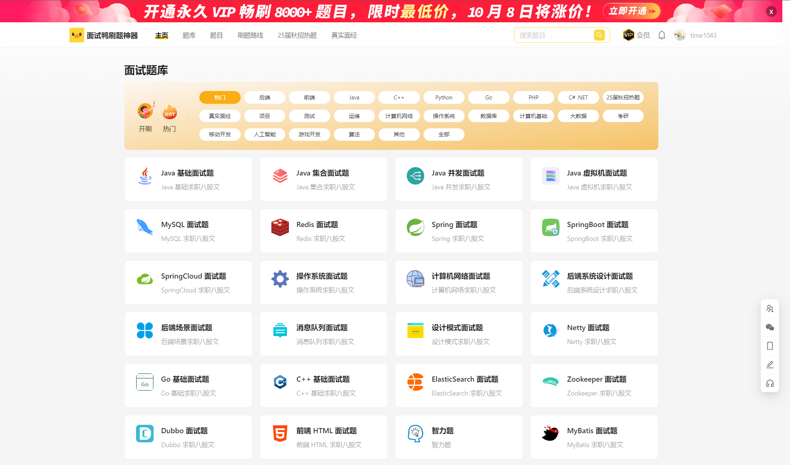

# Offer Machine

- Reference

  [mianshiya.com](https://www.mianshiya.com/) 

  [mainshiya github](https://github.com/liyupi/mianshiya-next)

  

## 背景介绍

### 需求分析

- 基础需求

  管理员：创建题库、题目、题解

  用户：注册登陆、分词检索题目、在线刷题、查看刷题记录日历图

- 延展需求

  性能：**数据库连接池**、**HotKey热点探测**、**缓存和高级数据结构**

  安全：*流量控制和熔断*、*动态IP黑白名单过滤*、*同端登陆冲突检测*、*分级反爬虫策略*

  

### 项目规划

- 三大阶段

  第一阶段：基础刷题平台 (熟悉项目开发流程 + Next.js服务端渲染 + springboot应用快速开发)

  第二阶段：真实业务场景 (Redis**缓存和高级数据结构** + ElasticSearch**搜索引擎** + Druid**连接池和并发编程** + **HotKey热点探测**)

  第三阶段：优化安全性 (Sentinel*网站流量控制和熔断* + Nacos*动态IP黑白名单* + Sa-Token*同端登陆冲突检测* + Redis*分级反爬虫策略*)

  

### 技术选型 ✔

- 前端

  Nodejs18.18 + React18 + Next.js服务端渲染 + Redux状态管理

  Ant Design组件库 + RTE组件

  ESLint + Prettier + TypeScript 前端工程化

  OpenAPI前端代码生成

- 后端

  JDK(11 17) + SpringBoot + Maven多模块构建

  Mysql + MyBatisPlus + MyBatisX

  Redis分布式缓存 + Caffeine本地缓存

  Redission分布式锁 + BitMap + BloomFilter

  ElasticSearch搜索引擎

  Druid数据库连接池 + 并发编程

  Sa-Token权限控制

  HotKey热点探测

  Sentinel流量控制

  Nacos配置中心

- 优化

  性能、安全、可用

  

### 业务流程 

- 核心流程

  

  

### 功能梳理

- 基础功能

  用户模块：用户注册、用户登陆(账号密码)、管理用户(管理员 CRUD)

  题库模块：题库列表、题库详情(很多题目)、管理题库(管理员 CRUD)

  题目模块：题目搜索、题目详情(刷题页面)、管理题目(管理员 CRUD 按照题库查询题目 修改题目所属题库)

- 扩展功能

  题目批量管理 (管理员 向题库添加题目 从题库移除题目 删除题目)

  分词题目搜索

  用户刷题记录日历图

  自动缓存热门题目

  网站流量控制和熔断

  动态IP黑马名单过滤

  同端登陆冲突检测

  分级题目反爬策略

  

### 架构设计 ✔

- Architecture

  

  

## 页面设计 ✔

### PC首页

- 首页

  

  

  

## 库表设计 ✔

## 接口数据 ✔

## 前端初始化

### 新建项目

### 路由配置

## 前端页面 XXX

