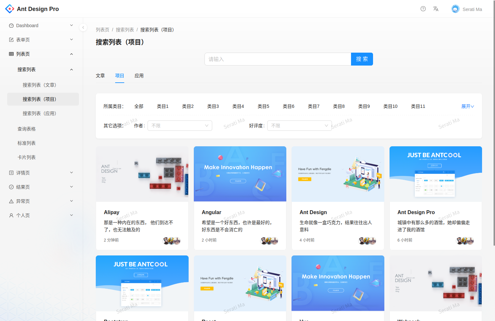
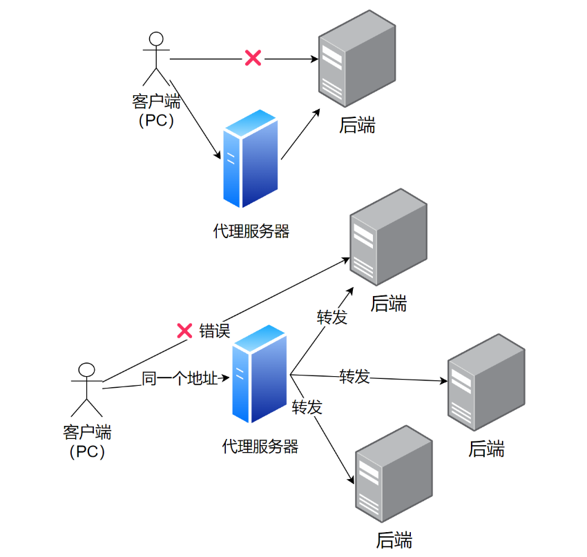

# User Center

[TOC]


---

- 鱼皮项目

  1. 用户中心：学完框架新手入门、完整项目开发流程、管理系统CRUD
  2. 伙伴匹配系统：Redis、事务、并非编程、大数据推荐思想
  3. API开放平台：模板封装、架构设计、sdk开发、API签名认证、Dubbo RPC、Gateway微服务网关
  3. RPC框架：轮子开发、网络协议设计、序列化、Etcd注册中心、Vert.x服务器、动态代理、SPI机制、负载均衡、服务重试容错机制、注解驱动启动器
  4. 聚合搜索平台：实践爬虫、ElasticStack、设计模式、数据同步、JMeter压力测试
  5. 智能BI项目：异步化、线程池、RabbitMQ、AIGC prompt
  6. OJ在线判题系统：模板封装、多种设计模式、单体项目微服务改造、Linux远程开发、Docker代码沙箱、Java安全控制
  7. 代码生成器共享平台：命令行开发、模板引擎、Vert.x、设计模式、对象存储、性能优化、存储优化、系统设计、分布式任务调度系统
  8. AI答题应用平台：React跨端小程序、后端分库分表、分布式锁、缓存、幂等设计、设计模式、RxJava响应式编程、SSE实时推送、线程池隔离

- 企业项目流程

  需求分析 -> 概要设计详细设计 -> 技术选型 

  -> 初始化/引入需要的技术 -> 写demo -> 写代码实现业务逻辑 (优化代码：复用代码、提取公共逻辑、提取常量)

  -> 单元测试 -> 代码提交代码评审 -> 部署发布

- IDEA 插件

  `MyBatis-X`

  `generate all setter`, `auto filling java call arguments`


## 背景介绍

- Reference code

  [user-center-backend-public (github)](https://github.com/liyupi/user-center-backend-public), 

- Reference dev

  [nodejs org](https://nodejs.org/en), [nodejs LTS (cn)](https://nodejs.cn/#google_vignette); 

  [Ant Design Pro (docs)](https://pro.ant.design/zh-CN/docs/getting-started), [Ant Design Pro (dashboard)](https://preview.pro.ant.design/dashboard/analysis); 
  
  [umi docs](https://umijs.org/docs/guides/getting-started), 
  
  [mybatisplus docs](https://baomidou.com/pages/226c21/), 
  
- Reference blog

  [多环境设计](https://blog.csdn.net/weixin_41701290/article/details/120173283)

  [如何部署网站？来比比谁的方法多](https://www.bilibili.com/read/cv16179200/)

  


### 需求分析

- 市场应用：微信、支付宝账号登录多个平台

- 用户体系：登录注册、用户管理(仅管理员可见)、用户校验(仅星球用户)

  **登录注册**：对用户的增加查询

  **用户管理**：对用户的查询修改 (管理员)

  **用户校验**：合法性 (爬虫、excel处理、定时任务)

  


### 项目规划

- 开发流程

  初始化项目：

  - 前端初始化：初始化、引入一些组件、框架介绍、项目瘦身
  - 后端初始化：准备环境(mysql)、引入框架整合框架

  **登陆注册**：前端、后端

  - 后端：注册和登录、service controller和接口测试
  - 前端：个性化、删代码；对接后端接口、获取用户的登录态
  - 注销功能

  **用户管理**：前端、后端

  - 后端：用户管理接口 (用户查询 状态更改)
  - 前端：开发；前端代码瘦身
  - 优化：注册失败返回-1不友好

  **校验用户**：星球用户


### 技术选型 ✔

- 前端

  HTML + CSS + JavaScript 

  Nodejs18.18 + React框架

  Ant Design Pro项目模板 + Ant Design组件库

  Umi框架 + Umi Request请求库

  正向和反向代理

- 后端

  JDK8

  Spring + SpringMVC + SpringBoot

  MyBatis + MyBatisPlus 数据库访问框架

  MySQL数据库

  jUnit单元测试库

- 部署

  服务器：Linux单机部署 + Nginx web服务器

  容器平台：Docker容器 + 容器托管平台

  绑定域名
  
  


---

- Spring

  `Spring`：依赖注入框架、帮你管理java对象、集成一些内容

  `SpringMVC`：web框架、提供接口访问、restful接口等能力

  `MyBatisPlus`：操作数据库、持久层框架、再封装即不用写sql

  `SpringBoot`：不用自己管理spring配置、不用自己整合各种框架、快速启动快速集成项目 ✔

- Ant Design

  `Ant Design`: 组件库 (封装了react)

  [`Ant Design Procomponents`](https://procomponents.ant.design/components/form): 面向业务 定制化 (封装了ant design)

  `Ant Design Pro`: 后台管理系统 (由ant design、react、ant design procomponents及其他库组成)
  
  
  
  


### 业务流程

### 功能梳理

### 架构设计 ✔


## 页面设计 ✔

### 登陆注册

### 用户管理


## 库表设计 ✔

- 库表设计

  有哪些表(model)？表中有哪些字段？字段的类型？

  数据库字段添加索引？表与表之间的关联？

  


### 用户

- user

  id(主键)、userAccount、username、avatarUrl、gender、userPassword、phone、email、userStatus；

  createTime、updateTime、isDelete；

  ```sql
  # drop database user_center;
  # create database user_center;
  # use user_center;
  
  -- 用户表
  drop table if exists user;
  create table user
  (
      id           bigint auto_increment primary key comment '唯一ID',
      username     varchar(255) comment '用户名',
      userAccount  varchar(255) comment '登录账号',
      avatarUrl    varchar(1024) comment '用户头像URL',
      gender       tinyint comment '用户性别',
      userPassword varchar(512) not null comment '用户密码',
      phone        varchar(128) comment '用户电话号码',
      email        varchar(512) comment '用户电子邮件',
      userStatus   int       default 0 comment '用户状态0为正常',
      -- 三项
      createTime   timestamp default current_timestamp comment '创建时间',
      updateTime   timestamp default current_timestamp on update current_timestamp comment '更新时间',
      isDelete     tinyint   default 0 comment '逻辑删除标志',
      -- 补充
      userRole     int       default 0 comment '用户角色 0是普通用户 1是管理员',
      planetCode   varchar(512) null comment '星球编号'
  ) comment '用户';
  
  insert into user (username, useraccount, avatarurl, gender, userpassword, phone, email, userstatus,
                    createtime, updatetime, isdelete,
                    userrole, planetCode)
  values ('oswin', 'oswin501',
          'https://miro.medium.com/v2/resize:fit:640/format:webp/1*4j2A9niz0eq-mRaCPUffpg.png', 1,
          'c9d21e89dc04f9f2b446b4fbdafdf4b8',
          '15534340089', 'oswin501@gmail.com', 0,
          current_timestamp, current_timestamp, 0,
          1, 'nn00000001'),
         ('yupi', 'yupi501',
          'https://miro.medium.com/v2/resize:fit:640/format:webp/0*1Og_hmJWdlMiDWuB.png', 1,
          'c9d21e89dc04f9f2b446b4fbdafdf4b8',
          '15534340089', 'yupi501@gmail.com', 0,
          current_timestamp, current_timestamp, 0,
          0, 'nn00000002'),
         ('yupi2', 'yupi502',
          'https://miro.medium.com/v2/resize:fit:640/format:webp/0*1Og_hmJWdlMiDWuB.png', 1,
          'c9d21e89dc04f9f2b446b4fbdafdf4b8',
          '15534340089', 'yupi501@gmail.com', 0,
          current_timestamp, current_timestamp, 1,
          0, 'nn00000003'),
         ('yupi3', 'yupi503',
          'https://miro.medium.com/v2/resize:fit:640/format:webp/0*1Og_hmJWdlMiDWuB.png', 1,
          'c9d21e89dc04f9f2b446b4fbdafdf4b8',
          '15534340089', 'yupi501@gmail.com', 1,
          current_timestamp, current_timestamp, 0,
          0, 'nn00000004');
  
  ```
  
  


## 接口数据 ✔

### 用户模块

- 注册登陆

  ```bash
  # #################################################
  # /user/register (POST,body-json)
  # #################################################
  
  # request
  {
      "userAccount": "lisi501",
      "userPassword": "lisi123456",
      "checkPassword": "lisi123456"
  }
  
  # response
  3
  
  # #################################################
  # /user/login (POST,body-json)
  # #################################################
  
  # request
  {
    "userPassword": "12345678"
  }
  
  # response
  {
      "id": 2,
      "username": "yupi",
      "userAccount": "yupi501",
      "avatarUrl": "https://pic6.sucaisucai.com/01/88/01388996_2.jpg",
      "gender": 1,
      "userPassword": null,
      "phone": "15534340089",
      "email": "yupi501@gmail.com",
      "userStatus": 0,
      "createTime": "2024-08-25T11:56:41.000+00:00",
      "updateTime": null,
      "isDelete": null,
      "userRole": 0
  }
  
  
  # #################################################
  # /user/current (GET)
  # #################################################
  
  # request (cookies)
  JSESSIONID=438C760521E1CB7B427BE40E151C8365
  
  # response
  {
      "id": 1,
      "username": "oswin",
      "userAccount": "oswin501",
      "avatarUrl": "https://miro.medium.com/v2/resize:fit:640/format:webp/1*4j2A9niz0eq-mRaCPUffpg.png",
      "gender": 1,
      "userPassword": null,
      "phone": "15534340089",
      "email": "oswin501@gmail.com",
      "userStatus": 0,
      "createTime": "2024-08-25T11:56:41.000+00:00",
      "updateTime": null,
      "isDelete": null,
      "userRole": 1
  }
  
  ```
  
- 用户管理

  ```bash
  # #################################################
  # /user/search (GET,admin)
  # #################################################
  
  # request 
  username=yupi
  # request (cookies)
  JSESSIONID=438C760521E1CB7B427BE40E151C8365
  
  # response
  [
      {
          "id": 2,
          "username": "yupi",
          "userAccount": "yupi501",
          "avatarUrl": "https://pic6.sucaisucai.com/01/88/01388996_2.jpg",
          "gender": 1,
          "userPassword": null,
          "phone": "15534340089",
          "email": "yupi501@gmail.com",
          "userStatus": 0,
          "createTime": "2024-08-25T11:56:41.000+00:00",
          "updateTime": null,
          "isDelete": null,
          "userRole": 0
      }
  ]
  
  
  # #################################################
  # /user/delete (POST,body-json,admin)
  # #################################################
  
  # request 
  2
  # request (cookies)
  JSESSIONID=438C760521E1CB7B427BE40E151C8365
  
  # response
  true
  
  ```

  


## 前端初始化

- 前端流水线 (布局 + 页面 + 组件)

  src/main.ts -> src/router/index.ts -> src/App.vue

  -> src/views/IndexView.vue -> src/views/OverView.vue

  -> src/components/...

  


### 新建项目

- 环境要求

  [nodejs LTS (cn)](https://nodejs.cn/#google_vignette); [Ant Design Pro](https://pro.ant.design/zh-CN/docs/getting-started), [umi docs](https://umijs.org/docs/guides/getting-started)
  
- 新建项目

  ```bash
  # 拉取脚手架代码 创建项目
  npm i @ant-design/pro-cli -g
  pro create user-center-admin  # simple
  cd user-center-admin && npm install
  
  # 安装umi ui
  npm install @umijs/preset-ui --save-dev
  npm run start
  
  
  # yarn
  yarn global add @ant-design/pro-cli
  pro create web-ts --typescript
  cd web-ts && yarn install
  
  yarn add @umijs/preset-ui -D
  yarn start
  
  ```
  
  项目结构
  
  ```
  Ant Design Pro (umi框架)
  - app.tsx 项目全局入口文件，定义了整个项目中使用的公共数据 (如用户信息)
    首次访问页面或刷新页面，进入app.tsx执行getInitialState方法，该方法的返回值就是全局可用的状态值
  - access.ts 控制用户的访问权限
  
  
  # 目录结构
  ├── config                   # umi 配置，包含路由，构建等配置
  ├── mock                     # 本地模拟数据
  ├── public
  │   └── favicon.png          # Favicon
  ├── src
  │   ├── assets               # 本地静态资源
  │   ├── components           # 业务通用组件
  │   ├── e2e                  # 集成测试用例
  │   ├── layouts              # 通用布局
  │   ├── models               # 全局 dva model
  │   ├── pages                # 业务页面入口和常用模板
  │   ├── services             # 后台接口服务
  │   ├── utils                # 工具库
  │   ├── locales              # 国际化资源
  │   ├── global.less          # 全局样式
  │   └── global.ts            # 全局 JS
  ├── tests                    # 测试工具
  ├── README.md
  └── package.json			 # 项目依赖
  
  
  # 页面代码
  src
  ├── components
  └── pages
      ├── Welcome        // 路由组件下不应该再包含其他路由组件，基于这个约定就能清楚的区分路由组件和非路由组件了
      |   ├── components // 对于复杂的页面可以再自己做更深层次的组织，但建议不要超过三层
      |   ├── Form.tsx
      |   ├── index.tsx  // 页面组件的代码
      |   └── index.less // 页面样式
      ├── Order          // 路由组件下不应该再包含其他路由组件，基于这个约定就能清楚的区分路由组件和非路由组件了
      |   ├── index.tsx
      |   └── index.less
      ├── User
      |   ├── components // group 下公用的组件集合
      |   ├── Login      // group 下的页面 Login
      |   ├── Register   // group 下的页面 Register
      |   └── util.ts    // 这里可以有一些共用方法之类，不做推荐和约束，看业务场景自行做组织
      └── *              // 其它页面组件代码
  
  
  ```
  
- 项目瘦身

  ```bash
  cd 
  
  npm run i18n-remove  # 国际化
  rm -rf src/locales  # 国际化
  # src/components/index.ts  # SelectLang
  
  # 若前面有使用umi-ui添加页面，可把该页面删除
  # config/routes.ts删除对应的路由规则
  
  rm -rf src/services/swagger/  # 定义了一系列后台接口程序
  rm -rf config/oneapi.json  # 定义了整个项目用到的一些接口
  # config/config.ts  # 删除oneapi配置
  
  rm -rf src/e2e  # 一系列测试流程
  rm -rf tests  # 和测试相关的
  rm -rf jest.config.js  # 测试相关的配置文件
  rm -rf playwright.config.ts  # 自动化测试工具，帮你在火狐或谷歌自动测试，不用真实地打开浏览器就能测试
  
  ```
  
- 新建文件

  ```bash
  mkdir src/constants
  touch src/constants/index.ts
  
  mkdir src/plugins
  touch src/plugins/globalRequest.ts
  
  ```
  
  


### 依赖配置

### 路由配置

- config/routes.ts

  ```typescript
  export default [
    {
      path: '/user',
      layout: false,
      routes: [
        {name: '登录', path: '/user/login', component: './User/Login'},
        {name: '注册', path: '/user/register', component: './User/Register'},
      ],
    },
    {path: '/welcome', name: '欢迎', icon: 'smile', component: './Welcome'},
    {
      path: '/admin',
      name: '管理页',
      icon: 'crown',
      access: 'canAdmin', // 鉴权
      // component: './Admin', // 父子页面
      routes: [
        {path: '/admin', redirect: '/admin/user-manager'},
        {path: '/admin/user-manager', name: '用户管理页', component: './Admin/UserManage'},
        // {path: '/admin/sub-page', name: '二级管理页', component: './Admin'},
      ],
    },
    {name: '查询表格', icon: 'table', path: '/list', component: './TableList'},
    {path: '/', redirect: '/welcome'},
    {path: '*', layout: false, component: './404'},
  ];
  
  ```
  
  


## 后端初始化

- 项目规范

  `controller ` (接收请求 封装接口给前端调用), `service` (业务逻辑), `mapper` (数据库操作)

  `model.domain` (实体类对象), 全局变量常量, `contant` (枚举常量)

  `utils`(工具类), 配置信息,

- 速查流程

  `Springboot Application` 加注解 @MapperScan

  `application.yml` 配置信息

  `pom.xml` 导入依赖baomidou 整合mybatis-plus

  `MyBatisX` 操作：MyBatisX-Generator -> module path ->  annotation (MyBatis-Plus3) options (comment lombok actualColumn Model)  template (mybatis-plus3)

- IDEA定义快捷方式

  settings -> live template 

  -> add group -> JavaCustom 

  -> add template -> Abbreviation: ...; Description: ...; Template text: ...; Define: java

  ```
  rusc
  Returns the successful packaging class
  return ResultUtils.success($END$);
  
  ruerr
  Returns the error wrapper class
  return ResultUtils.error($END$);
  
  therr
  throw new BusinessException($END$);
  
  ```
  


### 新建项目 vscode

- vscode插件

  `Extension Pack for Java`, `Spring Boot Extension Pack`
  
- 创建流程

  create java project 
  
  -> springboot -> maven project 
  
  -> maven -> 
  
- 补充设置

  settings -> proxy: http://1270.0.1:7890

  settings -> spring-init (java version, default language, service url)

  settings -> java.configuration.maven -> /opt/module/maven/conf/settings.xml (user settings, global settings)

  settings -> maven.executable.path -> /opt/module/maven/bin/mvn

  ```json
  {
    "files.autoSave": "onFocusChange",
    "editor.wordWrap": "on",
    "editor.formatOnSave": true,
    "editor.lineHeight": 20,
    "editor.defaultFormatter": "esbenp.prettier-vscode",
    "editor.codeActionsOnSave": {
      "source.fixAll.eslint": true,
      "source.organizeImports": true
    },
    "notebook.defaultFormatter": "esbenp.prettier-vscode",
    "workbench.colorTheme": "1984 - Cyberpunk",
    "workbench.iconTheme": "vscode-icons",
    "java.configuration.maven.userSettings": "/opt/module/maven/conf/settings.xml",
    "java.configuration.maven.globalSettings": "/opt/module/maven/conf/settings.xml",
    "maven.executable.path": "/opt/module/maven/bin/mvn",
    "maven.settingsFile": "/opt/module/maven/conf/settings.xml",
    "spring.initializr.defaultJavaVersion": "8",
    "spring.initializr.defaultLanguage": "Java",
    "spring.initializr.defaultPackaging": "JAR",
    "spring.initializr.defaultGroupId": "com.time1043",
    "spring.initializr.serviceUrl": [
      "https://start.aliyun.com/"
      // "https://start.spring.io"
    ]
  }
  
  ```

  


### 新建项目

- 集成开发工具：IDEA, webStorm (不需要其他)

- 三种方式初始化后端

  github上搜索springboot模板，拉现成的模板 (不推荐)

  SpringBoot 官方模板生成器：https://start.spring.io/

  集成开发工具IDEA (推荐✔)

- spring初始java8项目

  spring官方不再支持java8 https://start.spring.io

  用阿里云提供的脚手架 https://start.aliyun.com/

- 选择配置

  springboot2.6.4 

  springboot DevTools (热更新), spring configuration processor, spring web (web访问),

  mysql, mybatis framework (数据访问层),

  lombok (自动生成get set方法), junit (默认集成)

- 框架整合  [mybatisplus docs](https://baomidou.com/pages/226c21/)

  ```bash
  mv src/main/resources/application.properties src/main/resources/application.yml
  
  rm -rf src/main/resources/static/  # 前后端不分离
  cd src/main/java/com/time1043/usercenterbackend/ 
  mkdir controller service mapper model contant utils common  # springboot项目结构
  touch src/main/java/com/time1043/usercenterbackend/common/BaseResponse.java
  
  # mybatis-x
  # localhost:8080/api/index.html
  
  ```
  
  


---

- mysql

  ```bash
  # docker mysql8
  mkdir -p /opt/data/mysql/data /opt/data/mysql/conf /opt/data/mysql/init  # rz -E
  
  docker run -d \
    --name mysql \
    -p 3306:3306 \
    -e TZ=Asia/Shanghai \
    -e MYSQL_ROOT_PASSWORD=123456 \
    -v /opt/data/mysql/data:/var/lib/mysql \
    -v /opt/data/mysql/conf:/etc/mysql/conf.d \
    -v /opt/data/mysql/init:/docker-entrypoint-initdb.d \
    mysql:8
  
  docker exec -it mysql bash
  mysql -uroot -p123456
  
  
  # docker mysql57
  docker create --name mysql57 \
    -e MYSQL_ROOT_PASSWORD=123456 \
    -p 3307:3306 \
    mysql:5.7
  
  docker start mysql57
  docker exec -it mysql57 bash
  mysql -uroot -p123456
  
  ```
  
  


### mybatis-plus demo

- 框架整合  [mybatisplus docs](https://baomidou.com/pages/226c21/)

  ```bash
  # #################################################
  # 
  # #################################################
  
  # 依赖 pom.xml
  # 配置文件 application.yml
  
  # 启动类 Application.java  @MapperScan
  # model mapper
  # 测试类
  
  ```
  
  pom.xml
  
  ```xml
          <!-- mybatis-plus baomidou -->
          <dependency>
              <groupId>com.baomidou</groupId>
              <artifactId>mybatis-plus-boot-starter</artifactId>
              <version>3.5.1</version>
          </dependency>
  
          <!-- https://mvnrepository.com/artifact/junit/junit -->
          <dependency>
              <groupId>junit</groupId>
              <artifactId>junit</artifactId>
              <version>4.13.2</version>
              <scope>test</scope>
          </dependency>
  
  ```
  
- 编码

  src/main/java/com/time1043/usercenterbackend/UserCenterBackendApplication.java
  
  ```java
  package com.time1043.usercenterbackend;
  
  import org.mybatis.spring.annotation.MapperScan;
  import org.springframework.boot.SpringApplication;
  import org.springframework.boot.autoconfigure.SpringBootApplication;
  
  @SpringBootApplication
  @MapperScan("com.time1043.usercenterbackend.mapper")
  public class UserCenterBackendApplication {
  
      public static void main(String[] args) {
          SpringApplication.run(UserCenterBackendApplication.class, args);
      }
  
  }
  
  ```

  src/main/java/com/time1043/usercenterbackend/model/User.java
  
  ```java
  package com.time1043.usercenterbackend.model;
  
  import lombok.Data;
  
  @Data
  public class User {
      private Long id;
      private String name;
      private Integer age;
      private String email;
  }
  ```

  src/main/java/com/time1043/usercenterbackend/mapper/UserMapper.java
  
  ```java
  package com.time1043.usercenterbackend.mapper;
  
  import com.baomidou.mybatisplus.core.mapper.BaseMapper;
  import com.time1043.usercenterbackend.model.User;
  
  public interface UserMapper extends BaseMapper<User> {
  
  }
  ```

- 测试
  
  src/test/java/com/time1043/usercenterbackend/UserCenterBackendApplicationTests.java (与启动类名一致)
  
  ```java
  package com.time1043.usercenterbackend;
  
  import com.time1043.usercenterbackend.mapper.UserMapper;
  import com.time1043.usercenterbackend.model.User;
  import org.junit.Assert;
  import org.junit.jupiter.api.Test;
  import org.springframework.boot.test.context.SpringBootTest;
  
  import javax.annotation.Resource;
  import java.util.List;
  
  @SpringBootTest  // @SpringBootTest({"UserCenterBackendApplication"})
  class UserCenterBackendApplicationTests {
      @Resource
      private UserMapper userMapper;
  
      @Test
      void contextLoads() {
          System.out.println(("----- selectAll method test ------"));
          List<User> userList = userMapper.selectList(null);
          Assert.assertEquals(5, userList.size());
          userList.forEach(System.out::println);
      }
  }
  
  ```

  src/test/java/com/time1043/usercenterbackend/SampleTest.java (与启动类名不一致)
  
  添加@RunWith 
  
  ```java
  package com.time1043.usercenterbackend;
  
  import com.time1043.usercenterbackend.mapper.UserMapper;
  import com.time1043.usercenterbackend.model.User;
  import org.junit.Assert;
  import org.junit.Test;
  import org.junit.runner.RunWith;
  import org.springframework.boot.test.context.SpringBootTest;
  import org.springframework.test.context.junit4.SpringRunner;
  
  import javax.annotation.Resource;
  import java.util.List;
  
  @SpringBootTest
  @RunWith(SpringRunner.class)  // junit与springboot联系
  public class SampleTest {
      @Resource
      private UserMapper userMapper;
  
      @Test  // org.junit.Test
      public void testSelect() {
          System.out.println(("----- selectAll method test ------"));
          List<User> userList = userMapper.selectList(null);
          Assert.assertEquals(5, userList.size());
          userList.forEach(System.out::println);
      }
  }
  
  ```
  
  不用@RunWith 
  
  ```java
  package com.time1043.usercenterbackend;
  
  import com.time1043.usercenterbackend.mapper.UserMapper;
  import com.time1043.usercenterbackend.model.User;
  import org.junit.Assert;
  import org.junit.jupiter.api.Test;
  import org.springframework.boot.test.context.SpringBootTest;
  
  import javax.annotation.Resource;
  import java.util.List;
  
  @SpringBootTest
  public class SampleTest {
      @Resource
      private UserMapper userMapper;
  
      @Test  // org.junit.jupiter.api.Test
      public void testSelect() {
          System.out.println(("----- selectAll method test ------"));
          List<User> userList = userMapper.selectList(null);
          Assert.assertEquals(5, userList.size());
          userList.forEach(System.out::println);
      }
  }
  
  ```
  
  


### 项目配置 ✔

- 逻辑删除配置 [MyBatis-Plus docs](https://baomidou.com/pages/6b03c5/#使用方法)

  src\main\resources\application.yml

  ```yml
  spring:
    application:
      name: user-center-backend
    # Database configuration
    datasource:
      driver-class-name: com.mysql.jdbc.Driver
      url: jdbc:mysql://localhost:3306/user_center
      username: root
      password: 123456
    session:
      timeout: 86400 # 1天的session过期时间
  server:
    port: 8080
    servlet:
      context-path: /api # 指定接口全局api前缀
  
  mybatis-plus:
    configuration:
      map-underscore-to-camel-case: false  # 字段转换
    global-config:
      db-config:
        logic-delete-field: isDelete # 全局逻辑删除的实体字段名(since 3.3.0,配置后可以忽略不配置步骤2)
        logic-delete-value: 1 # 逻辑已删除值(默认为 1)
        logic-not-delete-value: 0 # 逻辑未删除值(默认为 0)
  
  ```
  
  


### 依赖配置 ✔

- pom.xml

  ```xml
  <?xml version="1.0" encoding="UTF-8"?>
  <project xmlns="http://maven.apache.org/POM/4.0.0" xmlns:xsi="http://www.w3.org/2001/XMLSchema-instance"
           xsi:schemaLocation="http://maven.apache.org/POM/4.0.0 https://maven.apache.org/xsd/maven-4.0.0.xsd">
      <modelVersion>4.0.0</modelVersion>
      <groupId>com.time1043</groupId>
      <artifactId>user-center-backend</artifactId>
      <version>0.0.1-SNAPSHOT</version>
      <name>user-center-backend</name>
      <description>Demo project for Spring Boot</description>
      <properties>
          <java.version>8</java.version>
          <project.build.sourceEncoding>UTF-8</project.build.sourceEncoding>
          <project.reporting.outputEncoding>UTF-8</project.reporting.outputEncoding>
          <spring-boot.version>2.6.13</spring-boot.version>
      </properties>
      <dependencies>
  
          <dependency>
              <groupId>org.springframework.boot</groupId>
              <artifactId>spring-boot-starter-actuator</artifactId>
          </dependency>
  
          <dependency>
              <groupId>org.springframework.boot</groupId>
              <artifactId>spring-boot-starter-web</artifactId>
          </dependency>
          <dependency>
              <groupId>org.mybatis.spring.boot</groupId>
              <artifactId>mybatis-spring-boot-starter</artifactId>
              <version>2.2.2</version>
          </dependency>
  
          <dependency>
              <groupId>org.springframework.boot</groupId>
              <artifactId>spring-boot-devtools</artifactId>
              <scope>runtime</scope>
              <optional>true</optional>
          </dependency>
          <dependency>
              <groupId>com.mysql</groupId>
              <artifactId>mysql-connector-j</artifactId>
              <scope>runtime</scope>
          </dependency>
          <dependency>
              <groupId>org.springframework.boot</groupId>
              <artifactId>spring-boot-configuration-processor</artifactId>
              <optional>true</optional>
          </dependency>
          <dependency>
              <groupId>org.projectlombok</groupId>
              <artifactId>lombok</artifactId>
              <optional>true</optional>
          </dependency>
          <dependency>
              <groupId>org.springframework.boot</groupId>
              <artifactId>spring-boot-starter-test</artifactId>
              <scope>test</scope>
          </dependency>
  
          <!-- mybatis-plus baomidou -->
          <dependency>
              <groupId>com.baomidou</groupId>
              <artifactId>mybatis-plus-boot-starter</artifactId>
              <version>3.5.1</version>
          </dependency>
  
          <!-- https://mvnrepository.com/artifact/junit/junit -->
          <dependency>
              <groupId>junit</groupId>
              <artifactId>junit</artifactId>
              <version>4.13.2</version>
              <scope>test</scope>
          </dependency>
  
      </dependencies>
      <dependencyManagement>
          <dependencies>
              <dependency>
                  <groupId>org.springframework.boot</groupId>
                  <artifactId>spring-boot-dependencies</artifactId>
                  <version>${spring-boot.version}</version>
                  <type>pom</type>
                  <scope>import</scope>
              </dependency>
          </dependencies>
      </dependencyManagement>
  
      <build>
          <plugins>
              <plugin>
                  <groupId>org.apache.maven.plugins</groupId>
                  <artifactId>maven-compiler-plugin</artifactId>
                  <version>3.8.1</version>
                  <configuration>
                      <source>8</source>
                      <target>8</target>
                      <encoding>UTF-8</encoding>
                  </configuration>
              </plugin>
              <plugin>
                  <groupId>org.springframework.boot</groupId>
                  <artifactId>spring-boot-maven-plugin</artifactId>
                  <version>${spring-boot.version}</version>
                  <configuration>
                      <mainClass>com.time1043.usercenterbackend.UserCenterBackendApplication</mainClass>
                      <skip>true</skip>
                  </configuration>
                  <executions>
                      <execution>
                          <id>repackage</id>
                          <goals>
                              <goal>repackage</goal>
                          </goals>
                      </execution>
                  </executions>
              </plugin>
          </plugins>
      </build>
  
  </project>
  
  ```
  
  


## 前端页面：用户模块

### 核心入口

- src/app.tsx 

  初始化数据：获取当前用户

  ```tsx
  getInitialState() {
      fetchUserInfo() {
          const msg = await queryCurrentUser()
          // 获取不到 则重定向登陆页面 history.push(loginPath);
      }
  }
  
  
  onPageChange() {
      // 如果是无需登录页面，放行
      // 没有登陆 则重定向登陆页面 history.push(loginPath);
  }
  ```

- src/access.ts

  控制用户访问权限 (access语法弹)

  ```typescript
  /**
   * @see https://umijs.org/docs/max/access#access
   * */
  export default function access(initialState: { currentUser?: API.CurrentUser } | undefined) {
    const { currentUser } = initialState ?? {};
    return {
      canAdmin: currentUser && currentUser.userRole === 1,  // admin
    };
  }
  
  ```

  


### 页面：用户登陆

- src/pages/User/Login/index.tsx

  用户登陆、获取当前用户 (前端获取用户登录态)
  
  ```tsx
  import {Footer} from '@/components';
  import {login} from '@/services/ant-design-pro/api';
  import {LockOutlined, UserOutlined,} from '@ant-design/icons';
  import {LoginForm, ProFormCheckbox, ProFormText,} from '@ant-design/pro-components';
  import {Helmet, history, useModel} from '@umijs/max';
  import {Alert, message, Tabs} from 'antd';
  import {createStyles} from 'antd-style';
  import React, {useState} from 'react';
  import {flushSync} from 'react-dom';
  import Settings from '../../../../config/defaultSettings';
  import {PLANET_LINK, SYSTEM_LOGO} from "@/constants";
  
  const useStyles = createStyles(({token}) => {
    return {
      action: {
        marginLeft: '8px',
        color: 'rgba(0, 0, 0, 0.2)',
        fontSize: '24px',
        verticalAlign: 'middle',
        cursor: 'pointer',
        transition: 'color 0.3s',
        '&:hover': {
          color: token.colorPrimaryActive,
        },
      },
      lang: {
        width: 42,
        height: 42,
        lineHeight: '42px',
        position: 'fixed',
        right: 16,
        borderRadius: token.borderRadius,
        ':hover': {
          backgroundColor: token.colorBgTextHover,
        },
      },
      container: {
        display: 'flex',
        flexDirection: 'column',
        height: '100vh',
        overflow: 'auto',
        backgroundImage:
          "url('https://mdn.alipayobjects.com/yuyan_qk0oxh/afts/img/V-_oS6r-i7wAAAAAAAAAAAAAFl94AQBr')",
        backgroundSize: '100% 100%',
      },
    };
  });
  const LoginMessage: React.FC<{
    content: string;
  }> = ({content}) => {
    return (
      <Alert
        style={{
          marginBottom: 24,
        }}
        message={content}
        type="error"
        showIcon
      />
    );
  };
  const Login: React.FC = () => {
    const [userLoginState, setUserLoginState] = useState<API.LoginResult>({});
    const [type, setType] = useState<string>('account');
    const {initialState, setInitialState} = useModel('@@initialState');
    const {styles} = useStyles();
    const fetchUserInfo = async () => {
      const userInfo = await initialState?.fetchUserInfo?.();
      if (userInfo) {
        flushSync(() => {
          setInitialState((s) => ({
            ...s,
            currentUser: userInfo,
          }));
        });
      }
    };
    const handleSubmit = async (values: API.LoginParams) => {
      try {
        // 登录
        const user = await login({...values, type,});
        if (user) {
          const defaultLoginSuccessMessage = '登录成功！';
          message.success(defaultLoginSuccessMessage);
          await fetchUserInfo();
          const urlParams = new URL(window.location.href).searchParams;
          history.push(urlParams.get('redirect') || '/');
          return;
        }
        // 如果失败去设置用户错误信息
        console.log(user);
        setUserLoginState(user);
      } catch (error) {
        const defaultLoginFailureMessage = '登录失败，请重试！';
        console.log(error);
        message.error(defaultLoginFailureMessage);
      }
    };
    const {status, type: loginType} = userLoginState;
    return (
      <div className={styles.container}>
        <Helmet>
          <title>
            {'登录'}- {Settings.title}
          </title>
        </Helmet>
        <div
          style={{
            flex: '1',
            padding: '32px 0',
          }}
        >
          <LoginForm
            contentStyle={{
              minWidth: 280,
              maxWidth: '75vw',
            }}
            logo={}
            title="User Center From OSWIN"
            subTitle={<a href={PLANET_LINK} target="_blank" rel="noopener noreferrer"> OSWIN: ALWAYS WIN </a>}
            initialValues={{
              autoLogin: true,
            }}
            onFinish={async (values) => {
              await handleSubmit(values as API.LoginParams);
            }}
          >
            <Tabs
              activeKey={type}
              onChange={setType}
              centered
              items={[
                {
                  key: 'account',
                  label: '账户密码登录',
                }
              ]}
            />
  
            {status === 'error' && loginType === 'account' && (
              <LoginMessage content={'错误的账户和密码'}/>
            )}
            {type === 'account' && (
              <>
                <ProFormText
                  name="userAccount"
                  fieldProps={{
                    size: 'large',
                    prefix: <UserOutlined/>,
                  }}
                  placeholder={'请输入账户 ...'}
                  rules={[
                    {
                      required: true,
                      message: '账户是必填项！',
                    },
                  ]}
                />
                <ProFormText.Password
                  name="userPassword"
                  fieldProps={{
                    size: 'large',
                    prefix: <LockOutlined/>,
                  }}
                  placeholder={'请输入密码 ...'}
                  rules={[
                    {
                      required: true,
                      message: '密码是必填项！',
                    },
                  ]}
                />
              </>
            )}
  
            <div
              style={{
                marginBottom: 24,
              }}
            >
              <ProFormCheckbox noStyle name="autoLogin">
                自动登录
              </ProFormCheckbox>
              <a
                style={{
                  float: 'right',
                }}
                href={'/user/register'}
                rel="noreferrer"
              >
                用户注册
              </a>
            </div>
          </LoginForm>
        </div>
        <Footer/>
      </div>
    );
  };
  export default Login;
  
  ```
  
  


### 页面：用户注册

- src/pages/User/Register/register.test.tsx

  ```tsx
  import {Footer} from '@/components';
  import {register} from '@/services/ant-design-pro/api';
  import {LockOutlined, UserOutlined,} from '@ant-design/icons';
  import {LoginForm, ProFormCheckbox, ProFormText,} from '@ant-design/pro-components';
  import {Helmet, history} from '@umijs/max';
  import {message, Tabs} from 'antd';
  import {createStyles} from 'antd-style';
  import React, {useState} from 'react';
  import Settings from '../../../../config/defaultSettings';
  import {PLANET_LINK, SYSTEM_LOGO} from "@/constants";
  
  const useStyles = createStyles(({token}) => {
    return {
      action: {
        marginLeft: '8px',
        color: 'rgba(0, 0, 0, 0.2)',
        fontSize: '24px',
        verticalAlign: 'middle',
        cursor: 'pointer',
        transition: 'color 0.3s',
        '&:hover': {
          color: token.colorPrimaryActive,
        },
      },
      lang: {
        width: 42,
        height: 42,
        lineHeight: '42px',
        position: 'fixed',
        right: 16,
        borderRadius: token.borderRadius,
        ':hover': {
          backgroundColor: token.colorBgTextHover,
        },
      },
      container: {
        display: 'flex',
        flexDirection: 'column',
        height: '100vh',
        overflow: 'auto',
        backgroundImage:
          "url('https://mdn.alipayobjects.com/yuyan_qk0oxh/afts/img/V-_oS6r-i7wAAAAAAAAAAAAAFl94AQBr')",
        backgroundSize: '100% 100%',
      },
    };
  });
  
  const Register: React.FC = () => {
    const [type, setType] = useState<string>('account');
    const {styles} = useStyles();
  
    // 表单提交
    const handleSubmit = async (values: API.RegisterParams) => {
  
      // 简单校验: 密码和确认密码是否一致 类型和值都要一致 (必选项不用 长度不用)
      const {userPassword, checkPassword} = values;
      if (userPassword !== checkPassword) {
        message.error('两次输入的密码不一致，请重新输入！');
        return;
      }
  
      try {
        // 注册
        const id = await register(values);
        if (id > 0) {
          const defaultRegisterSuccessMessage = '注册成功！';
          message.success(defaultRegisterSuccessMessage);
  
          const urlParams = new URL(window.location.href).searchParams;
          history.push(urlParams.get('redirect') || '/user/login');
          return;
        }
      } catch (error) {
        const defaultLoginFailureMessage = '注册失败，请重试！';
        console.log(error);
        message.error(defaultLoginFailureMessage);
      }
    };
  
    return (
      <div className={styles.container}>
        <Helmet>
          <title>
            {'注册'}- {Settings.title}
          </title>
        </Helmet>
        <div
          style={{
            flex: '1',
            padding: '32px 0',
          }}
        >
          <LoginForm
            // 提交按钮的字样
            submitter={{
              searchConfig: {submitText: '注册'}
            }}
            contentStyle={{
              minWidth: 280,
              maxWidth: '75vw',
            }}
            logo={}
            title="User Center From OSWIN"
            subTitle={<a href={PLANET_LINK} target="_blank" rel="noopener noreferrer"> OSWIN: ALWAYS WIN </a>}
            initialValues={{
              autoLogin: true,
            }}
            onFinish={async (values) => {
              await handleSubmit(values as API.RegisterParams);
            }}
          >
            <Tabs
              activeKey={type}
              onChange={setType}
              centered
              items={[
                {
                  key: 'account',
                  label: '账户密码注册',
                }
              ]}
            />
  
            {type === 'account' && (
              <>
                <ProFormText
                  name="userAccount"
                  fieldProps={{
                    size: 'large',
                    prefix: <UserOutlined/>,
                  }}
                  placeholder={'请输入账户 ...'}
                  rules={[
                    {
                      required: true,
                      message: '账户是必填项！',
                    },
                  ]}
                />
                <ProFormText.Password
                  name="userPassword"
                  fieldProps={{
                    size: 'large',
                    prefix: <LockOutlined/>,
                  }}
                  placeholder={'请输入密码 ...'}
                  rules={[
                    {
                      required: true,
                      message: '密码是必填项！',
                    },
                  ]}
                />
                <ProFormText.Password
                  name="checkPassword"
                  fieldProps={{
                    size: 'large',
                    prefix: <LockOutlined/>,
                  }}
                  placeholder={'请输入确认密码 ...'}
                  rules={[
                    {
                      required: true,
                      message: '确认密码是必填项！',
                    },
                  ]}
                />
                <ProFormText
                  name="planetCode"
                  fieldProps={{
                    size: 'large',
                    prefix: <UserOutlined/>,
                  }}
                  placeholder={'请输入星球编号 ...'}
                  rules={[
                    {
                      required: true,
                      message: '星球编号是必填项！',
                    },
                  ]}
                />
              </>
            )}
  
            <div
              style={{
                marginBottom: 24,
              }}
            >
              <ProFormCheckbox noStyle name="autoLogin">
                自动登录
              </ProFormCheckbox>
              <a
                style={{
                  float: 'right',
                }}
                href={'/user/login'}
                rel="noreferrer"
              >
                用户登陆
              </a>
            </div>
          </LoginForm>
        </div>
        <Footer/>
      </div>
    );
  };
  export default Register;
  
  ```
  
  


### 页面：用户管理

- src/pages/Admin.tsx

  TODO

  ```tsx
  import {PageContainer} from '@ant-design/pro-components';
  import React, {PropsWithChildren} from 'react';
  
  const Admin: React.FC = (props: PropsWithChildren) => {
    const {children} = props;
    return (
      <PageContainer content={' 这个页面只有 admin 权限才能查看'}>
        {children}
      </PageContainer>
    );
  };
  export default Admin;
  
  ```

- src/pages/Admin/UserManage/index.tsx

  [高级表格](https://procomponents.ant.design/components/table)

  ```tsx
  import type {ActionType, ProColumns} from '@ant-design/pro-components';
  import {ProTable, TableDropdown} from '@ant-design/pro-components';
  import {Image} from 'antd';
  import {useRef} from 'react';
  import {searchUsers} from "@/services/ant-design-pro/api";
  
  export const waitTimePromise = async (time: number = 100) => {
    return new Promise((resolve) => {
      setTimeout(() => {
        resolve(true);
      }, time);
    });
  };
  
  export const waitTime = async (time: number = 100) => {
    await waitTimePromise(time);
  };
  
  const columns: ProColumns<API.CurrentUser>[] = [
    {
      dataIndex: 'id',  // map
      valueType: "indexBorder",
      width: 48,
    },
    {
      title: '用户名',  // 展示在前端页面
      dataIndex: 'username',  // 对应后端的字段名
      copyable: true, // 是否可复制
      // ellipsis: true, // 是否自动省略
      // tip: '这是一段提示信息', // 鼠标悬停提示信息
    },
    {
      title: "用户账户",
      dataIndex: 'userAccount',
      copyable: true,
    },
    {
      title: '头像',
      dataIndex: 'avatarUrl',
      render: (_, record) => (  // 渲染逻辑 (一格, 一行)
        <div>
          <Image src={record.avatarUrl} width={100} height={100} />
        </div>
      )
    },
    {
      title: "性别",
      dataIndex: 'gender',
      valueEnum: {
        0: {text: '女'},
        1: {text: '男'},
      }
    },
    {
      title: "电话",
      dataIndex: 'phone',
      copyable: true,
    },
    {
      title: "邮箱",
      dataIndex: 'email',
      copyable: true,
    },
    {
      title: "状态",
      dataIndex: 'userStatus',
      valueEnum: {
        0: {text: '正常状态', status: 'Default'},
        1: {text: '非正常状态', status: 'Error'},
      }
    },
    {
      title: "角色",
      dataIndex: "userRole",
      valueType: "select",  // 声明类型 否则默认字符串
      valueEnum: {
        0: {text: '普通用户', status: 'Default'},
        1: {text: '管理员', status: 'Success'},
      }
    },
    {
      title: "星球编号",
      dataIndex: "planetCode"
    },
    {
      title: "创建时间",
      dataIndex: "createTime",
      valueType: "dateTime",  // 声明类型 否则默认字符串
    },
    {
      title: "操作",
      dataIndex: "option",
      render: (text, record, _, action) => [
        <a key="editable" onClick={() => {
          action?.startEditable?.(record.id);
        }}>编辑</a>,
        <a target="_blank" rel={"noopener noreferrer"} key="view">查看</a>,
        <TableDropdown key={"actionGroup"} onSelect={() => action?.reload()} menus={[
          {key: 'copy', name: '复制'},
          {key: 'delete', name: '删除'},
        ]}/>
      ]
    }
  ];
  
  export default () => {
    const actionRef = useRef<ActionType>();
    return (
      <ProTable<API.CurrentUser>
        columns={columns}
        actionRef={actionRef}
        cardBordered
        request={async (params, sort, filter) => {
          console.log(sort, filter);
          const userList = await searchUsers();
          return {
            data: userList
          }
        }}
        editable={{
          type: 'multiple',
        }}
        columnsState={{
          persistenceKey: 'pro-table-singe-demos',
          persistenceType: 'localStorage',
          defaultValue: {
            option: {fixed: 'right', disable: true},
          },
          onChange(value) {
            console.log('value: ', value);
          },
        }}
        rowKey="id"
        search={{
          labelWidth: 'auto',
        }}
        options={{
          setting: {
            listsHeight: 400,
          },
        }}
        form={{
          // 由于配置了 transform，提交的参数与定义的不同这里需要转化一下
          syncToUrl: (values, type) => {
            if (type === 'get') {
              return {
                ...values,
                created_at: [values.startTime, values.endTime],
              };
            }
            return values;
          },
        }}
        pagination={{
          pageSize: 5,
          onChange: (page) => console.log(page),
        }}
        dateFormatter="string"
        headerTitle="高级表格"
      />
    );
  };
  
  ```
  
  


### 组件：footer

- src/components/Footer/index.tsx

  ```tsx
  import { GithubOutlined } from '@ant-design/icons';
  import { DefaultFooter } from '@ant-design/pro-components';
  import React from 'react';
  import {PLANET_LINK} from "@/constants";
  
  const Footer: React.FC = () => {
    const defaultMessage = 'From oswin';
    const currentYear = new Date().getFullYear();
  
    return (
      <DefaultFooter
        copyright={`${currentYear} ${defaultMessage}`}
        style={{
          background: 'none',
        }}
        links={[
          {
            key: 'planet',
            title: '知识星球',
            href: PLANET_LINK,
            blankTarget: true,
          },
          {
            key: 'codeNav',
            title: '编程导航',
            href: 'https://www.code-nav.cn',
            blankTarget: true,
          },
          {
            key: 'github',
            title: <><GithubOutlined/> oswin GitHub</>,
            href: 'https://github.com/time1043',
            blankTarget: true,
          },
  
        ]}
      />
    );
  };
  
  export default Footer;
  
  ```
  
  


### 组件：AvatarDropdown

- src/components/RightContent/AvatarDropdown.tsx

  ```tsx
  import { outLogin } from '@/services/ant-design-pro/api';
  import { LogoutOutlined, SettingOutlined, UserOutlined } from '@ant-design/icons';
  import { history, useModel } from '@umijs/max';
  import { Spin } from 'antd';
  import { createStyles } from 'antd-style';
  import { stringify } from 'querystring';
  import type { MenuInfo } from 'rc-menu/lib/interface';
  import React, { useCallback } from 'react';
  import { flushSync } from 'react-dom';
  import HeaderDropdown from '../HeaderDropdown';
  
  export type GlobalHeaderRightProps = {
    menu?: boolean;
    children?: React.ReactNode;
  };
  
  export const AvatarName = () => {
    const { initialState } = useModel('@@initialState');
    const { currentUser } = initialState || {};
    return <span className="anticon">{currentUser?.username}</span>;
  };
  
  const useStyles = createStyles(({ token }) => {
    return {
      action: {
        display: 'flex',
        height: '48px',
        marginLeft: 'auto',
        overflow: 'hidden',
        alignItems: 'center',
        padding: '0 8px',
        cursor: 'pointer',
        borderRadius: token.borderRadius,
        '&:hover': {
          backgroundColor: token.colorBgTextHover,
        },
      },
    };
  });
  
  export const AvatarDropdown: React.FC<GlobalHeaderRightProps> = ({ menu, children }) => {
    /**
     * 退出登录，并且将当前的 url 保存
     */
    const loginOut = async () => {
      await outLogin();
      const { search, pathname } = window.location;
      const urlParams = new URL(window.location.href).searchParams;
      /** 此方法会跳转到 redirect 参数所在的位置 */
      const redirect = urlParams.get('redirect');
      // Note: There may be security issues, please note
      if (window.location.pathname !== '/user/login' && !redirect) {
        history.replace({
          pathname: '/user/login',
          search: stringify({
            redirect: pathname + search,
          }),
        });
      }
    };
    const { styles } = useStyles();
  
    const { initialState, setInitialState } = useModel('@@initialState');
  
    const onMenuClick = useCallback(
      (event: MenuInfo) => {
        const { key } = event;
        if (key === 'logout') {
          flushSync(() => {
            setInitialState((s) => ({ ...s, currentUser: undefined }));
          });
          loginOut();
          return;
        }
        history.push(`/account/${key}`);
      },
      [setInitialState],
    );
  
    const loading = (
      <span className={styles.action}>
        <Spin
          size="small"
          style={{
            marginLeft: 8,
            marginRight: 8,
          }}
        />
      </span>
    );
  
    if (!initialState) {
      return loading;
    }
  
    const { currentUser } = initialState;
  
    if (!currentUser || !currentUser.username) {
      return loading;
    }
  
    const menuItems = [
      ...(menu
        ? [
            {
              key: 'center',
              icon: <UserOutlined />,
              label: '个人中心',
            },
            {
              key: 'settings',
              icon: <SettingOutlined />,
              label: '个人设置',
            },
            {
              type: 'divider' as const,
            },
          ]
        : []),
      {
        key: 'logout',
        icon: <LogoutOutlined />,
        label: '退出登录',
      },
    ];
  
    return (
      <HeaderDropdown
        menu={{
          selectedKeys: [],
          onClick: onMenuClick,
          items: menuItems,
        }}
      >
        {children}
      </HeaderDropdown>
    );
  };
  
  ```

  


### 前后端交互 (前端请求)

- 前端向后端发请求

  `ajax`前端请求后端

  `axios`封装了ajax

  `request`是ant design项目的再一次封装

  


### 前后端交互：登陆注册

- 任务

  用户登陆 (用户态信息)

  获取当前用户


---

- 登陆页面 src/pages/User/Login/index.tsx

  onFinish

  ```tsx
          <LoginForm
            onFinish={async (values) => {
              await handleSubmit(values as API.LoginParams);
            }}
  
  ```

  handleSubmit

  ```tsx
    const handleSubmit = async (values: API.LoginParams) => {
      try {
        // 登录
        const msg = await login({
  ```

  API.LoginParams (src/services/ant-design-pro/typings.d.ts)

  ```typescript
  declare namespace API {
    // user/current
    type CurrentUser = {
      id: number,
      username?: string,
      userAccount?: string,
      avatarUrl?: string,
      gender?: number,
      phone?: string,
      email?: string,
      userStatus?: number,
      createTime?: Date,
      userRole?: number,
      planetCode?: string,
    };
  
    // user/login
    type LoginParams = {
      userAccount?: string;
      userPassword?: string;
      autoLogin?: boolean;
      type?: string;
    };
  
    type LoginResult = {
      status?: string;
      type?: string;
      currentAuthority?: string;
    };
  
    // user/register
    type RegisterParams = {
      userAccount?: string;
      userPassword?: string;
      checkPassword?: string;
      planetCode?: string;
      type?: string;
    };
  
    type RegisterResult = number;
  ```

- 发送请求

  login (src/services/ant-design-pro/api.ts)

  ```typescript
  /** 登录接口 POST /api/user/login */
  export async function login(body: API.LoginParams, options?: { [key: string]: any }) {
    return request<API.LoginResult>('/api/user/login', {
      method: 'POST',
      headers: {
        'Content-Type': 'application/json',
      },
      data: body,
      ...(options || {}),
    });
  }
  
  /** 注册接口 POST /api/user/register */
  export async function register(body: API.RegisterParams, options?: { [key: string]: any }) {
    return request<API.RegisterResult>('/api/user/register', {
      method: 'POST',
      headers: {
        'Content-Type': 'application/json',
      },
      data: body,
      ...(options || {}),
    });
  }
  
  /** 获取当前的用户 GET /api/user/current */
  export async function currentUser(options?: { [key: string]: any }) {
    return request<API.CurrentUser>('/api/user/current', {
      method: 'GET',
      ...(options || {}),
    });
  }
  
  /** 退出登录接口 POST /api/user/logout */
  export async function outLogin(options?: { [key: string]: any }) {
    return request<Record<string, any>>('/api/user/logout', {
      method: 'POST',
      ...(options || {}),
    });
  }
  
  /** 搜索用户接口 GET /api/user/search */
  export async function searchUsers(options?: { [key: string]: any }) {
    return request<API.CurrentUser[]>('/api/user/search', {
      method: 'GET',
      ...(options || {}),
    });
  }
  
  ```
  
  


### 跨域问题

- 代理

  正向代理：替客户端 向服务器发送请求

  反向代理：替服务器 接收请求

- 代理实现

  nginx服务器、nodejs服务器

- 简单实现

  config/proxy.ts

  ```typescript
  export default {
    // 如果需要自定义本地开发服务器  请取消注释按需调整
    dev: {
      // localhost:8000/api/** -> https://preview.pro.ant.design/api/**
      '/api/': {
        // 要代理的地址  // http !!!
        target: 'http://localhost:8080',
        // 配置了这个可以从 http 代理到 https
        // 依赖 origin 的功能可能需要这个，比如 cookie
        changeOrigin: true,
      },
    },
  ```

  


## 后端接口：用户模块

### 逻辑梳理：注册登陆

- 注册接口

  接收参数：用户账户、密码、校验密码、星球编号

  请求类型：POST

  请求体：JSON

  返回值：user.id (-1)

- 注册逻辑

  1. 用户在前端输入**账号和密码**、以及校验码 (todo)
  2. **校验**用户的账户、密码、检验密码是否符合要求  (非空检验、账户不小于4位、密码不小于8位、账户不能重复、账户不含特殊字符、密码和校验密码相同)
  3. 对密码进行**加密** (千万不要明文存储数据库)
  4. 向**数据库**插入用户数据

- 为什么前端校验了，后端还要校验？

  前端只能拦住正常用户，拦不住攻击，用户可以绕过前端向后端接口发请求

  


---

- 登录接口

  接收参数：用户账户、密码

  请求类型：POST

  请求体：JSON

  返回值：用户信息 (脱敏)

- 登录逻辑

  1. 检验用户账户和密码是否**合法** (非空、账户不小于4、密码不小于8、账户不含特殊字符)
  2. 校验**密码**是否输入正确，要和数据库密码密文对比
  3. 记录用户的**登录态** (session)，存到服务器上 (后端springBoot封装的服务器 tomcat)
  4. 返回用户信息 (**脱敏**)

- 如何知道是哪个用户登录？

  session, cookie

- 单机登录 (后续改造 redis分布式 第三方登录)

  


---

- 注销接口

- 注销逻辑

  删除登录态信息

  


### 逻辑梳理：用户管理

- 用户管理 CRUD

  查询用户：GET

  删除用户：POST


### 代码生成 MyBatisX

- MyBatisX

  domain：实体对象
  
  mapper：操作数据库的对象
  
  mapper.xml：定义了mapper对象和数据库的关联，可以自己写SQL
  
  service：包含常用CRUD
  
  serviceImpl：具体实现service
  
- MyBatisX 操作

  MyBatisX-Generator 

  -> module path 

  ->  annotation (MyBatis-Plus3) options (comment lombok actualColumn Model)  template (mybatis-plus3)

- 测试接口

  src/test/java/com/time1043/usercenterbackend/service/UserServiceTest.java (UserService 创建测试类 自动生成)

  ```java
  package com.time1043.usercenterbackend.service;
  
  import com.time1043.usercenterbackend.model.domain.User;
  import org.junit.jupiter.api.Assertions;
  import org.junit.jupiter.api.Test;
  import org.springframework.boot.test.context.SpringBootTest;
  
  import javax.annotation.Resource;
  
  /**
   * 用户服务测试类
   *
   * @author oswin
   */
  @SpringBootTest
  class UserServiceTest {
      @Resource
      private UserService userService;
  
      /**
       * 测试添加用户 (数据库操作层)
       */
      @Test
      void testAddUser() {
          // plugin: generateAllSetter
          User user = new User();
  
          //user.setId(0L);
          user.setUsername("zhangsan");
          user.setUserAccount("zhangsan501");
          user.setAvatarUrl("https://pic.616pic.com/ys_b_img/00/10/94/oGVCVUi1tc.jpg");
          user.setGender(0);
          user.setUserPassword("zhangsan123456");
          user.setPhone("13390905588");
          user.setEmail("zhangsan@qq.com");
          //user.setUserStatus(0);
          //user.setCreateTime(new Date());
          //user.setUpdateTime(new Date());
          //user.setIsDelete(0);
          //user.setUserRole(0);
  
          boolean result = userService.save(user);
          System.out.println(user.getId());
          Assertions.assertTrue(result);
      }
  }
  
  ```
  
  


### 数据库访问层 (mapper) ✔


### 业务逻辑层 (service) ✔

- src/main/java/com/time1043/usercenterbackend/service/UserService.java

  ```java
  package com.time1043.usercenterbackend.service;
  
  import com.baomidou.mybatisplus.extension.service.IService;
  import com.time1043.usercenterbackend.model.domain.User;
  
  import javax.servlet.http.HttpServletRequest;
  
  /**
   * @author oswin
   * @description 针对表【user(用户)】的数据库操作Service
   * @createDate 2024-08-25 13:56:11
   */
  public interface UserService extends IService<User> {
      /**
       * 用户注册
       *
       * @param userAccount   用户账号
       * @param userPassword  用户密码
       * @param checkPassword 确认密码
       * @return 注册成功返回用户id，失败返回-1
       */
      long userRegister(String userAccount, String userPassword, String checkPassword);
  
      /**
       * 用户登录
       *
       * @param userAccount  用户账号
       * @param userPassword 用户密码
       * @param request      http请求
       * @return 返回脱敏后的用户信息
       */
      User userLogin(String userAccount, String userPassword, HttpServletRequest request);
  
      /**
       * 用户注销
       *
       * @param request http请求
       * @return 返回1表示注销成功
       */
      int userLogout(HttpServletRequest request);
  
      /**
       * 获取脱敏的用户信息 (工具类)
       *
       * @param originalUser 原始用户信息
       * @return 脱敏后的用户信息
       */
      User getSafetyUser(User originalUser);
  }
  
  ```

- src/main/java/com/time1043/usercenterbackend/service/impl/UserServiceImpl.java

  注册：密码加密加盐、用户信息脱敏

  登陆注销：用户登陆态信息 (cookie ~ HttpServletRequest)

  ```java
  package com.time1043.usercenterbackend.service.impl;
  
  import com.baomidou.mybatisplus.core.conditions.query.QueryWrapper;
  import com.baomidou.mybatisplus.extension.service.impl.ServiceImpl;
  import com.time1043.usercenterbackend.mapper.UserMapper;
  import com.time1043.usercenterbackend.model.domain.User;
  import com.time1043.usercenterbackend.service.UserService;
  import lombok.extern.slf4j.Slf4j;
  import org.apache.commons.lang3.StringUtils;
  import org.springframework.stereotype.Service;
  import org.springframework.util.DigestUtils;
  
  import javax.annotation.Resource;
  import javax.servlet.http.HttpServletRequest;
  import java.util.regex.Matcher;
  import java.util.regex.Pattern;
  
  import static com.time1043.usercenterbackend.contant.UserConstant.USER_LOGIN_STATE;
  
  /**
   * @author oswin
   * @description 针对表【user(用户)】的数据库操作Service实现
   * @createDate 2024-08-25 13:56:11
   */
  @Service
  @Slf4j
  public class UserServiceImpl extends ServiceImpl<UserMapper, User>
          implements UserService {
  
      /**
       * 注入UserMapper
       */
      @Resource
      private UserMapper userMapper;
  
      /**
       * 密码加盐
       */
      private static final String SALT = "salt";
  
      /**
       * 用户注册
       *
       * @param userAccount   用户账号
       * @param userPassword  用户密码
       * @param checkPassword 确认密码
       * @param planetCode    星球编码 (用户校验)
       * @return 用户id 注册失败返回-1
       */
      @Override
      public long userRegister(String userAccount, String userPassword, String checkPassword, String planetCode) {
          // #################################################
          // 校验
          // #################################################
          // 空字符串 位数过少
          if (StringUtils.isAllBlank(userAccount, userPassword, checkPassword, planetCode)) {
              return -1;  // TODO 后续封装自定义异常类
          }
          if (userAccount.length() < 4) {
              return -1;
          }
          if (userPassword.length() < 8 || checkPassword.length() < 8) {
              return -1;
          }
          if (planetCode.length() > 12) {
              return -1;
          }
          // 账户不能包含特殊字符 正则
          String validPattern = "^[a-zA-Z0-9]+$";
          Matcher matcher = Pattern.compile(validPattern).matcher(userAccount);
          if (!matcher.find()) {
              return -1;
          }
          // 密码和确认密码一致
          if (!userPassword.equals(checkPassword)) {
              return -1;
          }
          // 账户不能重复 数据库查询 (性能消耗的放后面!!)
          QueryWrapper<User> queryWrapper = new QueryWrapper<>();
          queryWrapper.eq("userAccount", userAccount);
          Long count = userMapper.selectCount(queryWrapper);  // this.count(queryWrapper);
          if (count > 0) {
              return -1;
          }
          // 星球编号不能重复 数据库查询
          queryWrapper.clear();
          queryWrapper.eq("planetCode", planetCode);
          count = userMapper.selectCount(queryWrapper);
          if (count > 0) {
              return -1;
          }
  
          // #################################################
          // 加密
          // #################################################
          String encryptPassword = DigestUtils.md5DigestAsHex((userPassword + SALT).getBytes());
  
          // #################################################
          // 插入数据库
          // #################################################
          User user = new User();
          user.setUserAccount(userAccount);
          user.setUserPassword(encryptPassword);
          user.setPlanetCode(planetCode);
          user.setUsername("username");
          user.setAvatarUrl("https://miro.medium.com/v2/resize:fit:640/format:webp/0*1Og_hmJWdlMiDWuB.png");
          boolean saveResult = this.save(user);  // this.  service.
          if (!saveResult) {
              return -1;
          }
  
          return user.getId();
      }
  
      /**
       * 用户登录
       *
       * @param userAccount  用户账号
       * @param userPassword 用户密码
       * @param request      http请求
       * @return 登录成功返回用户对象，登录失败返回null
       */
      @Override
      public User userLogin(String userAccount, String userPassword, HttpServletRequest request) {
          // #################################################
          // 校验
          // #################################################
          // 空字符串 位数过少
          if (StringUtils.isAllBlank(userAccount, userPassword)) {
              return null;
          }
          if (userAccount.length() < 4) {
              return null;
          }
          if (userPassword.length() < 8) {
              return null;
          }
          // 账户不能包含特殊字符 正则
          String validPattern = "^[a-zA-Z0-9]+$";
          Matcher matcher = Pattern.compile(validPattern).matcher(userAccount);
          if (!matcher.find()) {
              return null;
          }
  
          // #################################################
          // 加密
          // #################################################
          String encryptPassword = DigestUtils.md5DigestAsHex((userPassword + SALT).getBytes());
  
          // #################################################
          // 查询数据库 (查不到逻辑逻辑删除的)
          // #################################################
          QueryWrapper<User> queryWrapper = new QueryWrapper<>();
          queryWrapper.eq("userAccount", userAccount);
          queryWrapper.eq("userPassword", encryptPassword);
          User user = userMapper.selectOne(queryWrapper);
          // 用户名或密码错误 or 用户不存在
          if (user == null) {
              log.info("user login failed, userAccount: {}, userPassword: {}", userAccount, userPassword);
              return null;
          }
          // TODO 限流策略
  
          // #################################################
          // 放行登陆
          // #################################################
          // 脱敏处理
          User safetyUser = getSafetyUser(user);
          // 记录用户登录态 session cookie
          request.getSession().setAttribute(USER_LOGIN_STATE, safetyUser);  // k v
          return safetyUser;
      }
  
      /**
       * 用户注销
       *
       * @param request http请求
       * @return 返回1表示注销成功
       */
      @Override
      public int userLogout(HttpServletRequest request) {
          // 移出登陆态 session cookie
          request.getSession().removeAttribute(USER_LOGIN_STATE);
          return 1;
      }
  
      /**
       * 获取脱敏用户信息 (工具类)
       *
       * @param originalUser 原始用户信息
       * @return 脱敏后的用户信息
       */
      @Override
      public User getSafetyUser(User originalUser) {
          // 空处理
          if (originalUser == null) {
              return null;
          }
  
          User safetyUser = new User();
          safetyUser.setId(originalUser.getId());
          safetyUser.setUsername(originalUser.getUsername());
          safetyUser.setUserAccount(originalUser.getUserAccount());
          safetyUser.setAvatarUrl(originalUser.getAvatarUrl());
          safetyUser.setGender(originalUser.getGender());
          safetyUser.setPhone(originalUser.getPhone());
          safetyUser.setEmail(originalUser.getEmail());
          safetyUser.setUserRole(originalUser.getUserRole());
          safetyUser.setPlanetCode(originalUser.getPlanetCode());
          safetyUser.setUserStatus(originalUser.getUserStatus());
          safetyUser.setCreateTime(originalUser.getCreateTime());
          return safetyUser;
      }
  }
  
  ```

- 测试接口

  ```java
  package com.time1043.usercenterbackend.service;
  
  import com.time1043.usercenterbackend.model.domain.User;
  import org.junit.jupiter.api.Assertions;
  import org.junit.jupiter.api.Test;
  import org.springframework.boot.test.context.SpringBootTest;
  import org.springframework.util.DigestUtils;
  
  import javax.annotation.Resource;
  
  /**
   * 用户服务测试类
   *
   * @author oswin
   */
  @SpringBootTest
  class UserServiceTest {
  
      @Resource
      private UserService userService;
  
      /**
       * 测试加密密码
       */
      @Test
      void testDigestPassword() {
          // spring 加密的工具类
          String newPassword = DigestUtils.md5DigestAsHex(("12345678" + "salt").getBytes());
          System.out.println(newPassword);  // c9d21e89dc04f9f2b446b4fbdafdf4b8
      }
      
      /**
       * 测试注册逻辑 (业务层)
       */
      @Test
      void testRegister() {
          String userAccount = "yingzhu2";
          String checkPassword = "123456";
          String planetCode = "nn00000009";
  
          // 非空检验
          String userPassword = "";
          long result = userService.userRegister(userAccount, userPassword, checkPassword, planetCode);
          Assertions.assertEquals(-1, result);
  
          // 账户长度不小于4
          userAccount = "yz";
          result = userService.userRegister(userAccount, userPassword, checkPassword, planetCode);
          Assertions.assertEquals(-1, result);
  
          // 密码长度不小于8
          userAccount = "yingzhu2";
          userPassword = "123456";
          result = userService.userRegister(userAccount, userPassword, checkPassword, planetCode);
          Assertions.assertEquals(-1, result);
  
          // 账户不包含特殊字符
          userAccount = "yingzhu2#";
          userPassword = "12345678";
          result = userService.userRegister(userAccount, userPassword, checkPassword, planetCode);
          Assertions.assertEquals(-1, result);
  
          // 账户名不能重复
          userAccount = "yingzhu";
          userPassword = "12345678";
          result = userService.userRegister(userAccount, userPassword, checkPassword, planetCode);
          Assertions.assertEquals(-1, result);
  
          // 密码和校验密码不一致
          userAccount = "yingzhu2";
          userPassword = "12345678";
          checkPassword = "123456789";
          result = userService.userRegister(userAccount, userPassword, checkPassword, planetCode);
          Assertions.assertEquals(-1, result);
  
          // planetCode TODO
  
          // 成功的
          userAccount = "yingzhu2";
          userPassword = "12345678";
          checkPassword = "12345678";
          result = userService.userRegister(userAccount, userPassword, checkPassword, planetCode);
          Assertions.assertTrue(result > 0);
      }
  }
  
  ```
  
  


### 接口访问层 (controller) ✔

- src/main/java/com/time1043/usercenterbackend/controller/UserController.java

  封装注册请求对象、封装登陆请求对象

  ```java
  package com.time1043.usercenterbackend.controller;
  
  import com.baomidou.mybatisplus.core.conditions.query.QueryWrapper;
  import com.time1043.usercenterbackend.model.domain.User;
  import com.time1043.usercenterbackend.model.domain.request.UserLoginRequest;
  import com.time1043.usercenterbackend.model.domain.request.UserRegisterRequest;
  import com.time1043.usercenterbackend.service.UserService;
  import org.apache.commons.lang3.StringUtils;
  import org.springframework.web.bind.annotation.*;
  
  import javax.annotation.Resource;
  import javax.servlet.http.HttpServletRequest;
  import java.util.ArrayList;
  import java.util.List;
  import java.util.stream.Collectors;
  
  import static com.time1043.usercenterbackend.contant.UserConstant.ADMIN_ROLE;
  import static com.time1043.usercenterbackend.contant.UserConstant.USER_LOGIN_STATE;
  
  /**
   * 用户接口
   *
   * @author oswin
   */
  @RestController  // restful风格api  返回值默认json
  @RequestMapping("/user")
  public class UserController {
  
      @Resource
      private UserService userService;
  
      @PostMapping("/register")
      public Long userRegister(@RequestBody UserRegisterRequest userRegisterRequest) {
          if (userRegisterRequest == null) {
              return null;
          }
  
          // plugin: auto filling java call arguments
          String userAccount = userRegisterRequest.getUserAccount();
          String userPassword = userRegisterRequest.getUserPassword();
          String checkPassword = userRegisterRequest.getCheckPassword();
  
          // 粗略校验 (controller层对请求参数的校验 没有涉及业务逻辑)
          if (StringUtils.isAnyBlank(userAccount, userPassword, checkPassword)) {
              return null;
          }
          return userService.userRegister(userAccount, userPassword, checkPassword);
      }
  
      @PostMapping("/login")
      public User userLogin(
              @RequestBody UserLoginRequest userLoginRequest,
              HttpServletRequest request
      ) {
          if (userLoginRequest == null) {
              return null;
          }
  
          String userAccount = userLoginRequest.getUserAccount();
          String userPassword = userLoginRequest.getUserPassword();
  
          if (StringUtils.isAnyBlank(userAccount, userPassword)) {
              return null;
          }
          return userService.userLogin(userAccount, userPassword, request);
      }
  
      @PostMapping("/logout")
      public int userLogout(HttpServletRequest request) {
          if (request == null) {
              return 0;  // 0表示注销失败
          }
  
          return userService.userLogout(request);  // 1表示注销成功
      }
  
      @GetMapping("/current")
      public User getCurrentUser(HttpServletRequest request) {
          // 从请求中拿到登录态 cookie
          Object userObj = request.getSession().getAttribute(USER_LOGIN_STATE);
          User currentUser = (User) userObj;
          if (currentUser == null) {
              return null;
          }
  
          // 数据库查询 (如果有积分信息)
          Long userId = currentUser.getId();
          User user = userService.getById(userId);
          // TODO 用户状态可能处于封号状态
          return userService.getSafetyUser(user);  // 脱敏
      }
  
      @GetMapping("/search")
      public List<User> searchUser(String username, HttpServletRequest request) {
          // 非管理员禁止搜索
          if (!isAdmin(request)) {
              return new ArrayList<>();
          }
  
          QueryWrapper<User> queryWrapper = new QueryWrapper<>();
          if (StringUtils.isNotBlank(username)) {
              queryWrapper.like("username", username);
          }
          List<User> userList = userService.list(queryWrapper);
          return userList.stream().map(
                  user -> userService.getSafetyUser(user)
          ).collect(Collectors.toList());  // 脱敏
      }
  
      @PostMapping("/delete")
      public boolean deleteUser(@RequestBody long id, HttpServletRequest request) {
          // 非管理员禁止删除
          if (!isAdmin(request)) {
              return false;
          }
          if (id <= 0) {
              return false;
          }
  
          return userService.removeById(id);  // mybatis-plus BaseMapper
      }
  
      /**
       * 鉴权：是否是管理员
       *
       * @param request 请求
       * @return 是否是管理员
       */
      private boolean isAdmin(HttpServletRequest request) {
          Object userObj = request.getSession().getAttribute(USER_LOGIN_STATE);
          User currentUser = (User) userObj;
          return currentUser != null && currentUser.getUserRole() == ADMIN_ROLE;
      }
  }
  
  ```

- 测试接口

  IDEA: tools -> http client -> create request

  ```bash
  ### 用户注册
  POST http://localhost:8080/api/user/register
  Content-Type: application/json
  
  {
    "userAccount": "lisi502",
    "userPassword": "lisi123456",
    "checkPassword": "lisi123456"
  }
  
  
  ### 用户登陆 (逻辑删除)
  POST http://localhost:8080/api/user/login
  Content-Type: application/json
  
  {
    "userAccount": "oswin501",
    "userPassword": "12345678"
  }
  
  ```

  


### 数据模型 (model)

- src/main/java/com/time1043/usercenterbackend/model/domain/User.java

  ```java
      /**
       * 逻辑删除标志
       */
      @TableLogic
      private Integer isDelete;
  
  ```

  src/main/java/com/time1043/usercenterbackend/model/domain/request/UserRegisterRequest.java
  
  ```java
  package com.time1043.usercenterbackend.model.domain.request;
  
  import lombok.Data;
  
  import java.io.Serializable;
  
  /**
   * 用户注册请求参数类
   *
   * @author oswin
   */
  @Data
  public class UserRegisterRequest implements Serializable {
      private static final long serialVersionUID = -5828182211292243190L;
  
      private String userAccount;
      private String userPassword;
      private String checkPassword;
      private String planetCode;
  }
  
  ```
  
  src/main/java/com/time1043/usercenterbackend/model/domain/request/UserLoginRequest.java
  
  ```java
  package com.time1043.usercenterbackend.model.domain.request;
  
  import lombok.Data;
  
  import java.io.Serializable;
  
  /**
   * 用户登录请求参数类
   *
   * @author oswin
   */
  @Data
  public class UserLoginRequest implements Serializable {
      private static final long serialVersionUID = -6452848799120833655L;
  
      private String userAccount;
      private String userPassword;
  }
  
  ```
  
  


### 常量类 (constrant)

- src/main/java/com/time1043/usercenterbackend/contant/UserConstant.java

  ```java
  package com.time1043.usercenterbackend.contant;
  
  /**
   * 用户常量类
   *
   * @author oswin
   */
  public interface UserConstant {
      /**
       * 用户登录态键
       */
      String USER_LOGIN_STATE = "userLoginState";
  
      /**
       * 默认角色
       */
      int DEFAULT_ROLE = 0;
  
      /**
       * 管理员角色
       */
      int ADMIN_ROLE = 1;
  }
  
  ```

  


## 后端优化：用户模块

- 优化 (造语法糖)

  封装通用返回对象 (明确业务的成功或失败)、自定义错误码

  封装异常类、全局异常处理器 (捕获后端所有异常内部消化集中处理 不给前端500 给前端详细错误)

  TODO 全局请求日志、登陆校验

- 效果

  ```json
  {
      "code": 0,  // 精准 业务状态码
      "data": {
          "username": "oswin"
      },
      "message": "ok"
  }
  
  
  {
      "code": 50001,  // 精准 业务状态码
      "data": null,
      "message": "xxx"
  }
  
  ```

  


### 通用返回对象

- src/main/java/com/time1043/usercenterbackend/common/BaseResponse.java

  ```java
  package com.time1043.usercenterbackend.common;
  
  import lombok.Data;
  
  import java.io.Serializable;
  
  /**
   * 通用返回对象
   *
   * @param <T>
   * @author oswin
   */
  @Data
  public class BaseResponse<T> implements Serializable {
  
      private int code;
      private T data;
      private String message;
      private String description;
  
      public BaseResponse() {
      }
  
      public BaseResponse(int code, T data, String message, String description) {
          this.code = code;
          this.data = data;
          this.message = message;
          this.description = description;
      }
  
      public BaseResponse(int code, T data, String message) {
          this(code, data, message, "");
      }
  
      public BaseResponse(int code, T data) {
          this(code, data, "", "");
      }
  
      public BaseResponse(ErrorCode errorCode) {
          this(errorCode.getCode(), null, errorCode.getMessage(), errorCode.getDescription());
      }
  }
  
  ```

  src/main/java/com/time1043/usercenterbackend/common/ResultUtils.java

  ```java
  package com.time1043.usercenterbackend.common;
  
  /**
   * 返回工具类
   *
   * @author oswin
   */
  public class ResultUtils {
  
      /**
       * 成功返回
       *
       * @param data 返回数据
       * @param <T>  数据类型
       * @return 成功响应
       */
      public static <T> BaseResponse<T> success(T data) {
          return new BaseResponse<>(0, data, "ok", "");
      }
  
      /**
       * 失败返回
       *
       * @param errorCode 错误码
       * @return 失败响应
       */
      public static BaseResponse error(ErrorCode errorCode) {
          return new BaseResponse<>(errorCode);
      }
  
      public static BaseResponse error(int code, String message, String description) {
          return new BaseResponse<>(code, null, message, description);
      }
  
      public static BaseResponse error(ErrorCode errorCode, String description) {
          return new BaseResponse<>(errorCode.getCode(), null, errorCode.getMessage(), description);
      }
  
      public static BaseResponse error(ErrorCode errorCode, String message, String description) {
          return new BaseResponse<>(errorCode.getCode(), null, message, description);
      }
  }
  
  ```

- src/main/java/com/time1043/usercenterbackend/common/ErrorCode.java

  ```java
  package com.time1043.usercenterbackend.common;
  
  /**
   * 全局错误码
   *
   * @author oswin
   */
  public enum ErrorCode {
  
      // 成功
      SUCCESS(0, "ok", ""),
      // 400 客户端错误
      PARAMS_ERROR(40000, "请求参数错误", ""),
      NULL_ERROR(40001, "请求数据为空", ""),
      NOT_LOGIN_ERROR(40100, "未登录", ""),
      NO_AUTH_ERROR(40101, "无权限", ""),
      // 500 服务端错误
      SYSTEM_ERROR(50000, "系统内部异常", "");
  
  
      private final int code;
      private final String message;  // 状态码信息
      private final String description;  // 详情描述
  
      ErrorCode(int code, String message, String description) {
          this.code = code;
          this.message = message;
          this.description = description;
      }
  
      public int getCode() {
          return code;
      }
  
      public String getMessage() {
          return message;
      }
  
      public String getDescription() {
          return description;
      }
  }
  
  ```

  


### 全局异常处理

- src/main/java/com/time1043/usercenterbackend/exception/BusinessException.java

  给原本的异常类RuntimeException扩充两个字段

  自定义构造函数可以更灵活快捷地构造字段

  ```java
  package com.time1043.usercenterbackend.exception;
  
  import com.time1043.usercenterbackend.common.ErrorCode;
  
  /**
   * 自定义异常类
   *
   * @author oswin
   */
  public class BusinessException extends RuntimeException {
  
      private final int code;
      private final String description;
  
  
      public BusinessException(String message, int code, String description) {
          super(message);
          this.code = code;
          this.description = description;
      }
  
      public BusinessException(ErrorCode errorCode) {
          super(errorCode.getMessage());
          this.code = errorCode.getCode();
          this.description = errorCode.getDescription();
      }
  
      public BusinessException(ErrorCode errorCode, String description) {
          super(errorCode.getMessage());
          this.code = errorCode.getCode();
          this.description = description;
      }
  
  
      public int getCode() {
          return code;
      }
  
      public String getDescription() {
          return description;
      }
  }
  
  ```

  src/main/java/com/time1043/usercenterbackend/exception/GlobalExceptionHandler.java

  SpringAOP 在调用方法前后进行额外处理

  定义根据什么异常 做出什么处理

  ```java
  package com.time1043.usercenterbackend.exception;
  
  import com.time1043.usercenterbackend.common.BaseResponse;
  import com.time1043.usercenterbackend.common.ErrorCode;
  import com.time1043.usercenterbackend.common.ResultUtils;
  import lombok.extern.slf4j.Slf4j;
  import org.springframework.web.bind.annotation.ExceptionHandler;
  import org.springframework.web.bind.annotation.RestControllerAdvice;
  
  /**
   * 全局异常处理器
   *
   * @author oswin
   */
  @RestControllerAdvice
  @Slf4j
  public class GlobalExceptionHandler {
  
      @ExceptionHandler(BusinessException.class)
      public BaseResponse<?> businessExceptionHandler(BusinessException e) {
          log.error("[businessException] " + e.getDescription(), e);
          return ResultUtils.error(e.getCode(), e.getMessage(), e.getDescription());
      }
  
      @ExceptionHandler(RuntimeException.class)
      public BaseResponse<?> runtimeExceptionHandler(RuntimeException e) {
          log.error("[runtimeException] ", e);
          return ResultUtils.error(ErrorCode.SYSTEM_ERROR, e.getMessage(), "");
      }
  }
  
  ```

  


### 业务逻辑层 (service) ✔

- src/main/java/com/time1043/usercenterbackend/service/impl/UserServiceImpl.java

  ```java
  package com.time1043.usercenterbackend.service.impl;
  
  import com.baomidou.mybatisplus.core.conditions.query.QueryWrapper;
  import com.baomidou.mybatisplus.extension.service.impl.ServiceImpl;
  import com.time1043.usercenterbackend.common.ErrorCode;
  import com.time1043.usercenterbackend.exception.BusinessException;
  import com.time1043.usercenterbackend.mapper.UserMapper;
  import com.time1043.usercenterbackend.model.domain.User;
  import com.time1043.usercenterbackend.service.UserService;
  import lombok.extern.slf4j.Slf4j;
  import org.apache.commons.lang3.StringUtils;
  import org.springframework.stereotype.Service;
  import org.springframework.util.DigestUtils;
  
  import javax.annotation.Resource;
  import javax.servlet.http.HttpServletRequest;
  import java.util.regex.Matcher;
  import java.util.regex.Pattern;
  
  import static com.time1043.usercenterbackend.contant.UserConstant.USER_LOGIN_STATE;
  
  /**
   * @author oswin
   * @description 针对表【user(用户)】的数据库操作Service实现
   * @createDate 2024-08-25 13:56:11
   */
  @Service
  @Slf4j
  public class UserServiceImpl extends ServiceImpl<UserMapper, User>
          implements UserService {
  
      /**
       * 注入UserMapper
       */
      @Resource
      private UserMapper userMapper;
  
      /**
       * 密码加盐
       */
      private static final String SALT = "salt";
  
      /**
       * 用户注册
       *
       * @param userAccount   用户账号
       * @param userPassword  用户密码
       * @param checkPassword 确认密码
       * @param planetCode    星球编码 (用户校验)
       * @return 用户id 注册失败返回-1
       */
      @Override
      public long userRegister(String userAccount, String userPassword, String checkPassword, String planetCode) {
          // #################################################
          // 校验
          // #################################################
          // 空字符串 位数过少
          if (StringUtils.isAllBlank(userAccount, userPassword, checkPassword, planetCode)) {
              throw new BusinessException(ErrorCode.PARAMS_ERROR, "参数不能为空");
          }
          if (userAccount.length() < 4) {
              throw new BusinessException(ErrorCode.PARAMS_ERROR, "用户名长度不能少于4位");
          }
          if (userPassword.length() < 8 || checkPassword.length() < 8) {
              throw new BusinessException(ErrorCode.PARAMS_ERROR, "密码长度不能少于8位");
          }
          if (planetCode.length() > 12) {
              throw new BusinessException(ErrorCode.PARAMS_ERROR, "星球编码长度不能超过12位");
          }
          // 账户不能包含特殊字符 正则
          String validPattern = "^[a-zA-Z0-9]+$";
          Matcher matcher = Pattern.compile(validPattern).matcher(userAccount);
          if (!matcher.find()) {
              throw new BusinessException(ErrorCode.PARAMS_ERROR, "用户名不能包含特殊字符");
          }
          // 密码和确认密码一致
          if (!userPassword.equals(checkPassword)) {
              throw new BusinessException(ErrorCode.PARAMS_ERROR, "密码和确认密码不一致");
          }
          // 账户不能重复 数据库查询 (性能消耗的放后面!!)
          QueryWrapper<User> queryWrapper = new QueryWrapper<>();
          queryWrapper.eq("userAccount", userAccount);
          Long count = userMapper.selectCount(queryWrapper);  // this.count(queryWrapper);
          if (count > 0) {
              throw new BusinessException(ErrorCode.PARAMS_ERROR, "用户名已存在");
          }
          // 星球编号不能重复 数据库查询
          queryWrapper.clear();
          queryWrapper.eq("planetCode", planetCode);
          count = userMapper.selectCount(queryWrapper);
          if (count > 0) {
              throw new BusinessException(ErrorCode.PARAMS_ERROR, "星球编号已存在");
          }
  
          // #################################################
          // 加密
          // #################################################
          String encryptPassword = DigestUtils.md5DigestAsHex((userPassword + SALT).getBytes());
  
          // #################################################
          // 插入数据库
          // #################################################
          User user = new User();
          user.setUserAccount(userAccount);
          user.setUserPassword(encryptPassword);
          user.setPlanetCode(planetCode);
          user.setUsername("username");
          user.setAvatarUrl("https://miro.medium.com/v2/resize:fit:640/format:webp/0*1Og_hmJWdlMiDWuB.png");
          boolean saveResult = this.save(user);  // this.  service.
          if (!saveResult) {
              throw new BusinessException(ErrorCode.SYSTEM_ERROR);
          }
  
          return user.getId();
      }
  
      /**
       * 用户登录
       *
       * @param userAccount  用户账号
       * @param userPassword 用户密码
       * @param request      http请求
       * @return 登录成功返回用户对象，登录失败返回null
       */
      @Override
      public User userLogin(String userAccount, String userPassword, HttpServletRequest request) {
          // #################################################
          // 校验
          // #################################################
          // 空字符串 位数过少
          if (StringUtils.isAllBlank(userAccount, userPassword)) {
              throw new BusinessException(ErrorCode.PARAMS_ERROR, "参数不能为空");
          }
          if (userAccount.length() < 4) {
              throw new BusinessException(ErrorCode.PARAMS_ERROR, "用户名长度不能少于4位");
          }
          if (userPassword.length() < 8) {
              throw new BusinessException(ErrorCode.PARAMS_ERROR, "密码长度不能少于8位");
          }
          // 账户不能包含特殊字符 正则
          String validPattern = "^[a-zA-Z0-9]+$";
          Matcher matcher = Pattern.compile(validPattern).matcher(userAccount);
          if (!matcher.find()) {
              throw new BusinessException(ErrorCode.PARAMS_ERROR, "用户名不能包含特殊字符");
          }
  
          // #################################################
          // 加密
          // #################################################
          String encryptPassword = DigestUtils.md5DigestAsHex((userPassword + SALT).getBytes());
  
          // #################################################
          // 查询数据库 (查不到逻辑逻辑删除的)
          // #################################################
          QueryWrapper<User> queryWrapper = new QueryWrapper<>();
          queryWrapper.eq("userAccount", userAccount);
          queryWrapper.eq("userPassword", encryptPassword);
          User user = userMapper.selectOne(queryWrapper);
          // 用户名或密码错误 or 用户不存在
          if (user == null) {
              log.info("user login failed, userAccount: {}, userPassword: {}", userAccount, userPassword);
              throw new BusinessException(ErrorCode.PARAMS_ERROR, "用户名或密码错误");
          }
          // TODO 限流策略
  
          // #################################################
          // 放行登陆
          // #################################################
          // 脱敏处理
          User safetyUser = getSafetyUser(user);
          // 记录用户登录态 session cookie
          request.getSession().setAttribute(USER_LOGIN_STATE, safetyUser);  // k v
          return safetyUser;
      }
  
      /**
       * 用户注销
       *
       * @param request http请求
       * @return 返回1表示注销成功
       */
      @Override
      public int userLogout(HttpServletRequest request) {
          // 移出登陆态 session cookie
          request.getSession().removeAttribute(USER_LOGIN_STATE);
          return 1;
      }
  
      /**
       * 获取脱敏用户信息 (工具类)
       *
       * @param originalUser 原始用户信息
       * @return 脱敏后的用户信息
       */
      @Override
      public User getSafetyUser(User originalUser) {
          // 空处理
          if (originalUser == null) {
              return null;
          }
  
          User safetyUser = new User();
          safetyUser.setId(originalUser.getId());
          safetyUser.setUsername(originalUser.getUsername());
          safetyUser.setUserAccount(originalUser.getUserAccount());
          safetyUser.setAvatarUrl(originalUser.getAvatarUrl());
          safetyUser.setGender(originalUser.getGender());
          safetyUser.setPhone(originalUser.getPhone());
          safetyUser.setEmail(originalUser.getEmail());
          safetyUser.setUserRole(originalUser.getUserRole());
          safetyUser.setPlanetCode(originalUser.getPlanetCode());
          safetyUser.setUserStatus(originalUser.getUserStatus());
          safetyUser.setCreateTime(originalUser.getCreateTime());
          return safetyUser;
      }
  }
  
  ```

  


### 接口访问层 (controller) ✔

- src/main/java/com/time1043/usercenterbackend/controller/UserController.java

  ```java
  package com.time1043.usercenterbackend.controller;
  
  import com.baomidou.mybatisplus.core.conditions.query.QueryWrapper;
  import com.time1043.usercenterbackend.common.BaseResponse;
  import com.time1043.usercenterbackend.common.ErrorCode;
  import com.time1043.usercenterbackend.common.ResultUtils;
  import com.time1043.usercenterbackend.exception.BusinessException;
  import com.time1043.usercenterbackend.model.domain.User;
  import com.time1043.usercenterbackend.model.domain.request.UserLoginRequest;
  import com.time1043.usercenterbackend.model.domain.request.UserRegisterRequest;
  import com.time1043.usercenterbackend.service.UserService;
  import org.apache.commons.lang3.StringUtils;
  import org.springframework.web.bind.annotation.*;
  
  import javax.annotation.Resource;
  import javax.servlet.http.HttpServletRequest;
  import java.util.List;
  import java.util.stream.Collectors;
  
  import static com.time1043.usercenterbackend.contant.UserConstant.ADMIN_ROLE;
  import static com.time1043.usercenterbackend.contant.UserConstant.USER_LOGIN_STATE;
  
  /**
   * 用户接口
   *
   * @author oswin
   */
  @RestController  // restful风格api  返回值默认json
  @RequestMapping("/user")
  public class UserController {
  
      @Resource
      private UserService userService;
  
      @PostMapping("/register")
      public BaseResponse<Long> userRegister(@RequestBody UserRegisterRequest userRegisterRequest) {
          if (userRegisterRequest == null) {
              // return ResultUtils.error(ErrorCode.PARAMS_ERROR);  // way1: ugly (通用返回对象 + 自定义错误码)
              throw new BusinessException(ErrorCode.PARAMS_ERROR, "请求参数错误");  // way2: better (+ 封装异常类)
          }
  
          // plugin: auto filling java call arguments
          String userAccount = userRegisterRequest.getUserAccount();
          String userPassword = userRegisterRequest.getUserPassword();
          String checkPassword = userRegisterRequest.getCheckPassword();
          String planetCode = userRegisterRequest.getPlanetCode();
  
          // 粗略校验 (controller层对请求参数的校验 没有涉及业务逻辑)
          if (StringUtils.isAnyBlank(userAccount, userPassword, checkPassword, planetCode)) {
              throw new BusinessException(ErrorCode.PARAMS_ERROR, "账户、密码、确认密码、星球编号不能为空");
          }
          long result = userService.userRegister(userAccount, userPassword, checkPassword, planetCode);  // user id
  
          // return new BaseResponse<>(0, result, "ok");  // way1: ugly (通用返回对象)
          return ResultUtils.success(result);  // way2: better (+ 返回对象工具类)
      }
  
      @PostMapping("/login")
      public BaseResponse<User> userLogin(
              @RequestBody UserLoginRequest userLoginRequest,
              HttpServletRequest request
      ) {
          if (userLoginRequest == null) {
              throw new BusinessException(ErrorCode.PARAMS_ERROR, "请求参数错误");
          }
  
          String userAccount = userLoginRequest.getUserAccount();
          String userPassword = userLoginRequest.getUserPassword();
  
          if (StringUtils.isAnyBlank(userAccount, userPassword)) {
              throw new BusinessException(ErrorCode.PARAMS_ERROR, "用户名或密码不能为空");
          }
          User user = userService.userLogin(userAccount, userPassword, request);
          return ResultUtils.success(user);
      }
  
      @PostMapping("/logout")
      public BaseResponse<Integer> userLogout(HttpServletRequest request) {
          if (request == null) {
              throw new BusinessException(ErrorCode.PARAMS_ERROR, "请求参数错误");
          }
  
          int result = userService.userLogout(request);
          return ResultUtils.success(result);
      }
  
      @GetMapping("/current")
      public BaseResponse<User> getCurrentUser(HttpServletRequest request) {
          // 从请求中拿到登录态 cookie
          Object userObj = request.getSession().getAttribute(USER_LOGIN_STATE);
          User currentUser = (User) userObj;
          if (currentUser == null) {
              throw new BusinessException(ErrorCode.NOT_LOGIN_ERROR, "用户未登录");
          }
  
          // 数据库查询 (如果有积分信息)
          Long userId = currentUser.getId();
          User user = userService.getById(userId);
          // TODO 用户状态可能处于封号状态
          User safetyUser = userService.getSafetyUser(user);
          return ResultUtils.success(safetyUser);
      }
  
      @GetMapping("/search")
      public BaseResponse<List<User>> searchUser(String username, HttpServletRequest request) {
          // 非管理员禁止搜索
          if (!isAdmin(request)) {
              throw new BusinessException(ErrorCode.NO_AUTH_ERROR, "非管理员禁止搜索");
          }
  
          QueryWrapper<User> queryWrapper = new QueryWrapper<>();
          if (StringUtils.isNotBlank(username)) {
              queryWrapper.like("username", username);
          }
          List<User> userList = userService.list(queryWrapper);
          List<User> safetyUserList = userList.stream().map(
                  user -> userService.getSafetyUser(user)
          ).collect(Collectors.toList());
          return ResultUtils.success(safetyUserList);
      }
  
      @PostMapping("/delete")
      public BaseResponse<Boolean> deleteUser(@RequestBody long id, HttpServletRequest request) {
          // 非管理员禁止删除
          if (!isAdmin(request)) {
              throw new BusinessException(ErrorCode.NO_AUTH_ERROR, "非管理员禁止删除");
          }
          if (id <= 0) {
              throw new BusinessException(ErrorCode.PARAMS_ERROR, "要删除用户的id错误");
          }
  
          boolean result = userService.removeById(id);
          return ResultUtils.success(result);
      }
  
      /**
       * 鉴权：是否是管理员
       *
       * @param request 请求
       * @return 是否是管理员
       */
      private boolean isAdmin(HttpServletRequest request) {
          Object userObj = request.getSession().getAttribute(USER_LOGIN_STATE);
          User currentUser = (User) userObj;
          return currentUser != null && currentUser.getUserRole() == ADMIN_ROLE;
      }
  }
  
  ```

  


## 前端优化：用户模块

- 计划

  适配后端 model api

  请求拦截器 响应拦截器


---

- 可以一点一点改 但没必要

  src/pages/User/Register/index.tsx

  ```typescript
      try {
        // 注册
        const res = await register(values);
        if (res.code === 200 && res.data > 0) {
          const defaultRegisterSuccessMessage = '注册成功！';
          message.success(defaultRegisterSuccessMessage);
  
          const urlParams = new URL(window.location.href).searchParams;
          history.push(urlParams.get('redirect') || '/user/login');
          return;
        } else {
          throw new Error(res.description)
        }
      } catch (error: any) {
        const defaultLoginFailureMessage = '注册失败，请重试！';
        console.log(error);
        message.error(error.message || defaultLoginFailureMessage);
      }
    };
  ```

- 适配requests 请求拦截器 响应拦截器

  src/.umi/plugin-request/request.ts

  ```typescript
  config.responseInterceptors = [
    async function (response: Response, options: RequestOptionsInit): Response | Promise<Response> {
      const data = await response.clone().json();
      console.log("全局响应拦截器", data)
    }
  ]
  
  
    config.responseInterceptors = [
      async function (response: Response, options: RequestOptionsInit): Response | Promise<Response> {
        const res = await response;
        if (res.code === 0) {
          console.log("全局响应拦截器", res.data)
        }
      }
    ]
  
  ```

  


### model api

- src/services/ant-design-pro/typings.d.ts

  ```typescript
  declare namespace API {
    // 通用返回类
    type BaseResponse<T> = {
      code: number;
      data: T;
      message: string;
      description: string;
    };
  
  ```

- src/services/ant-design-pro/api.ts

  ```typescript
  // @ts-ignore
  /* eslint-disable */
  // import {request} from '@umijs/max';
  import request from '@/plugins/globalRequest';
  
  /** 注册接口 POST /api/user/register */
  export async function register(body: API.RegisterParams, options?: { [key: string]: any }) {
    return request<API.BaseResponse<API.RegisterResult>>('/api/user/register', {
      method: 'POST',
      headers: {
        'Content-Type': 'application/json',
      },
      data: body,
      ...(options || {}),
    });
  }
  
  /** 登录接口 POST /api/user/login */
  export async function login(body: API.LoginParams, options?: { [key: string]: any }) {
    return request<API.BaseResponse<API.LoginResult>>('/api/user/login', {
      method: 'POST',
      headers: {
        'Content-Type': 'application/json',
      },
      data: body,
      ...(options || {}),
    });
  }
  
  /** 退出登录接口 POST /api/user/logout */
  export async function outLogin(options?: { [key: string]: any }) {
    return request<API.BaseResponse<number>>('/api/user/logout', {
      method: 'POST',
      ...(options || {}),
    });
  }
  
  /** 获取当前的用户 GET /api/user/current */
  export async function currentUser(options?: { [key: string]: any }) {
    return request<API.BaseResponse<API.CurrentUser>>('/api/user/current', {
      method: 'GET',
      ...(options || {}),
    });
  }
  
  /** 搜索用户接口 GET /api/user/search */
  export async function searchUsers(options?: { [key: string]: any }) {
    return request<API.BaseResponse<API.CurrentUser[]>>('/api/user/search', {
      method: 'GET',
      ...(options || {}),
    });
  }
  
  ```
  
  


### page

- src/pages/User/Register/index.tsx

  nothing


### interceptors

- src/plugins/globalRequest.ts

  对接口的*通用响应*进行统一处理，从response中取出data、根据code集中处理错误 (用户未登陆 没权限)
  
  不用在每个接口请求中写相同的逻辑 (axios request)
  
  ```typescript
  /**
   * request 网络请求工具
   * 更详细的 api 文档: https://github.com/umijs/umi-request
   */
  import {extend} from 'umi-request';
  import {message} from "antd";
  import {history} from "@@/core/history";
  import {stringify} from "querystring";
  
  /**
   * 配置request请求时的默认参数
   */
  const request = extend({
    credentials: 'include', // 默认请求是否带上cookie
    prefix: process.env.NODE_ENV === 'production' ? 'http://user-backend.code-nav.cn' : undefined
    // requestType: 'form',
  });
  
  /**
   * 所以请求拦截器
   */
  request.interceptors.request.use((url, options): any => {
    console.log(`do request url = ${url}`)
  
    return {
      url,
      options: {
        ...options,
        headers: {},
      },
    };
  });
  
  /**
   * 所有响应拦截器
   */
  request.interceptors.response.use(async (response, options): Promise<any> => {
    const res = await response.clone().json();
    if (res.code === 0) {
      return res.data;
    }
    if (res.code === 40100) {
      message.error('请先登录');
      history.replace({
        pathname: '/user/login',
        search: stringify({
          redirect: location.pathname,
        }),
      });
    // } else if (res.code === 40000) {
    //   message.error("请求参数错误")
    //   return;
    } else {
      message.error(res.description)
      // return;
    }
    return res.data;
  });
  
  export default request;
  
  ```
  
  


## 项目优化

- 优化方向

  应用场景：外卖管理系统 (外卖柜)


## 项目部署

- 多环境

  本地环境 localhost、开发环境 192.168.45.110、测试环境 192.168.45.112 (单元测试 性能测试 功能测试 系统集成测试)

  沙箱环境 (实验测试 用完即销毁)

  预发布环境 47.120.120.120 (内测体验)、生产环境 47.122.122.122 (性能更高) ~ *同一个数据库*

- 好处

  每个环境互不影响

  区分不同的阶段 (开发 测试 生产)

  对项目进行优化 (精确依赖 本地日志级别 项目环境jvm参数)

- 实现

  抽象配置类

  配置文件化

  诸如环境参数

  


### 前端多环境配置

- 前端 请求地址 

  umi框架build时会自动传入`NODE_ENV=production`

  ```js
  startFront(env) {
      if(env === "prod") {
          // 不输出注释
          // 项目优化
          // 修改请求地址
      } else {
          // 保持本地开发逻辑
      }
  }
  ```

  src/app.tsx

  ```tsx
  const isDev = process.env.NODE_ENV === 'development';
  
  ```

  src/plugins/globalRequest.ts

  ```typescript
  /**
   * 配置request请求时的默认参数
   */
  const request = extend({
    credentials: 'include', // 默认请求是否带上cookie
    prefix: process.env.NODE_ENV === 'production' ? 'http://user-backend.code-nav.cn' : undefined
    // requestType: 'form',
  });
  ```

  启动命令

  ```bash
  npm run start  # 本地启动 监听端口 自动更新
  npm run build  # 项目构建打包
  
  npm i -g serve
  cd dist/ && serve
  
  ```

- 配置文件 (umi的config)

  公共配置：config.ts

  开发环境：config.dev.ts

  生产环境：config.prod.ts

- 静态化构建

  config/config.ts https://umijs.org/docs/api/config#exportstatic

  ```typescript
  export default defineConfig({
    exportStatic: {}
  });
  ```

  


### 后端多环境配置

- 依赖 scope

  ```xml
              <plugin>
                  <groupId>org.springframework.boot</groupId>
                  <artifactId>spring-boot-maven-plugin</artifactId>
                  <version>${spring-boot.version}</version>
                  <configuration>
                      <mainClass>com.time1043.usercenterbackend.UserCenterBackendApplication</mainClass>
                      <!--<skip>true</skip>-->
                  </configuration>
                  <executions>
                      <execution>
                          <id>repackage</id>
                          <goals>
                              <goal>repackage</goal>
                          </goals>
                      </execution>
                  </executions>
              </plugin>
  
  ```

- 配置文件

  src/main/resources/application.yml

  ```yml
  spring:
    application:
      name: user-center-backend
    # Database configuration
    datasource:
      driver-class-name: com.mysql.jdbc.Driver  # com.mysql.cj.jdbc.Driver
      url: jdbc:mysql://localhost:3306/user_center
      username: root
      password: 123456
    session:
      timeout: 86400 # 1天的session过期时间
  server:
    port: 8080
    servlet:
      context-path: /api # 指定接口全局api前缀
  
  mybatis-plus:
    configuration:
      map-underscore-to-camel-case: false  # 字段转换
    global-config:
      db-config:
        logic-delete-field: isDelete # 全局逻辑删除的实体字段名(since 3.3.0,配置后可以忽略不配置步骤2)
        logic-delete-value: 1 # 逻辑已删除值(默认为 1)
        logic-not-delete-value: 0 # 逻辑未删除值(默认为 0)
  
  ```

  src/main/resources/application-prod.yml

  依赖环境地址：数据库地址、缓存地址、消息队列地址、项目端口号

  服务器配置：jvm参数

  ```yml
  spring:
    application:
      name: user-center-backend
    # Database configuration
    datasource:
      driver-class-name: com.mysql.jdbc.Driver  # com.mysql.cj.jdbc.Driver
      url: jdbc:mysql://175.178.125.185:3306/user_center
      username: root
      password: 123456
    session:
      timeout: 86400 # 1天的session过期时间
  server:
    port: 8080
    servlet:
      context-path: /api # 指定接口全局api前缀
      
  ```

- 打包

  ```bash
  cd target/
  java -jar ./user-center-backend-0.0.1-SNAPSHOT.jar --spring.profiles.active=prod
  
  # 前端联调
  
  ```
  
  


### 原始部署 way1

- 什么都自己装

  web服务器：[nginx](https://nginx.org/)(前端)、apache、tomcat

- 前端nginx

  ```bash
  # #################################################
  # 软件包管理器 yum apt
  # #################################################
  sudo apt update
  sudo apt install nginx
  systemctl status nginx
  
  sudo ufw allow 'Nginx HTTP'
  sudo ufw allow 'Nginx HTTPS'
  
  nginx -v
  sudo nginx -t  # 检查 配置文件
  
  sudo nginx  # 启动
  sudo nginx -s stop  # 停止服务
  sudo nginx -s reload  # 重新加载配置文件
  
  
  # 主配置文件：/etc/nginx/nginx.conf
  # 站点配置文件目录：/etc/nginx/sites-available 和 /etc/nginx/sites-enabled
  
  
  # #################################################
  # 官网下载 (编译过 源码包)
  # #################################################
  sudo apt-get install g++
  sudo apt-get install openssl libssl-dev
  sudo apt-get install libpcre3 libpcre3-dev
  sudo apt-get install zlib1g-dev
  sudo apt-get install libgd-dev
  
  wget https://nginx.org/download/nginx-1.26.2.tar.gz
  curl -o nginx-1.26.2.tar.gz https://nginx.org/download/nginx-1.26.2.tar.gz
  
  tar -zxvf nginx-1.26.2.tar.gz -C /opt/module/
  cd /opt/module && mv nginx-1.26.2/ nginx
  
  ./configure
  ./configure --with-http_ssl_module --with-http_v2_module --with-stream
  make  # 编译
  make install  # sudo
  
  cd /usr/local/nginx/sbin/  # nginx
  vim ~/.bashrc
  # nginx
  export NGINX_HOME=/usr/local/nginx
  export PATH=$PATH:$NGINX_HOME/sbin
  source ~/.bashrc
  
  nginx
  netstat -ntlp
  ps -ef | grep "nginx"
  
  ```
  
  配置文件nginx
  
  ```bash
  cd /opt/code/java-code/hello-java/code-show-project/user-center/user-center-frontend/
  scp -r dist/ ubuntu@175.178.125.185:/opt/code
  
  mv /opt/code/dist/ /opt/code/user-center-frontend
  cd /usr/local/nginx/conf/
  cp nginx.conf nginx.default.conf
  vim nginx.conf
  
  cd /opt/module/nginx/conf
  cp nginx.conf nginx.default.conf 
  vim nginx.conf
  
  nginx -s reload
  # 175.178.125.185
  
  ```
  
  nginx.conf
  
  ```
   1  user root
   
   
   43         location / {
   44             root   /opt/code/user-center-frontend;
   45             index  index.html index.htm;
   46         }
   
   
   48         # 代理配置
   49         location /api {
   50             # 重写 URL 去除前缀
   51             # rewrite ^/api(.*) $1 break;
   52 
   53             proxy_pass http://175.178.125.185:8080/;
   54             proxy_set_header Host $host;
   55             proxy_set_header X-Real-IP $remote_addr;
   56             proxy_set_header X-Forwarded-For $proxy_add_x_forwarded_for;
   57             proxy_set_header X-Forwarded-Proto $scheme;
   58         }
   
  ```
  
- 后端

  ```bash
  # jdk maven
  # git clone user-center-backend
  
  cd user-center-backend
  mvn package -DskipTests
  
  chmod +x user-center-backend-0.0.1-SNAPSHOT.jar
  nohup java -jar user-center-backend-0.0.1-SNAPSHOT.jar --spring.profiles.active=prod --server.port=8080 &
  
  jobs
  netstat -nltp
  jps
  
  ```
  
- 跨域问题

  ```bash
  
  ```

  


### 宝塔部署 way2

- 宝塔linux (可重选系统)

  https://www.bt.cn/new/download.html
  
  ```bash
  wget -O install.sh https://download.bt.cn/install/install_lts.sh && sudo bash install.sh ed8484bec
  # https://175.178.125.185:14838/f17ddc92
  # username password
  
  
  ==================================================================
  Congratulations! Installed successfully!
  =============注意：首次打开面板浏览器将提示不安全=================
  
   请选择以下其中一种方式解决不安全提醒
   1、下载证书，地址：https://dg2.bt.cn/ssl/baota_root.pfx，双击安装,密码【www.bt.cn】
   2、点击【高级】-【继续访问】或【接受风险并继续】访问
   教程：https://www.bt.cn/bbs/thread-117246-1-1.html
   mac用户请下载使用此证书：https://dg2.bt.cn/ssl/mac.crt
  
  ========================面板账户登录信息==========================
  
   【云服务器】请在安全组放行 14838 端口
   外网面板地址: https://175.178.125.185:14838/f17ddc92
   内网面板地址: https://10.1.20.6:14838/f17ddc92
   username: ilxkcu06
   password: c0d6e8ec
  
   浏览器访问以下链接，添加宝塔客服
   https://www.bt.cn/new/wechat_customer
  ==================================================================
  Time consumed: 2 Minute!
  
  ```
  
  


### 容器部署 way3

- docker安装

  ```bash
  # 宝塔安装docker
  
  ```

- 封装镜像

  ```bash
  cd /opt/code/user-center-backend
  docker build -t user-center-backend:v0.0.1 .
  
  cd /opt/code/user-center-frontend
  docker build -t user-center-frontend:v0.0.1 .
  
  
  # #################################################
  # log
  # #################################################
  
  
  ```

  Dockerfile (在容器中构建)

  ```dockerfile
  FROM maven:3.5-jdk-8-alpine as builder
  
  # Copy local code to the container image.
  WORKDIR /app
  COPY pom.xml .
  COPY src ./src
  
  # Build a release artifact.
  RUN mvn package -DskipTests
  
  # Run the web service on container startup.
  CMD ["java","-jar","/app/target/user-center-backend-0.0.1-SNAPSHOT.jar","--spring.profiles.active=prod"]
  
  ```

  Dockerfile (上传jar到容器中)

  ```dockerfile
  FROM openjdk:8-jdk-alpine
  
  # Copy local code to the container image.
  WORKDIR /app
  COPY target/user-center-backend-0.0.1-SNAPSHOT.jar ./target
  
  # Run the web service on container startup.
  CMD ["java","-jar","/app/target/user-center-backend-0.0.1-SNAPSHOT.jar","--spring.profiles.active=prod"]
  
  ```

  Dockerfile

  ```dockerfile
  FROM nginx
  
  WORKDIR /usr/share/nginx/html/
  USER root
  
  COPY ./docker/nginx.conf /etc/nginx/conf.d/default.conf
  COPY ./dist  /usr/share/nginx/html/
  
  EXPOSE 80
  CMD ["nginx", "-g", "daemon off;"]
  
  ```

  docker/nginx.conf

  ```conf
  server {
      listen 80;
  
      # gzip config
      gzip on;
      gzip_min_length 1k;
      gzip_comp_level 9;
      gzip_types text/plain text/css text/javascript application/json application/javascript application/x-javascript application/xml;
      gzip_vary on;
      gzip_disable "MSIE [1-6]\.";
  
      root /usr/share/nginx/html;
      include /etc/nginx/mime.types;
  
      location / {
          try_files $uri /index.html;
      }
  
  }
  ```

  Docker构建优化：减小尺寸、减少时间 (多阶段构建)

  


### 容器平台 way4


### 前后端联调 (跨域问题)


