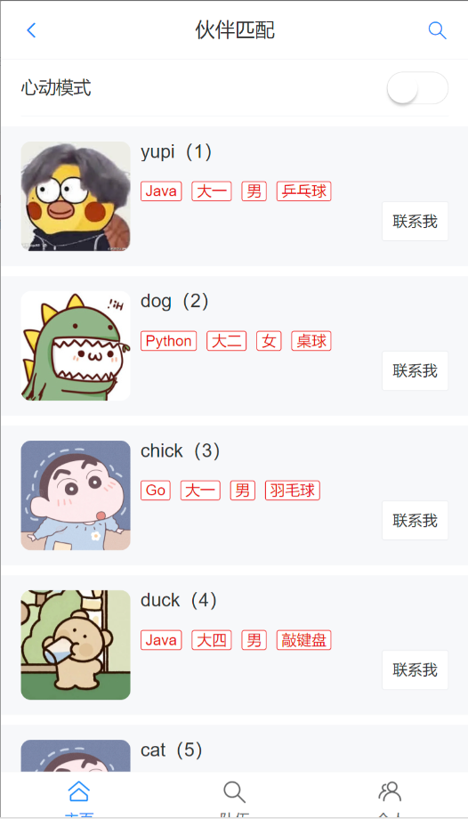
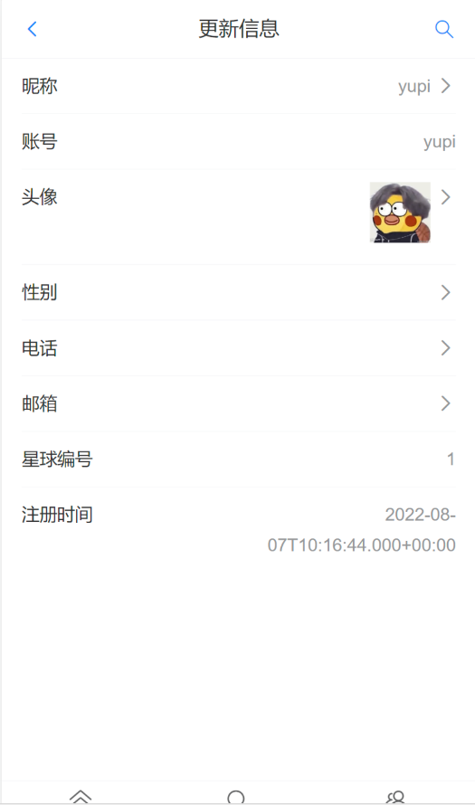
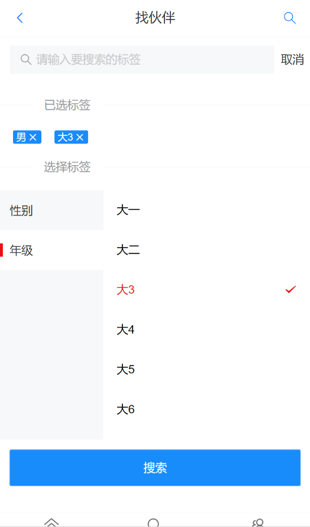
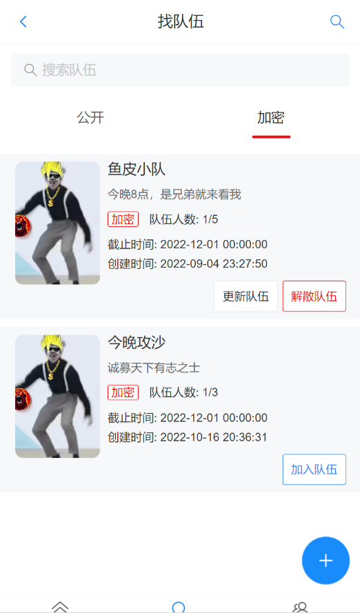
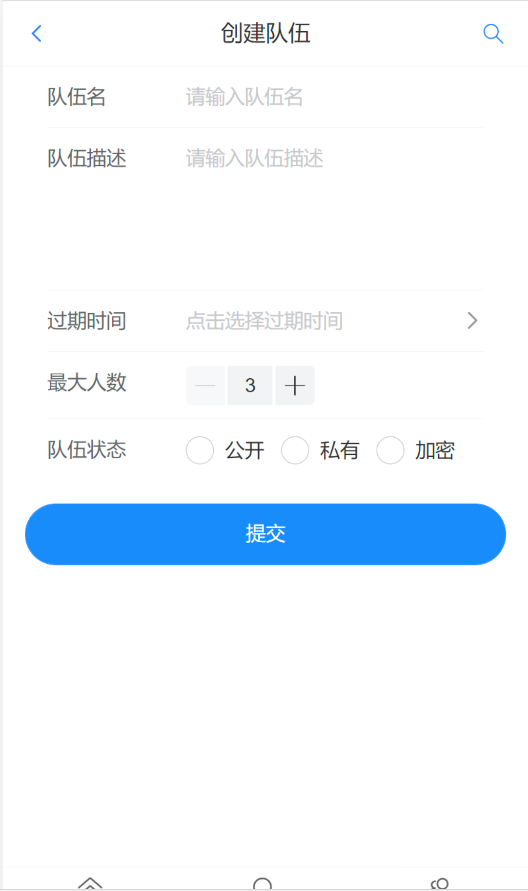

# yupao

[TOC]


## 背景介绍

- Reference dev

  [Vant UI](https://vant-ui.github.io/vant/v3/#/zh-CN), [Swagger](https://swagger.io/), [EasyExcel](https://easyexcel.opensource.alibaba.com/), 

- Reference blog

  [swagger springboot](https://www.javabetter.cn/gongju/knife4j.html#%E6%95%B4%E5%90%88-knife4j), 

  


### 需求分析

- 思路分析

  需求：找到志同道合的朋友

  实现：*标签*、属性、特征 (歌曲推荐 电影推荐)

- 需求分析

  标签的分类管理、允许用户修改标签 (学习方向java 工作状态大学在读)

  基于标签的主动搜索 (Redis缓存)

  基于标签的隐式推荐 (相似度计算算法 + 本地分布式计算)

  组队功能：创建队伍、加入队伍、根据标签查询队伍、邀请其他人、超过房间人数的替补

  


### 项目规划

- 开发流程

  初始化项目

  - 前端初始化：前端主页 + 组件概览
  - 后端初始化：数据库表设计(标签表 用户表)

  根据标签搜索用户


### 技术选型 ✔

- 前端

  Vue3 开发框架 

  Vant UI 基于VUe的移动端组件库 (React版 Zert)

  Vite 打包工具

  Nginx 单机部署

- 后端

  Java + SpringBoot + MyBatisPlus

  MySQL数据库 + Redis缓存 + Redis分布式登陆 + Redisson分布式锁

  大数据计算框架

  Swagger + Knife4j 接口文档

  Easy Excel 数据导入

  Gson JSON序列化库

- 部署

  Serverless服务

  云原生容器平台

  


### 业务流程

### 功能梳理

### 架构设计 ✔


## 页面设计 ✔

- 页面设计

  多参考设计稿

  从整体到局部

  先想样子再写代码

- 设想

  侧边栏 (移动端不要有)

  [导航条](https://vant-ui.github.io/vant/v3/#/zh-CN/nav-bar) (展示当前路径或名称)

  [底部栏](https://vant-ui.github.io/vant/v3/#/zh-CN/tabbar) (用户切换页面)：主页推荐+搜索+广告、队伍页、用户页 

  **主页**：搜索框 (->搜索页->搜索结果页/标签筛选页)、banner、推荐信息流

  **队伍页**：

  **用户页**：消息 (邮件)

  


### 页面 伙伴匹配

- 首页

  

  个人信息

  

  找伙伴

  


### 页面 组队

- 队伍列表

  

  创建队伍

  


## 库表设计 ✔

- 库表设计

  给用户添加标识 标签/特征

- 标签 (修改不频繁)

  性别：男、女

  语言：java、frontend、python、rust、cpp、csharp

  正在学：spring、react、langchain、unity

  目标：春招、秋招、社招、考研、考公、竞赛(蓝桥杯)、转行、跳槽

  段位：学会一门语言、学会一个框架、独立开发前后端、架构设计与优化

  身份：小学鸡、中学生、大学生、研究生、家里蹲、已就业

  状态：有点丧、没心没肺、一般；单身、有对象、已婚

  城市：苏州、深圳、厦门、广州

- 支持用户自定义标签 WAY1

  加一个*关联表*，记录用户和标签的关系

  优点：查询灵活、可以*正查倒查* (应用场景)

  缺点：要多建一个表、多维护一个表

  注意：企业大项目开发中，尽量减少*关联查询*，很影响扩展性，而且会影响查询性能

- 支持用户自定义标签 WAY2 ✔

  用户表补充字段 tag: json，如["java", "男"] 

  优点：查询方便，不用新建关联表；标签是用户的固有属性，其他系统复用，节省开发成本

  缺点：根据标签查用户时，只能模糊查询，或遍历用户列表，性能不高 *20W*

  优化：用缓存提高查询效率

  


---

- 汇总

  ```sql
  # drop database if exists yupao;
  # create database if not exists yupao;
  # use yupao;
  
  -- 用户表
  create table user
  (
      username     varchar(256) null comment '用户昵称',
      id           bigint auto_increment comment 'id' primary key,
      userAccount  varchar(256) null comment '账号',
      avatarUrl    varchar(1024) null comment '用户头像',
      gender       tinyint null comment '性别',
      userPassword varchar(512)       not null comment '密码',
      phone        varchar(128) null comment '电话',
      email        varchar(512) null comment '邮箱',
      userStatus   int      default 0 not null comment '状态 0 - 正常',
      createTime   datetime default CURRENT_TIMESTAMP null comment '创建时间',
      updateTime   datetime default CURRENT_TIMESTAMP null on update CURRENT_TIMESTAMP,
      isDelete     tinyint  default 0 not null comment '是否删除',
      userRole     int      default 0 not null comment '用户角色 0 - 普通用户 1 - 管理员',
      planetCode   varchar(512) null comment '星球编号',
      tags         varchar(1024) null comment '标签 json 列表'
  ) comment '用户';
  
  -- 队伍表
  create table team
  (
      id          bigint auto_increment comment 'id' primary key,
      name        varchar(256)       not null comment '队伍名称',
      description varchar(1024) null comment '描述',
      maxNum      int      default 1 not null comment '最大人数',
      expireTime  datetime null comment '过期时间',
      userId      bigint comment '用户id（队长 id）',,
      status      int      default 0 not null comment '0 - 公开，1 - 私有，2 - 加密',
      password    varchar(512) null comment '密码',
      createTime  datetime default CURRENT_TIMESTAMP null comment '创建时间',
      updateTime  datetime default CURRENT_TIMESTAMP null on update CURRENT_TIMESTAMP,
      isDelete    tinyint  default 0 not null comment '是否删除'
  ) comment '队伍';
  
  -- 用户队伍关系
  create table user_team
  (
      id         bigint auto_increment comment 'id' primary key,
      userId     bigint comment '用户id',
      teamId     bigint comment '队伍id',
      joinTime   datetime null comment '加入时间',
      createTime datetime default CURRENT_TIMESTAMP null comment '创建时间',
      updateTime datetime default CURRENT_TIMESTAMP null on update CURRENT_TIMESTAMP,
      isDelete   tinyint  default 0 not null comment '是否删除'
  ) comment '用户队伍关系';
  
  
  -- 标签表（可以不创建，因为标签字段已经放到了用户表中）
  create table tag
  (
      id         bigint auto_increment comment 'id' primary key,
      tagName    varchar(256) null comment '标签名称',
      userId     bigint null comment '用户 id',
      parentId   bigint null comment '父标签 id',
      isParent   tinyint null comment '0 - 不是, 1 - 父标签',
      createTime datetime default CURRENT_TIMESTAMP null comment '创建时间',
      updateTime datetime default CURRENT_TIMESTAMP null on update CURRENT_TIMESTAMP,
      isDelete   tinyint  default 0 not null comment '是否删除',
      constraint uniIdx_tagName unique (tagName)
  ) comment '标签';
  
  create index idx_userId on tag (userId);
  
  ```
  
  


### model 标签表 ??

- 标签表

  id, tagName: unique, userId: index, uniIdx_tagName

  parentId, isParent, 

  createTime、updateTime、isDelete；

  ```sql
  -- 标签表（可以不创建，因为标签字段已经放到了用户表中）
  create table tag
  (
      id         bigint auto_increment comment 'id' primary key,
      tagName    varchar(256) null comment '标签名称',
      userId     bigint null comment '用户 id',
      parentId   bigint null comment '父标签 id',
      isParent   tinyint null comment '0 - 不是, 1 - 父标签',
      createTime datetime default CURRENT_TIMESTAMP null comment '创建时间',
      updateTime datetime default CURRENT_TIMESTAMP null on update CURRENT_TIMESTAMP,
      isDelete   tinyint  default 0 not null comment '是否删除',
      constraint uniIdx_tagName unique (tagName)
  ) comment '标签';
  
  create index idx_userId on tag (userId);
  
  ```

- 思考设计能否满足业务诉求

  如何查询所有标签，并按标签分好组？groupby parentId

  根据父标签查询子标签？where id

  


### model 用户表 (修改)

- 用户表

  tags: json (作为用户的基本属性)

  ```sql
  -- 用户表
  create table user
  (
      username     varchar(256) null comment '用户昵称',
      id           bigint auto_increment comment 'id' primary key,
      userAccount  varchar(256) null comment '账号',
      avatarUrl    varchar(1024) null comment '用户头像',
      gender       tinyint null comment '性别',
      userPassword varchar(512)       not null comment '密码',
      phone        varchar(128) null comment '电话',
      email        varchar(512) null comment '邮箱',
      userStatus   int      default 0 not null comment '状态 0 - 正常',
      createTime   datetime default CURRENT_TIMESTAMP null comment '创建时间',
      updateTime   datetime default CURRENT_TIMESTAMP null on update CURRENT_TIMESTAMP,
      isDelete     tinyint  default 0 not null comment '是否删除',
      userRole     int      default 0 not null comment '用户角色 0 - 普通用户 1 - 管理员',
      planetCode   varchar(512) null comment '星球编号',
      tags         varchar(1024) null comment '标签 json 列表'
  ) comment '用户';
  
  ```

  


### SQL语句分类

- SQL语句分类

  DDL: define  建表 操作表

  DML: manage  更新删除数据 影响实际表里的内容

  DCL: control  控制 权限

  DQL: query  查询

  


## 接口数据 ✔

### Interface X

### Interface X


## 前端初始化

### 新建项目

- 脚手架初始项目 (移动端用户端)

  [vite](https://cn.vitejs.dev/) ✔, [vue-cli](https://cli.vuejs.org/zh/), 

  ```bash
  cd /opt/code/java-code/hello-java/code-show-project/yupao
  npm create vite@latest  # yupao-frontend  # Vue  # TypeScript
  
  cd yupao-frontend && npm i
  npm run dev
  
  ```

  项目结构

  ```bash
  oswin@dt501:/opt/code/java-code/hello-java/code-show-project/yupao/yupao-frontend$ tree -L 3
  .
  ├── index.html					# html入口
  │
  ├── node_modules			# 依赖环境
  ├── package.json			# 依赖声明 运行脚本 项目元信息
  ├── package-lock.json		# npm自动生成
  │
  ├── public					# 不需要经过构建过程的静态资源 图片字体等 
  │   └── vite.svg
  ├── README.md
  │
  ├── src						# 源码
  │   ├── App.vue					# vue入口 vue应用的根组件
  │   ├── assets					# 静态资源 图片字体样式表等
  │   │
  │   ├── layouts					# 通用布局
  │   ├── pages					# 页面
  │   ├── components				# 组件
  │   │
  │   ├── main.ts					# 全局ts 初始化vue应用并挂载到DOM上
  │   ├── style.css				# 全局css
  │   └── vite-env.d.ts			# 声明vite的环境变量类型
  │
  ├── tsconfig.json			# ts主配置文件 定义了ts编译器的全局配置：编译目标、模块系统、严格模式等
  ├── tsconfig.app.json		# 代码的编译配置 
  ├── tsconfig.node.json		# nodejs环境的编译配置 
  │
  └── vite.config.ts			# vite的配置文件：开发服务器、构建输出、插件
  
  ```
  
  


### 依赖配置

- 整合组件库 [Vant UI](https://vant-ui.github.io/vant/v3/#/zh-CN/quickstart#fang-fa-er.-an-xu-yin-ru-zu-jian-yang-shi)

  ```bash
  # 按需引入组件库
  npm i vant
  npm i unplugin-vue-components -D
  
  ```

  整合路由 [Vue-Router](https://router.vuejs.org/zh/)

  ```bash
  npm install vue-router@4
  # https://router.vuejs.org/zh/guide/
  
  ```
  
- 项目配置插件 按需引入组件库
  
  vite.config.js
  
  ```js
  import {defineConfig} from 'vite';
  import vue from '@vitejs/plugin-vue';
  
  import Components from 'unplugin-vue-components/vite';
  import {VantResolver} from 'unplugin-vue-components/resolvers';
  
  // https://vitejs.dev/config/
  export default defineConfig({
      plugins: [
          vue(),
          Components({
              resolvers: [VantResolver()],
          }),
      ],
  })
  
  ```
  
  引入到项目 全局引入
  
  src/main.ts
  
  ```typescript
  import {createApp} from 'vue'
  import './style.css'
  import App from './App.vue'
  import {Button} from 'vant';
  
  const app = createApp(App)
  app.use(Button);
  app.mount('#app')
  
  ```
  
  使用组件 (`unplugin-vue-components` 会解析模板并自动注册对应的组件)
  
  src/App.vue
  
  ```vue
  <template>  
    <van-button type="primary">主要按钮</van-button>
    <van-button type="success">成功按钮</van-button>
    <van-button type="default">默认按钮</van-button>
    <van-button type="warning">警告按钮</van-button>
    <van-button type="danger">危险按钮</van-button>
  </template>
  
  ```
  
  


### 精简项目 ✔

- 精简项目

  ```bash
  rm -rf src/components/HelloWorld.vue 
  mkdir src/layouts && touch src/layouts/BasicLayout.vue
  mkdir src/pages && touch src/pages/Index.vue src/pages/Team.vue src/pages/UserEditPage.vue
  mkdir src/config && touch src/config/route.ts
  mkdir src/models && touch src/models/user.d.ts
  
  ```
  
  


---

- 入口ts

  src/main.ts

  ```typescript
  import {createApp} from 'vue'
  import './style.css'
  import App from './App.vue'
  // import {Button, Icon, NavBar, Tabbar, TabbarItem} from 'vant';
  import {createRouter, createWebHashHistory} from 'vue-router';
  import routes from "./config/route.ts";
  
  
  // VueRouter
  const router = createRouter({
      history: createWebHashHistory(),  // createMemoryHistory
      routes,
  })
  
  const app = createApp(App);
  // app.use(Button).use(NavBar).use(Icon).use(Tabbar).use(TabbarItem);
  app.use(router)
  app.mount('#app')
  
  ```

- 入口vue

  src/App.vue

  ```vue
  <script setup lang="ts">
  import BasicLayout from "./layouts/BasicLayout.vue";
  </script>
  
  <template>
    <BasicLayout/>
  </template>
  
  <style scoped>
  </style>
  
  ```

- 入口HTML

  index.html

  ```html
  <!doctype html>
  <html lang="en">
    <head>
      <meta charset="UTF-8" />
      <link rel="icon" type="image/svg+xml" href="/vite.svg" />
      <meta name="viewport" content="width=device-width, initial-scale=1.0" />
      <title>Vite + Vue + TS</title>
    </head>
    <body>
      <div id="app"></div>
      <script type="module" src="/src/main.ts"></script>
    </body>
  </html>
  
  ```

- 全局样式

  src/style.css

  ```css
  
  ```

  


### 假页面：基础布局 ✔

- src/layouts/BasicLayout.vue

  ```vue
  <template>
    <!-- 导航条 -->
    <van-nav-bar
        title="标题"
        left-arrow
        fixed="true"
        @click-left="onClickLeft"
        @click-right="onClickRight"
    >
      <template #right>
        <van-icon name="search" size="18"/>
      </template>
    </van-nav-bar>
  
    <!-- 中间内容：插槽/路由、或根据点击切换页面 -->
    <!-- <slot name="content"></slot>-->
    <div id="content">
  
      <!-- WAY1: v-if active -->
      <!--
      <template v-if="active === 'index'">
        <Index/>
      </template>
      <template v-if="active === 'team'">
        <Team/>
      </template>
      -->
  
      <!-- WAY2: Vue Router -->
      <!-- https://vant-ui.github.io/vant/v3/#/zh-CN/tabbar -->
      <RouterView/>
    </div>
  
    <!-- 底部栏 -->
    <!-- <van-tabbar route v-model="active" @change="onChange">-->
    <van-tabbar route @change="onChange">
      <van-tabbar-item icon="home-o" name="index" to="/">主页</van-tabbar-item>
      <van-tabbar-item icon="search" name="team" to="/team">队伍</van-tabbar-item>
      <van-tabbar-item icon="friends-o" name="user" to="/user">个人</van-tabbar-item>
    </van-tabbar>
  
  </template>
  
  <script setup lang="ts">
  
  // 导航条
  const onClickLeft = () => console.log('点击左侧按钮');
  const onClickRight = () => console.log('点击右侧按钮')
  
  // 底部栏
  // const active = ref("index");
  const onChange = (index) => console.log(index);
  </script>
  
  <style scoped>
  
  </style>
  
  ```
  
  


### 假页面：首页(用户列表页) ✔

- src/pages/Index.vue

  ```vue
  <template>
    首页
  </template>
  
  <script setup lang="ts">
  
  </script>
  
  <style scoped>
  
  </style>
  ```

  


### 假页面：搜索页 ✔

- src/pages/SearchPage.vue

  ```vue
  <template>
    <!-- 搜索框 -->
    <!-- https://vant-ui.github.io/vant/v3/#/zh-CN/search -->
    <form action="/">
      <van-search
          v-model="searchText"
          show-action
          placeholder="请输入搜索标签"
          @search="onSearch"
          @cancel="onCancel"
      />
    </form>
  
    <!-- 标签列表 -->
    <!-- https://vant-ui.github.io/vant/v3/#/zh-CN/tag -->
    <!-- https://vant-ui.github.io/vant/v3/#/zh-CN/divider -->
    <!-- https://vant-ui.github.io/vant/v3/#/zh-CN/collapse -->
    <!-- https://vant-ui.github.io/vant/v3/#/zh-CN/tree-select -->
    <van-divider dashed>已选标签</van-divider>
    <div v-if="activeIds.length === 0" style="font-size: 12px; text-align: center">请选择标签...</div>
    <van-row gutter="16" style="padding: 0 16px">
      <van-col v-for="tag in activeIds">
        <van-tag size="small" type="primary" closeable @close="doClose(tag)"> {{ tag }}</van-tag>
      </van-col>
    </van-row>
  
    <van-divider dashed>选择标签</van-divider>
    <van-tree-select
        height="340px"
        v-model:active-id="activeIds"
        v-model:main-active-index="activeIndex"
        :items="tagList"
    />
  
    <!-- 搜索按钮 -->
    <!-- https://vant-ui.github.io/vant/v3/#/zh-CN/button -->
    <van-button type="primary" size="large" @click="doSearchResult">搜索伙伴</van-button>
  </template>
  
  <script setup lang="ts">
  import {ref} from 'vue';
  import {useRouter} from "vue-router";
  
  const router = useRouter();
  
  // 选择标签 分类选择
  const activeIds = ref([]);
  const activeIndex = ref(0);
  
  /**
   * 标签列表 封装响应式
   */
  const originTagList = [
    {
      text: '性别',
      children: [
        {text: '男', id: '男'},
        {text: '女', id: '女'},
        {text: 'Javaer', id: 'Javaer'},
        {text: '未知', id: '未知', disabled: true},
      ],
    },
    {
      text: '语言',
      children: [
        {text: 'Java', id: 'Java'},
        {text: 'Python', id: 'Python'},
        {text: 'JavaScript', id: 'JavaScript'},
        {text: 'TypeScript', id: 'TypeScript'},
        {text: 'PHP', id: 'PHP'},
        {text: 'C++', id: 'C++'},
        {text: 'C#', id: 'C#'},
        {text: 'Go', id: 'Go'},
        {text: 'Kotlin', id: 'Kotlin'},
        {text: 'Swift', id: 'Swift'},
        {text: 'Bug', id: 'Bug'},
      ],
    },
  ];
  let tagList = ref(originTagList);
  
  /**
   * 搜索过滤
   * @param val
   */
  const onSearch = (val) => {
    // 抽出标签列表 打平  // 过滤
    tagList.value = originTagList.map(parentTag => {
      const tempChildren = [...parentTag.children];
      const tempParentTag = {...parentTag};
      tempParentTag.children = tempChildren.filter(item => item.text.includes(searchText.value));
      console.log(typeof tempParentTag)
      console.log(tempParentTag)
  
      // TODO
      activeIndex.value = 1;
      return tempParentTag;
    });
  }
  
  // 搜索框
  const searchText = ref('');
  const onCancel = () => {
    searchText.value = '';
    tagList.value = originTagList;
  }
  
  // 标签列表 删除标签
  const doClose = (tag) => {
    activeIds.value = activeIds.value.filter(item => {
      return item !== tag;
    })
  }
  
  /**
   * 搜索按钮 用户列表
   */
  const doSearchResult = () => {
    // http://localhost:5173/#/user/list?tags=%E7%94%B7&tags=Python
    router.push({
      path: "/user/list",
      query: {
        tags: activeIds.value
      }
    })
  }
  
  </script>
  
  <style scoped>
  
  </style>
  ```

  


### 假页面：搜索结果(用户列表页) ✔

- src/pages/UserList.vue

  ```vue
  
  ```

  


### 假页面：团队页 ✔✔✔

- src/pages/Team.vue

  ```vue
  <template>
    队伍页面
  </template>
  
  <script setup lang="ts">
  
  </script>
  
  <style scoped>
  
  </style>
  ```

  


### 假页面：个人页 修改页 ✔

- src/pages/UserPage.vue

  ```vue
  <template>
    <!-- https://vant-ui.github.io/vant/v3/#/zh-CN/cell -->
    <van-cell title="头像" title-style="text-align:left; ">
      <van-image :src="user.avatarUrl" fit="cover" width="40" height="40"/>
    </van-cell>
    <van-cell title="账号" :value="user.userAccount" />
    <van-cell title="角色" :value="user.userRole" />
  
    <van-cell title="用户名" is-link :value="user.username"
              @click="toEdit('username','用户名', user.username)"/>
    <van-cell title="性别" is-link :value="user.gender"
              @click="toEdit('gender','性别', user.gender as number )"/>
    <van-cell title="手机号" is-link :value="user.phone"
              @click="toEdit('phone','手机号', user.phone)"/>
    <van-cell title="邮箱" is-link :value="user.email"
              @click="toEdit('email','邮箱', user.email)"/>
  
    <van-cell title="创建时间" :value="user.createTime?.toISOString()" />
    <van-cell title="星球代码" :value="user.planetCode" />
    <van-cell title="用户标签" is-link :value="user.tags" />
  </template>
  
  <script setup lang="ts">
  import {UserType} from "../models/user";
  import {useRouter} from "vue-router";
  
  const router = useRouter();
  
  const user: UserType = {
    id: 1,
    username: "oswin",
    userAccount: "oswin501",
    avatarUrl: "https://miro.medium.com/v2/resize:fit:640/format:webp/1*4j2A9niz0eq-mRaCPUffpg.png",
    gender: 1,  // 若1则男，若0则女
    phone: "15534340089",
    email: "oswin501@gmail.com",
    createTime: new Date(),
    userRole: 1,
    planetCode: "nn00000001",
    tags: ["java", "cpp"],
  };
  user.gender = user.gender === 1 ? '男' : '女';
  user.userRole = user.userRole === 1 ? '管理员' : '普通用户';
  
  // 编辑用户信息 路由传参
  const toEdit = (editKey: string, editName: string, currentValue: number | string | undefined) => {
    router.push({
      path: "/user/edit",
      query: {editKey, editName, currentValue,},
    })
  }
  
  </script>
  
  <style scoped>
  
  </style>
  ```
  
- src/pages/UserEditPage.vue

  ```vue
  <template>
    <!--https://vant-ui.github.io/vant/v3/#/zh-CN/form-->
    <van-form @submit="onSubmit">
      <van-cell-group inset>
        <van-field
            v-model="editUser.currentValue"
            :name="editUser.editKey"
            :label="editUser.editName"
            :placeholder="`请输入${editUser.editName}`"
            :rules="[{ required: true, message: '请填写用户性别' }]"
        />
      </van-cell-group>
      <div style="margin: 16px;">
        <van-button round block type="primary" native-type="submit">
          确认修改
        </van-button>
      </div>
    </van-form>
  </template>
  
  <script setup lang="ts">
  import {useRoute, useRouter} from "vue-router";
  import {ref} from "vue";
  
  const router = useRouter();
  const route = useRoute();
  
  // 取到路由参数
  console.log(route.query)
  
  // 表单数据 对象定义
  const editUser = ref({
    editKey: route.query.editKey,
    editName: route.query.editName,
    currentValue: route.query.currentValue,
  })
  // editUser.value.currentValue = editUser.value.currentValue === "1" ? "男" : "女"
  
  const onSubmit = (values) => {
    console.log('submit', values);  // { editKey: "gender", editName: "性别", currentValue: "1" }
    // TODO：将editKey editName currentValue提交到后端
  };
  </script>
  
  <style scoped>
  
  </style>
  ```

  


### 路由配置

- 路由配置

  src/config/route.ts
  
  ```typescript
  import Index from "../pages/Index.vue";
  import TeamPage from "../pages/TeamPage.vue";
  import UserPage from "../pages/UserPage.vue";
  import SearchPage from '../pages/SearchPage.vue';
  import EditUserPage from "../pages/UserEditPage.vue";
  
  const routes = [
      // page 1
      {path: '/', component: Index},
      {path: '/search', component: SearchPage},
      // page 2
      {path: '/team', component: TeamPage},
      // page 3
      {path: '/user', component: UserPage},
      {path: '/user/edit', component: EditUserPage},
  ]
  
  export default routes;
  
  ```
  
  


### 类型约束

- 类型约束

  src/models/user.d.ts

  ```typescript
  /**
   * 用户类型
   */
  export type UserType = {
      id: number,
      username?: string,
      userAccount?: string,
      avatarUrl?: string,
      gender?: number,
      phone?: string,
      email?: string,
      userStatus?: number,
      createTime?: Date,
      userRole?: number,
      planetCode?: string,
      tags?: string[],
  };
  
  ```

  


## 后端初始化

### 新建项目

- 基于用户中心

  ```bash
  cp -r ../user-center/user-center-backend/ ./yupao-backend
  cd yupao-backend/ && rm -rf .idea/ target/
  
  # 全局替换
  # user-center-backend -> yupao-backend
  # 启动类
  # UserCenterBackendApplication -> YupaoBackendApplication
  # 
  # Ctrl+Shift+A -> Add Maven Projects
  
  ```
  
  


### 依赖配置

- 依赖配置

  spring, mybatis, juit

  mysql, redis

  json

  ```xml
          <!-- https://mvnrepository.com/artifact/com.google.code.gson/gson -->
          <dependency>
              <groupId>com.google.code.gson</groupId>
              <artifactId>gson</artifactId>
              <version>2.8.9</version>
          </dependency>
  ```

  swagger
  
  ```xml
          <!-- swagger -->
          <!-- https://mvnrepository.com/artifact/io.springfox/springfox-swagger2 -->
          <dependency>
              <groupId>io.springfox</groupId>
              <artifactId>springfox-swagger2</artifactId>
              <version>3.0.0</version>
          </dependency>
          <!-- https://mvnrepository.com/artifact/io.springfox/springfox-swagger-ui -->
          <dependency>
              <groupId>io.springfox</groupId>
              <artifactId>springfox-swagger-ui</artifactId>
              <version>3.0.0</version>
          </dependency>
  ```
  
  easyexcel
  
  ```xml
          <!-- https://mvnrepository.com/artifact/com.alibaba/easyexcel -->
          <dependency>
              <groupId>com.alibaba</groupId>
              <artifactId>easyexcel</artifactId>
              <version>3.1.1</version>
          </dependency>
  ```
  
  


### 配置文件

- src/main/resources/application.yml

  ```yml
  spring:
    profiles:
      active: dev
    application:
      name: yupao-backend
    # Database configuration
    datasource:
      driver-class-name: com.mysql.jdbc.Driver  # com.mysql.cj.jdbc.Driver
      url: jdbc:mysql://localhost:3306/yupao
      username: root
      password: 123456
    session:
      timeout: 86400 # 1天的session过期时间
  server:
    port: 8080
    servlet:
      context-path: /api # 指定接口全局api前缀
  
  mybatis-plus:
    configuration:
      map-underscore-to-camel-case: false  # 字段转换
      log-impl: org.apache.ibatis.logging.stdout.StdOutImpl # 日志输出
    global-config:
      db-config:
        logic-delete-field: isDelete # 全局逻辑删除的实体字段名(since 3.3.0,配置后可以忽略不配置步骤2)
        logic-delete-value: 1 # 逻辑已删除值(默认为 1)
        logic-not-delete-value: 0 # 逻辑未删除值(默认为 0)
  
  ```

  


### 中间件配置

- MySQL

  ```bash
  docker start mysql
  docker exec -it mysql bash
  mysql -uroot -p123456
  
  drop database if exists yupao;
  create database if not exists yupao;
  use yupao;
  
  ```

  


### 补全学习 ✔

- 补习

  Java8特性：lambda、stream、parallelStream流式处理、Optional可选类

  MyBatisPlus：ORM 免SQL的API


### 接口文档 ✔

- 接口文档

  写接口信息的文档 (前端 后端 项目负责人)

  接口信息：请求参数、响应参数(错误码)、接口地址、接口名称、请求类型、请求格式、备注

  文档作用：项目维护参考、开发联调介质、在线调试

  实现方式：md笔记手写、自动化接口文档生成([`Swagger`](https://swagger.io/), `Postman`, `Apifox`, `Apipost`, `Eolink`)

- 整合 Swagger Knife4j

  引入依赖 -> 自定义Swagger配置项 -> 定义代码位置 (线上环境不要把接口全部暴露)

- 向上环境不要暴露接口

  


## 前端页面 用户标签

- 需求 (与后端联调)

  搜索页

  用户页、用户修改页
  
  
  


### 前端页面跳转传值 ✔

- 跳转传值 (多种实现)

  router.query：本质是url.searchParms，url后附加参数，传递的值长度有限

  router.params：动态路由，参数量更少

  vuex全局状态管理：搜索页将关键词塞到状态中，搜索结果页从状态中取值

  prop：父子组件传值

  


### 页面和布局


### 页面：搜索页

- 组件选择

  [Search](https://vant-ui.github.io/vant/v3/#/zh-CN/search), [Picker](https://vant-ui.github.io/vant/v3/#/zh-CN/picker), 

- src/pages/SearchPage.vue

  ```vue
  
  ```

  


### 组件 X

### 组件 X

### 前端请求


## 后端接口 用户标签

- 需求

  根据标签搜索用户

  用户修改标签
  
  


### 逻辑梳理 根据标签搜索用户

- 根据标签搜索用户 (用户中心提供)

  允许用户传入多个标签，多个标签都存在才搜索出来 and  `like %java% and like %cpp%`

  允许用户传入多个标签，有一个标签存在就能搜索出来 or  `like %java% or like %cpp%`  ✔

- 实现方式

  内存查询：*灵活*，可以通过并发进一步优化

  SQL查询：*实现简单*，可以通过拆分查询进一步优化

  MySQL的JSON 很复杂

- 方案选择

  若参数可以分析，根据用户的参数去选择查询方式，如标签数

  若参数不可分析，且数据库连接足够、内存足够，可以并发同时查询，谁先返回用谁

  也可以SQL查询与内存计算相结合，如先用SQL过滤部分tag

  实际测试哪种查询比较快，数据量大验证效果明显

  


---

- JSON解析字符串

  序列化：java对象 -> json (传输方便 节省空间 通用规范)

  反序列化：json -> java对象 (内存)

- Java三方库选择

  [gson](https://mvnrepository.com/artifact/com.google.code.gson/gson/2.8.9): google ✔

  [fastjson](https://mvnrepository.com/artifact/com.alibaba.fastjson2/fastjson2): alibaba 快 但漏洞太多

  [jackson](https://mvnrepository.com/artifact/com.fasterxml.jackson.core/jackson-databind): 

  [kryo](https://mvnrepository.com/artifact/com.esotericsoftware/kryo): 性能极高的序列化库

  [hutool](https://mvnrepository.com/artifact/cn.hutool/hutool-all): 

  


### 数据导入 ✔

- 存量用户信息导入及同步

- 需求

  所有星球用户信息：接口爬虫(httpclient okhttp) -> 数据清洗 -> 数据导入excel

  自我介绍的标签信息：导入

  


---

- EssayExcel两种读方式

  确定表头：创建对象，建立映射

  不确定表头：每一行数据映射为Map<String, Object>

- EssayExcel两种读取模式

  监听器：创建监听器、在读取文件时绑定监听器 (单独抽离处理逻辑 代码清晰易于维护；一条条处理 适用于数据量大的场景)

  同步读：无需创建监听器，要获取完整数据 (简单直接；但数据量大 有等待时长 容易卡顿甚至内存溢出)

  


---

- src/main/java/com/time1043/yupaobackend/once/ImportUser.java

  ```java
  package com.time1043.yupaobackend.once;
  
  import com.alibaba.excel.EasyExcel;
  import org.apache.commons.lang3.StringUtils;
  
  import java.util.List;
  import java.util.Map;
  import java.util.Objects;
  import java.util.stream.Collectors;
  
  /**
   * 任务 导入用户数据 (包含数据清洗)
   *
   * @author oswin
   */
  public class ImportUser {
      public static void main(String[] args) {
          String fileName = "/opt/code/java-code/hello-java/code-show-project/yupao/yupao-backend/data/user.xlsx";
          List<ZSXQTableUserInfo> userInfoList = EasyExcel.read(fileName).head(ZSXQTableUserInfo.class).sheet().doReadSync();
  
          // 判断用户重复
          Map<String, List<ZSXQTableUserInfo>> listMap = userInfoList.stream()   // 先转换为map
                  .filter(userInfo -> StringUtils.isNotEmpty(userInfo.getUsername()))  // 过滤掉空用户名
                  .collect(Collectors.groupingBy(ZSXQTableUserInfo::getUsername));   // 按用户名分组
          System.out.println("sum: " + userInfoList.size());
          System.out.println("enum: " + listMap.keySet().size());
  
          // 输出重复的用户名
          for (Map.Entry<String, List<ZSXQTableUserInfo>> stringListEntry : listMap.entrySet()) {
              if (stringListEntry.getValue().size() > 1) {
                  System.out.println("=====================================");
                  System.out.println("username: " + stringListEntry.getKey());
              }
          }
      }
  }
  
  ```

- src/main/java/com/time1043/yupaobackend/once/ImportExcel.java

  ```java
  package com.time1043.yupaobackend.once;
  
  import com.alibaba.excel.EasyExcel;
  import com.alibaba.excel.read.listener.PageReadListener;
  
  import java.util.List;
  import java.util.Map;
  
  /**
   * 工具 导入Excel数据
   *
   * @author oswin
   */
  public class ImportExcel {
  
      public static void main(String[] args) {
          String fileName = "/opt/code/java-code/hello-java/code-show-project/yupao/yupao-backend/data/user.xlsx";
          //readByListener(fileName);
          synchronousRead(fileName);
      }
  
      /**
       * 读取Excel数据，监听器模式
       *
       * @param fileName Excel文件路径
       */
      public static void readByListener(String fileName) {
          // https://easyexcel.opensource.alibaba.com/docs/current/quickstart/read#%E4%BB%A3%E7%A0%81
          EasyExcel.read(fileName, ZSXQTableUserInfo.class, new TableListener()).sheet().doRead();
      }
  
      /**
       * 读取Excel数据，同步读取模式
       *
       * @param fileName Excel文件路径
       */
      public static void synchronousRead(String fileName) {
          // https://easyexcel.opensource.alibaba.com/docs/current/quickstart/read#%E5%90%8C%E6%AD%A5%E7%9A%84%E8%BF%94%E5%9B%9E
          List<ZSXQTableUserInfo> totalDataList = EasyExcel.read(fileName).head(ZSXQTableUserInfo.class).sheet().doReadSync();
          for (ZSXQTableUserInfo zsxqTableUserInfo : totalDataList) {
              System.out.println(zsxqTableUserInfo);
          }
      }
  }
  
  ```

  src/main/java/com/time1043/yupaobackend/once/TableListener.java

  ```java
  package com.time1043.yupaobackend.once;
  // https://easyexcel.opensource.alibaba.com/docs/current/quickstart/read#%E6%9C%80%E7%AE%80%E5%8D%95%E7%9A%84%E8%AF%BB%E7%9A%84%E7%9B%91%E5%90%AC%E5%99%A8
  
  import com.alibaba.excel.context.AnalysisContext;
  import com.alibaba.excel.read.listener.ReadListener;
  import lombok.extern.slf4j.Slf4j;
  
  /**
   * 自定义的监听器，用于读取Excel数据
   *
   * @author oswin
   */
  @Slf4j
  public class TableListener implements ReadListener<ZSXQTableUserInfo> {
      // 有个很重要的点 DemoDataListener 不能被spring管理，要每次读取excel都要new,然后里面用到spring可以构造方法传进去
  
      /**
       * 这个每一条数据解析都会来调用
       *
       * @param data    one row value. Is is same as {@link AnalysisContext#readRowHolder()}
       * @param context
       */
      @Override
      public void invoke(ZSXQTableUserInfo data, AnalysisContext context) {
          System.out.println(data);
      }
  
      /**
       * 所有数据解析完成了 都会来调用
       *
       * @param context
       */
      @Override
      public void doAfterAllAnalysed(AnalysisContext context) {
          System.out.println("所有数据解析完成了");
      }
  
  }
  ```

  src/main/java/com/time1043/yupaobackend/once/ZSXQTableUserInfo.java

  ```java
  package com.time1043.yupaobackend.once;
  // https://easyexcel.opensource.alibaba.com/docs/current/quickstart/read#%E5%AF%B9%E8%B1%A1
  
  import com.alibaba.excel.annotation.ExcelProperty;
  import lombok.Data;
  import lombok.EqualsAndHashCode;
  
  /**
   * Excel 映射实体类
   */
  @Data
  @EqualsAndHashCode
  public class ZSXQTableUserInfo {
  
      @ExcelProperty("成员编号")  // index = 0
      private String planetCode;
  
      @ExcelProperty("成员昵称")
      private String username;
  
  }
  ```

  


### 分布式session登陆 ✔


### 代码生成 MyBatisX

- Tag 不生成

- User 补充 (tags)

  src/main/resources/mapper/UserMapper.xml

  ```xml
      <resultMap id="BaseResultMap" type="com.time1043.yupaobackend.model.domain.User">
          <id property="id" column="id" jdbcType="BIGINT"/>
          <result property="username" column="username" jdbcType="VARCHAR"/>
          <result property="userAccount" column="userAccount" jdbcType="VARCHAR"/>
          <result property="avatarUrl" column="avatarUrl" jdbcType="VARCHAR"/>
          <result property="gender" column="gender" jdbcType="TINYINT"/>
          <result property="userPassword" column="userPassword" jdbcType="VARCHAR"/>
          <result property="phone" column="phone" jdbcType="VARCHAR"/>
          <result property="email" column="email" jdbcType="VARCHAR"/>
          <result property="userStatus" column="userStatus" jdbcType="INTEGER"/>
          <result property="createTime" column="createTime" jdbcType="TIMESTAMP"/>
          <result property="updateTime" column="updateTime" jdbcType="TIMESTAMP"/>
          <result property="isDelete" column="isDelete" jdbcType="TINYINT"/>
          <result property="userRole" column="userRole" jdbcType="INTEGER"/>
          <result property="planetCode" column="planetCode" jdbcType="VARCHAR"/>
          <result property="tags" column="tags" jdbcType="VARCHAR"/>
      </resultMap>
  
      <sql id="Base_Column_List">
          id
          ,username,userAccount,
          avatarUrl,gender,userPassword,
          phone,email,userStatus,
          createTime,updateTime,isDelete,
          userRole,planetCode,tags
      </sql>
  ```

  src/main/java/com/time1043/yupaobackend/model/domain/User.java

  ```java
      /**
       * 用户标签 json
       */
      private String tags;
  
  ```

  src/main/java/com/time1043/yupaobackend/service/impl/UserServiceImpl.java

  ```java
      /**
       * 获取脱敏用户信息 (工具类)
       *
       * @param originalUser 原始用户信息
       * @return 脱敏后的用户信息
       */
      @Override
      public User getSafetyUser(User originalUser) {
          // 空处理
          if (originalUser == null) {
              return null;
          }
  
          User safetyUser = new User();
          safetyUser.setId(originalUser.getId());
          safetyUser.setUsername(originalUser.getUsername());
          safetyUser.setUserAccount(originalUser.getUserAccount());
          safetyUser.setAvatarUrl(originalUser.getAvatarUrl());
          safetyUser.setGender(originalUser.getGender());
          safetyUser.setPhone(originalUser.getPhone());
          safetyUser.setEmail(originalUser.getEmail());
          safetyUser.setUserRole(originalUser.getUserRole());
          safetyUser.setPlanetCode(originalUser.getPlanetCode());
          safetyUser.setUserStatus(originalUser.getUserStatus());
          safetyUser.setCreateTime(originalUser.getCreateTime());
          safetyUser.setTags(originalUser.getTags());
          return safetyUser;
      }
  
  ```

  


### 数据库访问层 (mapper) ✔

### 业务逻辑层 (service) ✔

- src/main/java/com/time1043/yupaobackend/service/UserService.java

  ```java
      /**
       * 根据标签搜索用户 (SQL)
       *
       * @param tagNameList 用户要拥有的标签列表
       * @return 用户列表
       */
      List<User> searchUsersByTagsBySQL(List<String> tagNameList);
  
      /**
       * 根据标签搜索用户 (Memory)
       *
       * @param tagNameList 用户要拥有的标签列表
       * @return 用户列表
       */
      List<User> searchUsersByTagsByMemory(List<String> tagNameList);
  
  ```

- src/main/java/com/time1043/yupaobackend/service/impl/UserServiceImpl.java

  ```java
      /**
       * 根据标签搜索用户 (SQL)
       *
       * @param tagNameList 用户要拥有的标签列表
       * @return 用户列表
       */
      @LogExecutionTime
      @Override
      public List<User> searchUsersByTagsBySQL(List<String> tagNameList) {
          // 不允许：用户不输入条件，返回全部用户
          if (CollectionUtils.isEmpty(tagNameList)) {
              throw new BusinessException(ErrorCode.PARAMS_ERROR, "标签不能为空");
          }
  
          // #################################################
          // WAY1: SQL
          // #################################################
          // 拼接 and 查询  // queryWrapper.like("column", "value").like("column", "value")
          QueryWrapper<User> queryWrapper = new QueryWrapper<>();
          for (String tagName : tagNameList) {
              queryWrapper = queryWrapper.like("tags", tagName);
          }
          List<User> userList = userMapper.selectList(queryWrapper);
  
          // userList.forEach(user -> {getSafetyUser(user);});
          // userList.forEach(this::getSafetyUser);  // Java8 lambda
          return userList.stream().map(this::getSafetyUser).collect(Collectors.toList());  // Java8 stream
      }
  
      /**
       * 根据标签搜索用户 (Memory)
       *
       * @param tagNameList 用户要拥有的标签列表
       * @return 用户列表
       */
      @LogExecutionTime
      @Override
      public List<User> searchUsersByTagsByMemory(List<String> tagNameList) {
          // 不允许：用户不输入条件，返回全部用户
          if (CollectionUtils.isEmpty(tagNameList)) {
              throw new BusinessException(ErrorCode.PARAMS_ERROR, "标签不能为空");
          }
  
          // #################################################
          // WAY2: Memory
          // #################################################
          // SQL 所有用户
          QueryWrapper<User> queryWrapper = new QueryWrapper<>();
          List<User> userList = userMapper.selectList(queryWrapper);
  
          // Memory 判断符合要求 (灵活)
          Gson gson = new Gson();
          /*for (User user : userList) {
              String tagsStr = user.getTags();  // str -> json: List<User>
              Set<String> tempTagNameSet = gson.fromJson(tagsStr, new TypeToken<Set<String>>() {
              }.getType());  // O(1)
              // gson.toJson(tempTagNameList);  // json -> str
  
              for (String tagName : tagNameList) {
                  if (!tempTagNameSet.contains(tagName)) {
                      return null;
                  }
              }
          }*/
          return userList.stream().filter(user -> {
              String tagsStr = user.getTags();
  
              // 数据库中没有符合要求的用户
              if (StringUtils.isBlank(tagsStr)) {
                  return false;
              }
  
              Set<String> tempTagNameSet = gson.fromJson(tagsStr, new TypeToken<Set<String>>() {
              }.getType());
              for (String tagName : tagNameList) {
                  if (!tempTagNameSet.contains(tagName)) {
                      return false;
                  }
              }
              return true;
          }).map(this::getSafetyUser).collect(Collectors.toList());  // Java8 stream parallelStream  // 公共线程池 有未知风险
      }
  
  ```

- 工具类
  
  src/main/java/com/time1043/yupaobackend/utils/LogExecutionTime.java  测时间注解

  ```java
  package com.time1043.yupaobackend.utils;
  
  import java.lang.annotation.ElementType;
  import java.lang.annotation.Retention;
  import java.lang.annotation.RetentionPolicy;
  import java.lang.annotation.Target;
  
  @Retention(RetentionPolicy.RUNTIME)
  @Target(ElementType.METHOD)
  public @interface LogExecutionTime {
  }
  ```

  src/main/java/com/time1043/yupaobackend/utils/LogExecutionTimeAspect.java  测时间注解实现

  ```java
  package com.time1043.yupaobackend.utils;
  
  import org.aspectj.lang.ProceedingJoinPoint;
  import org.aspectj.lang.annotation.Around;
  import org.aspectj.lang.annotation.Aspect;
  import org.aspectj.lang.annotation.Pointcut;
  import org.springframework.stereotype.Component;
  
  @Aspect
  @Component
  public class LogExecutionTimeAspect {
  
      @Pointcut("@annotation(LogExecutionTime)")
      public void logExecutionTimePointcut() {
      }
  
      @Around("logExecutionTimePointcut()")
      public Object logExecutionTime(ProceedingJoinPoint joinPoint) throws Throwable {
          long startTime = System.currentTimeMillis();
          Object proceed = joinPoint.proceed();
          long executionTime = System.currentTimeMillis() - startTime;
  
          System.out.println(joinPoint.getSignature() + " executed in " + executionTime + " ms");
          return proceed;
      }
  }
  ```

  pom.xml  

  ```xml
          <dependency>
              <groupId>org.springframework.boot</groupId>
              <artifactId>spring-boot-starter-aop</artifactId>
          </dependency>
  ```

- src/test/java/com/time1043/yupaobackend/service/UserServiceTest.java 单元测试

  ```java
      /**
       * 测试根据标签搜索用户 (业务层 - SQL)
       */
      @Test
      void searchUsersByTagsBySQL() {
          List<String> tagNameList = Arrays.asList("python", "javascript");
          List<User> userList = userService.searchUsersByTagsBySQL(tagNameList);
          Assert.assertNotNull(userList);
  
          /*
          ==>  Preparing: SELECT id,username,userAccount,avatarUrl,gender,userPassword,phone,email,userStatus,createTime,updateTime,isDelete,userRole,planetCode,tags FROM user WHERE isDelete=0 AND (tags LIKE ? AND tags LIKE ?)
          ==> Parameters: %python%(String), %javascript%(String)
          <==    Columns: id, username, userAccount, avatarUrl, gender, userPassword, phone, email, userStatus, createTime, updateTime, isDelete, userRole, planetCode, tags
          <==        Row: 2, yupi, yupi501, https://miro.medium.com/v2/resize:fit:640/format:webp/0*1Og_hmJWdlMiDWuB.png, 1, c9d21e89dc04f9f2b446b4fbdafdf4b8, 15534340089, yupi501@gmail.com, 0, 2024-09-15 16:55:56, 2024-09-15 16:55:56, 0, 0, nn00000002, ["python", "javascript"]
          <==        Row: 4, yupi3, yupi503, https://miro.medium.com/v2/resize:fit:640/format:webp/0*1Og_hmJWdlMiDWuB.png, 1, c9d21e89dc04f9f2b446b4fbdafdf4b8, 15534340089, yupi501@gmail.com, 1, 2024-09-15 16:55:56, 2024-09-15 16:55:56, 0, 0, nn00000004, ["python", "javascript"]
          <==      Total: 2
          */
      }
  
      @Test
      void searchUsersByTagsByMemory() {
          List<String> tagNameList = Arrays.asList("python", "javascript");
          List<User> userList = userService.searchUsersByTagsByMemory(tagNameList);
          Assert.assertNotNull(userList);
  
          /*
          ==>  Preparing: SELECT id,username,userAccount,avatarUrl,gender,userPassword,phone,email,userStatus,createTime,updateTime,isDelete,userRole,planetCode,tags FROM user WHERE isDelete=0
          ==> Parameters:
          <==    Columns: id, username, userAccount, avatarUrl, gender, userPassword, phone, email, userStatus, createTime, updateTime, isDelete, userRole, planetCode, tags
          <==        Row: 1, oswin, oswin501, https://miro.medium.com/v2/resize:fit:640/format:webp/1*4j2A9niz0eq-mRaCPUffpg.png, 1, c9d21e89dc04f9f2b446b4fbdafdf4b8, 15534340089, oswin501@gmail.com, 0, 2024-09-15 16:55:56, 2024-09-15 16:55:56, 0, 1, nn00000001, ["java", "cpp"]
          <==        Row: 2, yupi, yupi501, https://miro.medium.com/v2/resize:fit:640/format:webp/0*1Og_hmJWdlMiDWuB.png, 1, c9d21e89dc04f9f2b446b4fbdafdf4b8, 15534340089, yupi501@gmail.com, 0, 2024-09-15 16:55:56, 2024-09-15 16:55:56, 0, 0, nn00000002, ["python", "javascript"]
          <==        Row: 4, yupi3, yupi503, https://miro.medium.com/v2/resize:fit:640/format:webp/0*1Og_hmJWdlMiDWuB.png, 1, c9d21e89dc04f9f2b446b4fbdafdf4b8, 15534340089, yupi501@gmail.com, 1, 2024-09-15 16:55:56, 2024-09-15 16:55:56, 0, 0, nn00000004, ["python", "javascript"]
          <==      Total: 3
           */
      }
  
      @Test
      void searchUsersByTagsTime() {
          List<String> tagNameList = Arrays.asList("python", "javascript");
  
          List<User> userList = userService.searchUsersByTagsBySQL(tagNameList);  // 数据库连接时间
          List<User> userList1 = userService.searchUsersByTagsBySQL(tagNameList);
          List<User> userList2 = userService.searchUsersByTagsByMemory(tagNameList);
  
          /*
          // 数据库连接时间  // 少量数据时，SQL查询更快   // 多量数据 1w
          List com.time1043.yupaobackend.service.impl.UserServiceImpl.searchUsersByTagsBySQL(List) executed in 236 ms
          List com.time1043.yupaobackend.service.impl.UserServiceImpl.searchUsersByTagsBySQL(List) executed in 3 ms  // 分治
          List com.time1043.yupaobackend.service.impl.UserServiceImpl.searchUsersByTagsByMemory(List) executed in 16 ms  // 并发 多线程
           */
      }
  
  ```
  
  


### 接口访问层 (controller) ✔


### 数据模型 (model)

### 自定义异常

### 测试接口


## 项目部署


