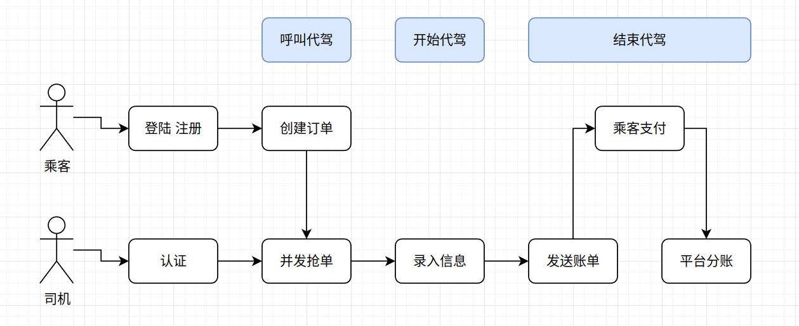
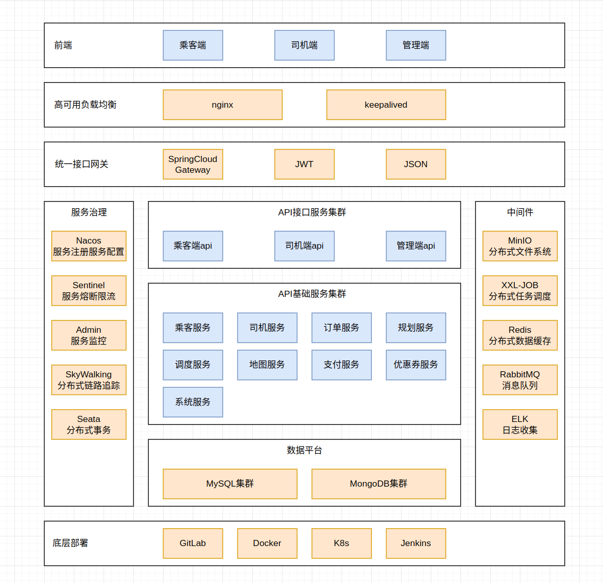
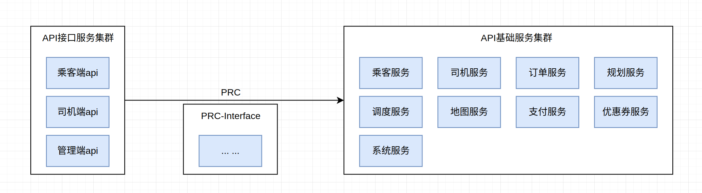

# LeShangDaiJia

p7 1:06

## 背景介绍

### 需求分析

- 代驾业务 (司机端 乘客端 管理端)

  乘客：登陆、呼叫代驾；*结束代价*乘客支付

  司机：认证、并发抢单、开始代驾服务；*结束代驾*发送账单、平台和司机的微信分账


### 项目规划


### 技术选型 ✔

- 前端

  Vue3全家桶 + UniApp微信小程序 + TypyScript

  GraceUI + UniUI

  uniapp-axios-adapter

- 后端

  JDK17 + SpringBoot + MyBatisPlus + MySQL 

  SpringCloudAlibaba(Nacos注册中心 Sentinel配置中心) + OpenFeign远程调用 + Gateway网关

  Redis 缓存 + 高级特性GEO(存储和计算位置信息) + Redisson分布式锁(并发问题)

  MongDB 实时特性(记录和获取司机的实时位置信息)

  RabbitMQ 消息队列(分布式事务最终一致性)

  Seata 分布式事务

  Drools 规则引擎(计算预估费用 取消费用)

  ThreadPoolExecutor + CompletableFuture 异步编排 线程池实现异步操作

  XXL-JOB 分布式定时任务调度

  MinIO 私有化对象存储集群 分布式文件存储

  微信支付 微信分账

  Knife4j YAPI 接口文档工具

  Lombok 实体类getset生成的jar包

  Natapp 内网穿透

- 后端云服务 (tenxun)

  对象存储服务COS：存储司机实名认证的身份证和驾驶证等隐私图片

  人脸识别AiFace：每天司机接单前的身份核实，并且具备静态活体检测功能

  人员库管理Face-Lib：云端存储司机注册时的人脸模型，用于身份比对使用

  数据万象CI：监测用户录音文本内容，判断是否包含暴力色情

  证件识别OCR：识别和扫描身份证和驾驶证的信息

  微信同声传译插件：把文字合成语音，播报订单；把录音转换成文本，用于安全监控

  路线规划插件：规划司机下班回家的路线、小程序订单显示的路线

  地图选点插件：小程序地图选点操作

  腾讯位置服务：路线规划、定位导航、里程和时间估计

- 部署

  Docker
  
  


### 业务流程

- 核心业务

  乘客：登陆注册；起始地址、预估距离费用时间；呼叫代驾、生成订单、搜索附近司机；等待司机接单 (15min无司机接单则取消订单)

  乘客：等待司机来到、司乘同显；
  
  乘客：到达终点、乘客支付司机账单 (*优惠券*)、评价投诉
  
  司机：登陆注册、认证 (身份证 驾驶证 人脸识别)；上传位置、并发抢单；
  
  司机：前往地址、司乘同显；
  
  司机：到达终点、生成账单 (正常+高速)、发送给乘客
  
  
  
  


### 功能梳理

- 并发抢单

- 分布式事务

  


### 架构设计 ✔

- 架构图

  

  


## 页面设计 ✔

### 页面 X

### 页面 X


## 库表设计 ✔

### model X

### model X


## 接口数据 ✔

### Interface X

### Interface X


## 前端初始化

### 新建项目

- 环境准备

  注册微信开发者账号、appid和app密钥、开通服务和插件 (地图)

  Nodejs、微信开发者工具 (导入前端项目)

  https://github.com/msojocs/wechat-web-devtools-linux

  https://www.58jb.com/html/use-wechat-on-ubuntu.html

  ```bash
  # wine
  sudo apt-get install wine -y
  
  cd /opt/devide
  git clone https://github.com/cytle/wechat_web_devtools.git
  cd wechat_web_devtools
  ./bin/wxdt install  # 自动下载最新 `nw.js` , 同时部署目录 `~/.config/wechat_web_devtools/`
  ./bin/wxdt  # 启动开发者工具
  
  sudo vim /usr/share/applications/WechatDevtools.desktop
  
  
  # 在安装过程中，我遇到错误提示了，解决方法就是把以下两个目录删除，再执行一次安装
  sudo rm -rf dist/           #它在wechat_web_devtools目录下安装时会自动生成
  sudo rm -rf /tmp/wxdt_xsp/
  
  # 给目录授权
  sudo chmod -R 777 ~/.config/wechat_web_devtools/
  
  ```

  WechatDevtools.desktop

  ```
  [Desktop Entry]
  Type=Application
  Name=微信开发者工具
  Icon=/opt/devide/wechat_web_devtools/images/logo_miniprogram.png
  GenericName=WechatDevtools
  Comment=WechatDevtools
  Exec="/opt/devide/wechat_web_devtools/bin/wxdt" -desktop
  Terminal=false
  Categories=Wechat;tencent;
  ```

  


### 依赖配置

### 路由配置


## 后端初始化

### 新建项目

- 项目模板

  ```bash
  cp -r daijia-parent/ /opt/code/java-code/hello-java/code-show-project/leshang-daijia/
  cd /opt/code/java-code/hello-java/code-show-project/leshang-daijia
  
  ```

- IDEA配置

  jdk17、maven

  ```bash
  oswin@dt501:/opt/code/java-code/hello-java/code-show-project/leshang-daijia/daijia-parent$ tree -L 2
  .
  ├── common							# # 公共部分：日志、工具类、中间件工具类
  │   ├── common-log
  │   ├── common-util
  │   ├── pom.xml
  │   ├── rabbit-util
  │   ├── service-util
  │   └── spring-security
  ├── model							# 实体类 VO类
  │   ├── pom.xml
  │   └── src
  ├── server-gateway					# 微服务网关
  │   ├── pom.xml
  │   └── src
  │
  ├── service							# 基础模块服务
  │   ├── pom.xml							# 
  │   ├── service-coupon					# 优惠券相关功能
  │   ├── service-customer				# 乘客相关功能
  │   ├── service-dispatch				# 调度相关功能
  │   ├── service-driver					# 司机相关功能
  │   ├── service-map						# 地图相关功能
  │   ├── service-mq						# 消息队列相关功能
  │   ├── service-order					# 订单相关功能
  │   ├── service-payment					# 支付相关功能
  │   ├── service-rules					# 规则相关功能
  │   └── service-system					# 系统相关功能
  ├── service-client					# 客户端服务 (远程调用接口的定义)
  │   ├── pom.xml							# 
  │   ├── service-coupon-client			# 
  │   ├── service-customer-client			# 
  │   ├── service-dispatch-client			# 
  │   ├── service-driver-client			# 
  │   ├── service-map-client				# 
  │   ├── service-order-client			# 
  │   ├── service-payment-client			# 
  │   ├── service-rules-client			# 
  │   └── service-system-client			# 
  ├── web								# 网页入口
  │   ├── pom.xml							# 
  │   ├── web-customer					# 乘客端
  │   ├── web-driver						# 司机端
  │   └── web-mgr							# 管理端
  │
  ├── pom.xml
  └── Reference						# SpingCloudAlibaba Nacos配置中心
      └── DEFAULT_GROUP
  
  ```

  
  
  


### 依赖配置


## 前端页面 XXX

### 页面和布局

### 组件 X

### 组件 X

### 前端请求


## 后端接口 XXX

### 逻辑梳理

### 代码生成 MyBatisX


### 数据库访问层 (mapper) ✔

### 业务逻辑层 (service) ✔

### 接口访问层 (controller) ✔


### 数据模型 (model)

### 自定义异常

### 测试接口


## 项目部署


