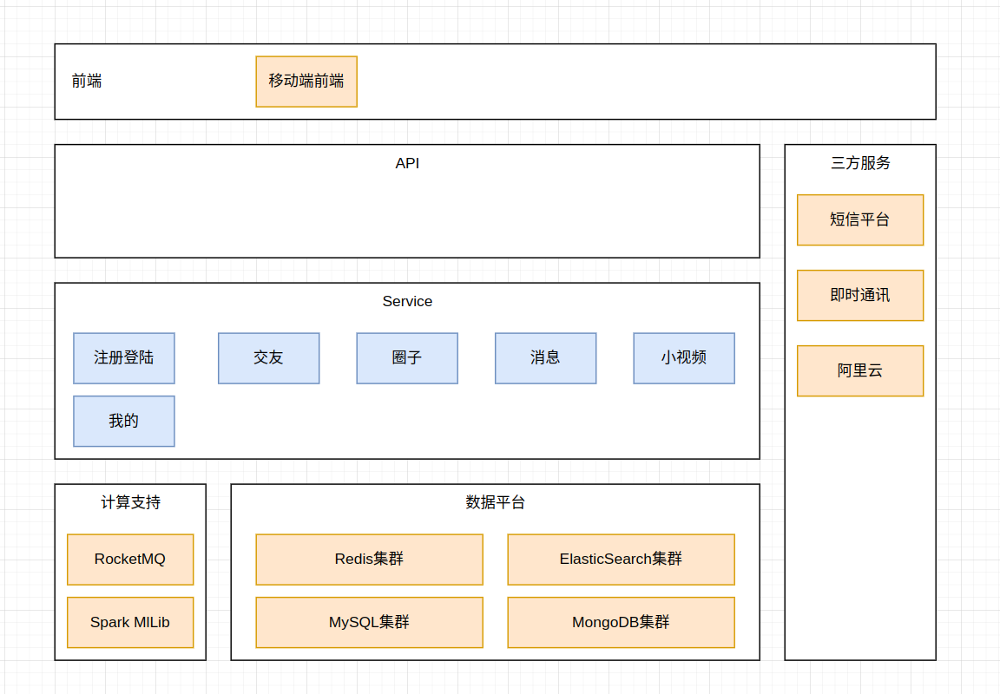

# TanHuaJiaoYou

## 背景介绍

### 需求分析

- 竞品分析

  花田、SOUL、陌陌

- 目标群体

  学生党、上班族

- 使用场景

  社交、组队、脱单

  


### 项目规划


### 技术选型 ✔

- 前端

  Android + Flutter UI 

  环信SDK + redux + shared preferences + connectivity + iconfont + webview + sqflite

- 后端

  SpringBoot + MyBatis 系统主架构

  Redis 集群实现缓存的高可用

  Apache Dobbo 微服务架构技术

  ElasticSearch GEO 地理位置查询

  RocketMQ 消息服务中间件

  MongoDB 海量数据存储

  Spark MlLib 智能推荐

  环信服务 即时通讯

  分布式文件系统 存储小视频数据

  CDN 加速静态资源及小视频的加载

  虹软开放平台 人脸识别

  


### 业务流程


### 功能梳理

- 注册登陆

  用户无需单独注册，直接通过手机号登陆即可

  首次登陆成功后需要完善个人信息

- 交友

  测灵魂、桃花传音、搜附近、探花

- 圈子

  用户发动态、查看好友动态

- 消息

  通知类消息、即时通讯消息

- 小视频

  用户发表小视频、评论

  小视频列表需要推荐算法计算

- 我的

  我的动态、关注数、粉丝数、通用配置等


### 架构设计 ✔

- 架构

  

  


## 页面设计 ✔

### 注册登陆


### 交友：首页


### 交友：探花


### 交友：搜附近


### 交友：桃花传音


### 交友：测灵魂


### 圈子


### 消息


### 小视频


### 我的


## 库表设计 ✔

- 库表环境

  ```bash
  
  ```

- 汇总sql

  ```sql
  /*
  navicat mysql data transfer
  
  source server         : 127.0.0.1-3306
  source server version : 50622
  source host           : 127.0.0.1:3306
  source database       : mytanhua
  
  target server type    : mysql
  target server version : 50622
  file encoding         : 65001
  
  date: 2019-08-02 17:16:18
  */
  
  set foreign_key_checks=0;
  
  -- ----------------------------
  -- table structure for tb_user
  -- ----------------------------
  drop table if exists `tb_user`;
  create table `tb_user` (
    `id` bigint(20) not null auto_increment,
    `mobile` varchar(11) default null comment '手机号',
    `password` varchar(32) default null comment '密码，需要加密',
    `created` datetime default null,
    `updated` datetime default null,
    primary key (`id`),
    key `mobile` (`mobile`) using btree
  ) engine=innodb auto_increment=5 default charset=utf8 comment='用户表';
  
  -- ----------------------------
  -- records of tb_user
  -- ----------------------------
  insert into `tb_user` values ('3', '17602189189', 'e10adc3949ba59abbe56e057f20f883e', '2019-08-02 16:43:46', '2019-08-02 16:43:46');
  insert into `tb_user` values ('4', '15800807944', 'e10adc3949ba59abbe56e057f20f883e', '2019-08-02 16:50:32', '2019-08-02 16:50:32');
  
  -- ----------------------------
  -- table structure for tb_user_info
  -- ----------------------------
  drop table if exists `tb_user_info`;
  create table `tb_user_info` (
    `id` bigint(20) not null auto_increment,
    `user_id` bigint(20) not null comment '用户id',
    `nick_name` varchar(50) default null comment '昵称',
    `logo` varchar(100) default null comment '用户头像',
    `tags` varchar(50) default null comment '用户标签：多个用逗号分隔',
    `sex` tinyint(1) default '3' comment '性别，1-男，2-女，3-未知',
    `age` int(11) default null comment '用户年龄',
    `edu` varchar(20) default null comment '学历',
    `city` varchar(20) default null comment '居住城市',
    `birthday` varchar(20) default null comment '生日',
    `cover_pic` varchar(50) default null comment '封面图片',
    `industry` varchar(20) default null comment '行业',
    `income` varchar(20) default null comment '收入',
    `marriage` varchar(20) default null comment '婚姻状态',
    `created` datetime default null,
    `updated` datetime default null,
    primary key (`id`),
    key `user_id` (`user_id`)
  ) engine=innodb auto_increment=4 default charset=utf8 comment='用户信息表';
  
  -- ----------------------------
  -- records of tb_user_info
  -- ----------------------------
  insert into `tb_user_info` values ('2', '3', 'heima', null, null, '2', null, null, '北京市-北京城区-东城区', '2019-08-01', null, null, null, null, '2019-08-02 16:44:23', '2019-08-02 16:44:23');
  insert into `tb_user_info` values ('3', '4', '波仔1', 'http://itcast-tanhua.oss-cn-shanghai.aliyuncs.com/images/2019/08/02/15647359300685826.jpg', null, '2', null, null, '北京市-北京城区-朝阳区', '2019-06-02', null, null, null, null, '2019-08-02 16:50:47', '2019-08-02 16:52:10');
  
  ```

  


### user

- user

  ```sql
  -- ----------------------------
  -- table structure for tb_user
  -- ----------------------------
  drop table if exists `tb_user`;
  create table `tb_user` (
    `id` bigint(20) not null auto_increment,
    `mobile` varchar(11) default null comment '手机号',
    `password` varchar(32) default null comment '密码，需要加密',
    `created` datetime default null,
    `updated` datetime default null,
    primary key (`id`),
    key `mobile` (`mobile`) using btree
  ) engine=innodb auto_increment=5 default charset=utf8 comment='用户表';
  
  -- ----------------------------
  -- records of tb_user
  -- ----------------------------
  insert into `tb_user` values ('3', '17602189189', 'e10adc3949ba59abbe56e057f20f883e', '2019-08-02 16:43:46', '2019-08-02 16:43:46');
  insert into `tb_user` values ('4', '15800807944', 'e10adc3949ba59abbe56e057f20f883e', '2019-08-02 16:50:32', '2019-08-02 16:50:32');
  
  -- ----------------------------
  -- table structure for tb_user_info
  -- ----------------------------
  drop table if exists `tb_user_info`;
  create table `tb_user_info` (
    `id` bigint(20) not null auto_increment,
    `user_id` bigint(20) not null comment '用户id',
    `nick_name` varchar(50) default null comment '昵称',
    `logo` varchar(100) default null comment '用户头像',
    `tags` varchar(50) default null comment '用户标签：多个用逗号分隔',
    `sex` tinyint(1) default '3' comment '性别，1-男，2-女，3-未知',
    `age` int(11) default null comment '用户年龄',
    `edu` varchar(20) default null comment '学历',
    `city` varchar(20) default null comment '居住城市',
    `birthday` varchar(20) default null comment '生日',
    `cover_pic` varchar(50) default null comment '封面图片',
    `industry` varchar(20) default null comment '行业',
    `income` varchar(20) default null comment '收入',
    `marriage` varchar(20) default null comment '婚姻状态',
    `created` datetime default null,
    `updated` datetime default null,
    primary key (`id`),
    key `user_id` (`user_id`)
  ) engine=innodb auto_increment=4 default charset=utf8 comment='用户信息表';
  
  -- ----------------------------
  -- records of tb_user_info
  -- ----------------------------
  insert into `tb_user_info` values ('2', '3', 'heima', null, null, '2', null, null, '北京市-北京城区-东城区', '2019-08-01', null, null, null, null, '2019-08-02 16:44:23', '2019-08-02 16:44:23');
  insert into `tb_user_info` values ('3', '4', '波仔1', 'http://itcast-tanhua.oss-cn-shanghai.aliyuncs.com/images/2019/08/02/15647359300685826.jpg', null, '2', null, null, '北京市-北京城区-朝阳区', '2019-06-02', null, null, null, null, '2019-08-02 16:50:47', '2019-08-02 16:52:10');
  
  ```

  


## 接口数据 ✔

### Interface X

### Interface X


## 前端初始化

### 新建项目

### 依赖配置

### 路由配置


## 后端初始化

### 新建项目

- 新建maven

  ```
  
  ```

  


### 配置文件

- aliyun.properties

  ```properties
  aliyun.endpoint = http://oss-cn-shanghai.aliyuncs.com
  aliyun.accessKeyId = xxx
  aliyun.accessKeySecret = xxx
  aliyun.bucketName=itcast-tanhua
  aliyun.urlPrefix=http://itcast-tanhua.oss-cn-shanghai.aliyuncs.com/
  
  ```

- application.properties

  ```properties
  # springboot
  spring.application.name = tanhua-sso
  server.port = 18080
  
  # db
  spring.datasource.driver-class-name=com.mysql.jdbc.Driver
  spring.datasource.url=jdbc:mysql://127.0.0.1:3307/tanhua?useUnicode=true&characterEncoding=utf8&autoReconnect=true&allowMultiQueries=true&useSSL=false
  spring.datasource.username=root
  spring.datasource.password=123456
  
  # mybatis-plus
  mybatis-plus.type-enums-package=com.tanhua.sso.enums
  mybatis-plus.global-config.db-config.table-prefix=tb_
  mybatis-plus.global-config.db-config.id-type=auto
  
  # Redis
  spring.redis.jedis.pool.max-wait = 5000ms
  spring.redis.jedis.pool.max-Idle = 100
  spring.redis.jedis.pool.min-Idle = 10
  spring.redis.timeout = 10s
  spring.redis.cluster.nodes = 192.168.45.110:6379,192.168.45.110:6380,192.168.45.110:6381
  spring.redis.cluster.max-redirects=5
  
  # RocketMQ
  spring.rocketmq.nameServer=192.168.45.110:9876
  spring.rocketmq.producer.group=tanhua
  
  # tanhua
  jwt.secret=76bd425b6f29f7fcc2e0bfc286043df1
  
  # arcsoft
  arcsoft.appid=2yKexS8BDMHdNTzwJpcT3uxujeoTRbP7AReyJxv7KFbf
  arcsoft.sdkKey=DstQj1yAARVbH1oed4HbaFifVoiMPbQo3hHnSi2Ssm6L
  arcsoft.libPath=F:\\code\\WIN64
  
  ```

  

### 依赖配置

- 父工程

  ```xml
  <?xml version="1.0" encoding="UTF-8"?>
  <project xmlns="http://maven.apache.org/POM/4.0.0"
           xmlns:xsi="http://www.w3.org/2001/XMLSchema-instance"
           xsi:schemaLocation="http://maven.apache.org/POM/4.0.0 http://maven.apache.org/xsd/maven-4.0.0.xsd">
      <modelVersion>4.0.0</modelVersion>
  
      <parent>
          <groupId>org.springframework.boot</groupId>
          <artifactId>spring-boot-starter-parent</artifactId>
          <version>2.1.0.RELEASE</version>
      </parent>
  
      <groupId>com.time1043</groupId>
      <artifactId>tanhua-backend</artifactId>
      <version>1.0-SNAPSHOT</version>
      <packaging>pom</packaging>
      <modules>
          <module>tanhua-sso</module>
      </modules>
  
      <!-- 集中定义依赖版本号 -->
      <properties>
          <mysql.version>5.1.47</mysql.version>
          <jackson.version>2.9.9</jackson.version>
          <druid.version>1.0.9</druid.version>
          <servlet-api.version>2.5</servlet-api.version>
          <jsp-api.version>2.0</jsp-api.version>
          <joda-time.version>2.5</joda-time.version>
          <commons-lang3.version>3.3.2</commons-lang3.version>
          <commons-io.version>1.3.2</commons-io.version>
          <mybatis.version>3.2.8</mybatis.version>
          <mybatis.mybatis-plus>3.1.1</mybatis.mybatis-plus>
          <lombok.version>1.18.4</lombok.version>
      </properties>
  
      <!--通用依赖-->
      <dependencies>
          <dependency>
              <groupId>org.springframework.boot</groupId>
              <artifactId>spring-boot-starter-test</artifactId>
              <scope>test</scope>
          </dependency>
          <dependency>
              <groupId>junit</groupId>
              <artifactId>junit</artifactId>
              <version>4.12</version>
              <scope>test</scope>
          </dependency>
      </dependencies>
  
      <!-- 依赖管理 父工程 -->
      <dependencyManagement>
          <dependencies>
              <!-- mybatis-plus插件依赖 -->
              <dependency>
                  <groupId>com.baomidou</groupId>
                  <artifactId>mybatis-plus</artifactId>
                  <version>${mybatis.mybatis-plus}</version>
              </dependency>
              <!-- MySql -->
              <dependency>
                  <groupId>mysql</groupId>
                  <artifactId>mysql-connector-java</artifactId>
                  <version>${mysql.version}</version>
              </dependency>
  
              <dependency>
                  <groupId>org.mongodb</groupId>
                  <artifactId>mongodb-driver-sync</artifactId>
                  <version>3.9.1</version>
              </dependency>
              <dependency>
                  <groupId>org.projectlombok</groupId>
                  <artifactId>lombok</artifactId>
                  <optional>true</optional>
                  <version>${lombok.version}</version>
              </dependency>
              <dependency>
                  <groupId>org.apache.commons</groupId>
                  <artifactId>commons-lang3</artifactId>
                  <version>${commons-lang3.version}</version>
              </dependency>
              <!--RocketMQ相关依赖-->
              <dependency>
                  <groupId>org.apache.rocketmq</groupId>
                  <artifactId>rocketmq-spring-boot-starter</artifactId>
                  <version>2.0.1</version>
              </dependency>
              <dependency>
                  <groupId>org.apache.rocketmq</groupId>
                  <artifactId>rocketmq-client</artifactId>
                  <version>4.3.2</version>
              </dependency>
              <!-- Jackson Json处理工具包 -->
              <dependency>
                  <groupId>com.fasterxml.jackson.core</groupId>
                  <artifactId>jackson-databind</artifactId>
                  <version>${jackson.version}</version>
              </dependency>
              <dependency>
                  <groupId>com.alibaba</groupId>
                  <artifactId>druid</artifactId>
                  <version>${druid.version}</version>
              </dependency>
              <!-- 加密工具包 -->
              <dependency>
                  <groupId>commons-codec</groupId>
                  <artifactId>commons-codec</artifactId>
                  <version>1.11</version>
              </dependency>
              <!-- 工具包 -->
              <dependency>
                  <groupId>org.apache.commons</groupId>
                  <artifactId>commons-lang3</artifactId>
                  <version>3.7</version>
              </dependency>
          </dependencies>
      </dependencyManagement>
  
      <build>
          <plugins>
              <!-- java编译插件 -->
              <plugin>
                  <groupId>org.apache.maven.plugins</groupId>
                  <artifactId>maven-compiler-plugin</artifactId>
                  <version>3.2</version>
                  <configuration>
                      <source>1.8</source>
                      <target>1.8</target>
                      <encoding>UTF-8</encoding>
                  </configuration>
              </plugin>
          </plugins>
      </build>
  
  </project>
  ```

- 子工程 sso (单点登录)

  ```xml
  <?xml version="1.0" encoding="UTF-8"?>
  <project xmlns="http://maven.apache.org/POM/4.0.0"
           xmlns:xsi="http://www.w3.org/2001/XMLSchema-instance"
           xsi:schemaLocation="http://maven.apache.org/POM/4.0.0 http://maven.apache.org/xsd/maven-4.0.0.xsd">
      <modelVersion>4.0.0</modelVersion>
      <parent>
          <groupId>com.time1043</groupId>
          <artifactId>tanhua-backend</artifactId>
          <version>1.0-SNAPSHOT</version>
      </parent>
  
      <artifactId>tanhua-sso</artifactId>
  
      <dependencies>
          <!-- springboot-web -->
          <dependency>
              <groupId>org.springframework.boot</groupId>
              <artifactId>spring-boot-starter-web</artifactId>
          </dependency>
          <!-- mybatis-plus -->
          <dependency>
              <groupId>com.baomidou</groupId>
              <artifactId>mybatis-plus</artifactId>
          </dependency>
          <dependency>
              <groupId>com.baomidou</groupId>
              <artifactId>mybatis-plus-boot-starter</artifactId>
              <version>${mybatis.mybatis-plus}</version>
          </dependency>
          <!-- mysql -->
          <dependency>
              <groupId>mysql</groupId>
              <artifactId>mysql-connector-java</artifactId>
          </dependency>
          
          <dependency>
              <groupId>com.alibaba</groupId>
              <artifactId>druid</artifactId>
          </dependency>
          <dependency>
              <groupId>org.projectlombok</groupId>
              <artifactId>lombok</artifactId>
          </dependency>
          <dependency>
              <groupId>org.apache.commons</groupId>
              <artifactId>commons-lang3</artifactId>
          </dependency>
          <!-- json -->
          <dependency>
              <groupId>com.fasterxml.jackson.core</groupId>
              <artifactId>jackson-databind</artifactId>
          </dependency>
          <!-- redis -->
          <dependency>
              <groupId>org.springframework.boot</groupId>
              <artifactId>spring-boot-starter-data-redis</artifactId>
          </dependency>
          
          <dependency>
              <groupId>commons-codec</groupId>
              <artifactId>commons-codec</artifactId>
          </dependency>
          
          <!--RocketMQ-->
          <dependency>
              <groupId>org.apache.rocketmq</groupId>
              <artifactId>rocketmq-spring-boot-starter</artifactId>
              <version>2.0.1</version>
          </dependency>
          <dependency>
              <groupId>org.apache.rocketmq</groupId>
              <artifactId>rocketmq-client</artifactId>
              <version>4.3.2</version>
          </dependency>
  
          <dependency>
              <groupId>io.jsonwebtoken</groupId>
              <artifactId>jjwt</artifactId>
              <version>0.9.1</version>
          </dependency>
  
          <dependency>
              <groupId>com.aliyun.oss</groupId>
              <artifactId>aliyun-sdk-oss</artifactId>
              <version>2.8.3</version>
          </dependency>
  
          <dependency>
              <groupId>joda-time</groupId>
              <artifactId>joda-time</artifactId>
          </dependency>
  
          <!--人脸识别 -->
          <!--<dependency>
              <groupId>com.arcsoft.face</groupId>
              <artifactId>arcsoft-sdk-face</artifactId>
              <version>2.2.0.1</version>
          </dependency>-->
  
      </dependencies>
  
  
  </project>
  ```

  


### 依赖环境

- mysql

  ```bash
  # #################################################
  # mysql
  # #################################################
  
  # docker mysql8
  mkdir -p /opt/data/mysql/data /opt/data/mysql/conf /opt/data/mysql/init  # rz -E
  
  docker run -d \
    --name mysql \
    -p 3306:3306 \
    -e TZ=Asia/Shanghai \
    -e MYSQL_ROOT_PASSWORD=123456 \
    -v /opt/data/mysql/data:/var/lib/mysql \
    -v /opt/data/mysql/conf:/etc/mysql/conf.d \
    -v /opt/data/mysql/init:/docker-entrypoint-initdb.d \
    mysql:8
  
  docker exec -it mysql bash
  mysql -uroot -p123456
  
  
  # docker mysql57
  docker create --name mysql57 \
    -e MYSQL_ROOT_PASSWORD=123456 \
    -p 3307:3306 \
    mysql:5.7
  
  docker start mysql57
  docker exec -it mysql57 bash
  mysql -uroot -p123456
  
  
  # sql
  drop database if exists `tanhua`;
  create database `tanhua` character set utf8;
  
  ```

- redis cluster

  ```bash
  # #################################################
  # redis cluster
  # #################################################
  docker create --name redis-node01 \
    --net host -v redis-node01:/data redis:5.0.2 \
    --cluster-enabled yes \
    --cluster-config-file nodes-node-01.conf \
    --port 6379
  docker create --name redis-node02 \
    --net host -v redis-node02:/data redis:5.0.2 \
    --cluster-enabled yes \
    --cluster-config-file nodes-node-02.conf \
    --port 6380
  docker create --name redis-node03 \
    --net host -v redis-node03:/data redis:5.0.2 \
    --cluster-enabled yes \
    --cluster-config-file nodes-node-03.conf \
    --port 6381
  
  # 启动容器
  docker start redis-node01 redis-node02 redis-node03
  # 进入容器 组建集群
  docker exec -it redis-node01 bash
  redis-cli --cluster create 192.168.45.110:6379 192.168.45.110:6380 192.168.45.110:6381 --cluster-replicas 0 
  # 测试集群1
  redis-cli
  cluster nodes
  # 测试集群2
  redis-cli -c
  set abc 123
  get abc
  del abc
  
  
  # #################################################
  # redis cluster log
  # #################################################
  root@dt501:/data# redis-cli --cluster create 192.168.45.110:6379 192.168.45.110:6380 192.168.45.110:6381 --cluster-replicas 0
  >>> Performing hash slots allocation on 3 nodes...
  Master[0] -> Slots 0 - 5460
  Master[1] -> Slots 5461 - 10922
  Master[2] -> Slots 10923 - 16383
  M: 8f5060fb05375a1465d0698066f1b094de4d6ae0 192.168.45.110:6379
     slots:[0-5460] (5461 slots) master
  M: 559ab828422978e6ea6c141c8057a3b3358370cf 192.168.45.110:6380
     slots:[5461-10922] (5462 slots) master
  M: fc24ef7d93d060e5ed9c8b14c1b7067d3635463e 192.168.45.110:6381
     slots:[10923-16383] (5461 slots) master
  Can I set the above configuration? (type 'yes' to accept): yes
  >>> Nodes configuration updated
  >>> Assign a different config epoch to each node
  >>> Sending CLUSTER MEET messages to join the cluster
  Waiting for the cluster to join
  .
  >>> Performing Cluster Check (using node 192.168.45.110:6379)
  M: 8f5060fb05375a1465d0698066f1b094de4d6ae0 192.168.45.110:6379
     slots:[0-5460] (5461 slots) master
  M: 559ab828422978e6ea6c141c8057a3b3358370cf 192.168.45.110:6380
     slots:[5461-10922] (5462 slots) master
  M: fc24ef7d93d060e5ed9c8b14c1b7067d3635463e 192.168.45.110:6381
     slots:[10923-16383] (5461 slots) master
  [OK] All nodes agree about slots configuration.
  >>> Check for open slots...
  >>> Check slots coverage...
  [OK] All 16384 slots covered.
  
  root@dt501:/data# redis-cli
  127.0.0.1:6379> cluster nodes
  559ab828422978e6ea6c141c8057a3b3358370cf 192.168.45.110:6380@16380 master - 0 1725260979625 2 connected 5461-10922
  fc24ef7d93d060e5ed9c8b14c1b7067d3635463e 192.168.45.110:6381@16381 master - 0 1725260981630 3 connected 10923-16383
  8f5060fb05375a1465d0698066f1b094de4d6ae0 192.168.45.110:6379@16379 myself,master - 0 1725260980000 1 connected 0-5460
  
  root@dt501:/data# redis-cli -c
  127.0.0.1:6379> set abc 123
  -> Redirected to slot [7638] located at 192.168.45.110:6380
  OK
  192.168.45.110:6380> get abc
  "123"
  192.168.45.110:6380> del abc
  (integer) 1
  
  ```
  
- rocketmq cluster

  ```bash
  # #################################################
  # rocketmq cluster
  # #################################################
  cd /opt/module/rmq
  
  docker pull foxiswho/rocketmq:server-4.3.2
  docker pull foxiswho/rocketmq:broker-4.3.2
  
  # nameserver
  docker create -p 9876:9876 --name rmqserver \
    -e "JAVA_OPT_EXT=-server -Xms128m -Xmx128m -Xmn128m" \
    -e "JAVA_OPTS=-Duser.home=/opt" \
    -v rmqserver-logs:/opt/logs \
    -v rmqserver-store:/opt/store \
    foxiswho/rocketmq:server-4.3.2
  
  # broker.conf
  vim /opt/module/rmq/rmqbroker/conf/broker.conf
  brokerIP1=192.168.45.110
  namesrvAddr=192.168.45.110:9876
  brokerName=broker_tanhua
  
  # broker
  docker create -p 10911:10911 -p 10909:10909 --name rmqbroker \
    -e "JAVA_OPTS=-Duser.home=/opt" \
    -e "JAVA_OPT_EXT=-server -Xms128m -Xmx128m -Xmn128m" \
    -v /opt/module/rmq/rmqbroker/conf/broker.conf:/etc/rocketmq/broker.conf \
    -v rmqbroker-logs:/opt/logs \
    -v rmqbroker-store:/opt/store \
    foxiswho/rocketmq:broker-4.3.2
  
  docker start rmqserver rmqbroker
  docker stop rmqserver rmqbroker
  docker rm rmqserver rmqbroker
  
  # 管理工具
  docker pull styletang/rocketmq-console-ng:1.0.0
  docker run -e "JAVA_OPTS=-Drocketmq.namesrv.addr=192.168.45.110:9876 -Dcom.rocketmq.sendMessageWithVIPChannel=false" \
    -p 8082:8080 \
    -t styletang/rocketmq-console-ng:1.0.0
  # 192.168.45.110:8082
  
  ```

- Android apk

  VirtualBox ...

  Android Studio

  ```
  
  ```

  


## 前端页面 XXX

### 页面和布局

### 组件 X

### 组件 X

### 前端请求


## 后端接口 登陆注册

### 逻辑梳理

- 四个接口

  发送手机验证码：接入第三方短信平台 [云之讯](https://www.ucpaas.com/)

  校验用户登陆：校验手机号和验证码、成功后JWT规范响应 (标识是否首次)

  首次登陆完善个人信息：

  校验token是否有效：校验存储到redis中的token是否有效

  


### 代码生成 MyBatisX


### 数据库访问层 (mapper) ✔

### 业务逻辑层 (service) ✔

### 接口访问层 (controller) ✔


### 数据模型 (model)

### 自定义异常

### 测试接口


## 项目部署


